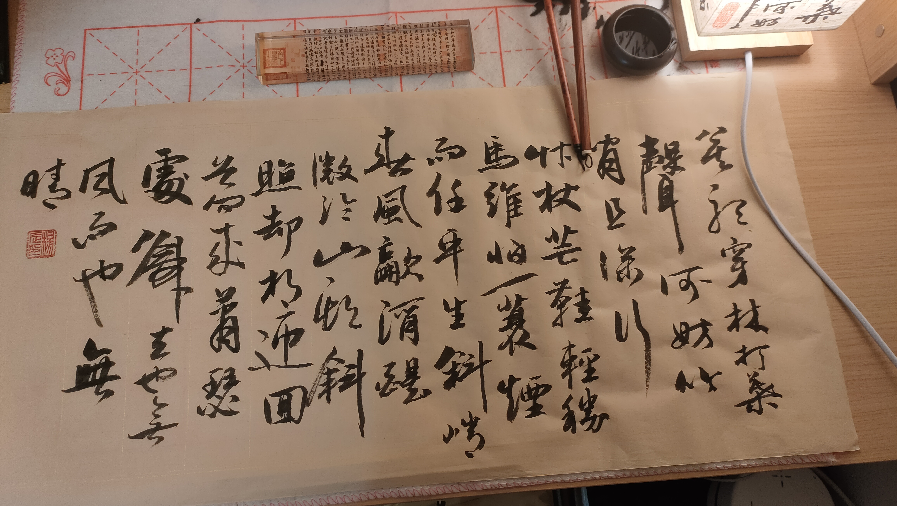

# About Me

I am a student in the School of Intelligent Software Engineering at NJU. I am keen on *software engineering*, *LLMs*, and *AI agents*. 

## 🎓 Education

- **Bachelor's Degree** | Nanjing University | School of Intelligent Software Engineering | Software Engineering (Intelligent Software) | 2022 – 2026

- **Master's Degree** | Nanjing University | School of Computer Science | Computer Technology | 2026 – Present

## 🗺️ Research Interests

I have a broad interest in *LLMs* and *NLP*. Currently, I am primarily focusing on *MoE Compression* and *LLM Safety*.

## 🔧 Technical Skills

- Languages: C/C++, Python, Java, Latex
- Frameworks: Flask, Pytorch
- Tools: Linux, VSCode, Cursor, Claude Code, Typora, Zotero
- AI: RAG, Agent, Agent Frameworks(LangChain, LangGraph), MCP, Skill, Prompt Engineering

## 💼 Internship Experience

- **AI Product Intern** | Radnova | Jan 2026 – Mar 2026
- Led the requirements analysis for an agent product, designed complete system prompts, and developed tools and skills to support multi‑skill scenario switching.
- Built a sales agent using LangGraph state graphs and the Agentickit enterprise framework, enabling inter‑agent collaboration via the A2A protocol.
- Designed state management mechanisms to achieve core capabilities such as context tracking, object management, and SQL query result caching, significantly improving response speed and conversation coherence.
- Implemented toolchain management and state injection using a middleware pattern, integrated Langfuse for full‑chain monitoring, and established an observable agent infrastructure.
- Successfully empowered sales personnel with intelligent script generation, real‑time competitor analysis, and customer insight extraction, effectively enhancing sales conversion efficiency.

## 🎯 Hobbies

⚽ *Soccer* and 🖊  *calligraphy* are my merits — I am a fan of Real Madrid and have created numerous calligraphy works to date. I play as a defender on the pitch.

I started learning calligraphy from the third grade of elementary school. I first learned at home with my grandfather, and later attended an extracurricular calligraphy class. I began with regular script using Yan Zhenqing's *Yan Qin Li Stele*, then moved on to running-regular script by studying Zhao Mengfu's *Di Shi Dan Ba Stele*. After that, I studied *Shengjiao Xu* (Preface to the Sacred Teachings). The calligraphy of *Shengjiao Xu* is rigorous in structure and rules, making it very suitable for the transition from regular script to running script. Moreover, since it is a collection of characters (from Wang Xizhi), it lends itself well to creative adaptations and allows switching to other running script styles. Later, I self-studied Zhao Mengfu's running script works, such as *Luoshen Fu*, *Qiuxing Fu*, *Chibi Fu*, and *Xianju Fu*, and also tried my hand at calligraphers like Wang Xizhi, Mi Fu, Su Shi, and Zhi Yong.

Since entering university, I began learning cursive script with Sun Guoting's *Shu Pu* (also known as *Treatise on Calligraphy*). Sun Guoting's cursive script is both elegant and aesthetically pleasing, making it highly suitable for beginners. I am most proficient in the *Zhao style*. Years of copying and creating calligraphic works have not only broadened my horizons but also deepened my understanding of China's fine traditional culture. The way of calligraphy is also the way of being human: integrity and flexibility, uninhibitedness and restraint, blank spacing and density, wet ink and dry brush—all of these reflect the wisdom of the ancients.

