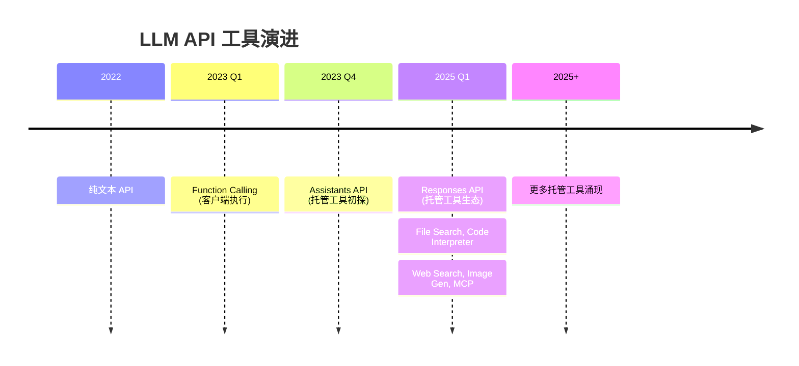

# LLM API 形态演进调研报告：从 /chat/completions 到 Agentic API

## 核心观点

**LLM API 正经历从"对话接口"向"代理接口"的范式转变**

*   **第一代** (`/v1/completions`): 文本补全接口

*   **第二代** (`/v1/chat/completions`): 对话交互接口

*   **第三代** (`/v1/responses`): **Agent 推理接口**

这场演进的驱动力是：**模型能力的提升倒逼 API 设计必须演进**

从 GPT-4 到 GPT-5，模型从"聊天伙伴"进化为"推理智能体"，API 必须支持：

*   持久化的推理状态

*   多步骤的工具调用

*   多模态的原生支持

*   服务端托管的工具

---

## API 形态演进史

### 第一代：/v1/completions (2020-2022)

```python
response = openai.Completion.create(
    model="text-davinci-003",
    prompt="Once upon a time..."
)

```

**特点**：

*   ✅ 简单直接：给提示词，模型完成文本

*   ❌ 限制：无法建立对话上下文

*   ❌ 限制：输出结构难以控制

**适用场景**：

*   文本补全

*   代码补全

*   简单的文本生成

**为什么被淘汰**： RLHF 和 ChatGPT 的出现，模型从"补全者"变为"对话者"，API 设计必须跟上。

---

### 第二代：/v1/chat/completions (2022-2024)

```python
response = openai.ChatCompletion.create(
    model="gpt-4",
    messages=[
        {"role": "system", "content": "You are a helpful assistant."},
        {"role": "user", "content": "What's the weather?"}
    ]
)

```

**特点**：

*   ✅ 引入角色：`system`, `user`, `assistant`

*   ✅ 支持对话上下文

*   ✅ 2023年增加 Function Calling

*   ❌ **致命缺陷**：推理状态在调用之间丢失

*   ❌ 结构限制：无法区分消息和函数调用的顺序

**为什么需要下一代**：

1.  **Function Calling** 让模型可以调用工具，但开发者需要自己管理工具调用状态

2.  **Assistants API** (2023 beta) 尝试解决，但 API 设计限制导致采用率不高

3.  **推理模型**（o1, GPT-5）需要持久化的推理链

---

### 第三代：/v1/responses (2025- )

```python
response = openai.responses.create(
    model="gpt-5",
    input=[{"role": "user", "content": "What's the weather?"}],
    tools=[{"type": "web_search"}]
)

# 返回多态 Items
for item in response.output:
    if item.type == "message":
        print(item.content)
    elif item.type == "function_call":
        execute(item.name, item.arguments)
    elif item.type == "reasoning":
        # 推理状态被保留，但原始 CoT 被隐藏
        pass

```

**核心变革**：

1. **从 Turn-based 到 Agentic Loop**

   *   Chat Completions: 简单的回合制聊天

   *   Responses API: 结构化的推理和行动循环

2. **从 Message 到 Items**

   ```json
   // Chat Completions 返回
   {
     "message": {
       "content": "...",
       "tool_calls": [...]  // 嵌套在 message 中
     }
   }
   
   // Responses API 返回
   {
     "output": [
       {"type": "reasoning", "summary": "..."},
       {"type": "message", "content": "..."},
       {"type": "function_call", "name": "...", "arguments": "..."}
     ]  // 平级的多态 Items
   }
   
   ```

3. **从 Stateless 到 Stateful**

   *   Chat Completions: 推理在调用之间丢失

   *   Responses API: 推理状态持久化，通过 `previous_response_id` 继续

---

## 三种形态对比

| 维度                 | /v1/completions | /v1/chat/completions | /v1/responses            |
| -------------------- | --------------- | -------------------- | ------------------------ |
| **发布时间**         | 2020            | 2022                 | 2025                     |
| **交互模式**         | 单次补全        | 多轮对话             | Agentic Loop             |
| **状态管理**         | 无状态          | 无状态（需手动管理） | **有状态**（推理持久化） |
| **输出结构**         | 单一文本        | 单一 message         | **多态 Items**           |
| **Function Calling** | ❌               | ✅ (2023)             | ✅ (原生支持)             |
| **工具执行**         | 客户端          | 客户端               | **服务端托管**           |
| **多模态**           | ❌               | ⚠️ (后期添加)         | ✅ (原生设计)             |
| **推理模型支持**     | ❌               | ⚠️ (不保留状态)       | ✅ (专为推理优化)         |
| **缓存效率**         | N/A             | 基准                 | **+40-80%**              |
| **适用模型**         | GPT-3           | GPT-3.5/4            | **GPT-5/o1**             |

### 实际差异示例

#### 场景：多步骤推理 + 工具调用

**Chat Completions 的痛点**：

```python
# 需要手动管理 4 次调用

messages = [ ]


# 第1次：用户提问
messages.append({"role": "user", "content": "分析这个PDF并生成图表"})
response = client.chat.completions.create(model="gpt-4", messages=messages)

# 第2次：模型调用工具（需手动解析）
tool_call = response.choices[0].message.tool_calls[0]
messages.append(response.choices[0].message)

# 第3次：手动执行工具，返回结果
tool_result = execute_tool(tool_call)
messages.append({
    "role": "tool",
    "tool_call_id": tool_call.id,
    "content": str(tool_result)
})

# 第4次：模型基于工具结果生成最终回答
response = client.chat.completions.create(model="gpt-4", messages=messages)
# 推理链已丢失

```

**Responses API 的优雅**：

```python
# 一次调用，自动处理多步骤
response = client.responses.create(
    model="gpt-5",
    input=[{"role": "user", "content": "分析这个PDF并生成图表"}],
    tools=[
        {"type": "file_search"},
        {"type": "code_interpreter"},
        {"type": "image_gen"}
    ]
)

# 自动处理：推理 → 搜索 → 分析 → 生成
for item in response.output:
    if item.type == "reasoning":
        # 推理过程被保留（安全地）
        print(f"推理摘要: {item.summary}")
    elif item.type == "function_call":
        print(f"调用: {item.name}")
    elif item.type == "message":
        print(f"最终回答: {item.content}")

# 下次对话可以继续推理状态
response2 = client.responses.create(
    model="gpt-5",
    previous_response_id=response.id,
    input=[{"role": "user", "content": "再细化一下"}]
)

```

---

## Responses API 深度解析

### 1. 设计哲学

**Q: 为什么需要新 API？**

> "Every generation of OpenAI APIs has been built around the same question: **what's the simplest, most powerful way for developers to talk to models?**"

答案随着模型能力变化：

*   GPT-3 时代：文本补全 → `/v1/completions`

*   GPT-3.5/4 时代：对话交互 → `/v1/chat/completions`

*   GPT-5/o1 时代：**推理智能体** → `/v1/responses`

### 2. 核心特性

#### 2.1 Agentic Loop（智能体循环）

```plaintext
用户输入 → 模型推理 → 调用工具 → 获取结果 → 继续推理 → 输出
                ↑___________________________________|

                  (推理状态在循环中保留)

```

对比 Chat Completions：

*   **Chat Completions**: 推理状态每次都丢失（像侦探每次离开房间都忘记线索）

*   **Responses API**: 推理状态持久化（像侦探保留笔记本）

#### 2.2 多态输出 Items

```json
{
  "output": [
    {
      "type": "reasoning",
      "id": "rs_xxx",
      "summary": [{
        "type": "summary_text",
        "text": "**Determining weather response**\n需要查询天气..."
      }]
    },
    {
      "type": "message",
      "id": "msg_xxx",
      "status": "completed",
      "role": "assistant",
      "content": [{"type": "output_text", "text": "我来查询天气..."}]
    },
    {
      "type": "function_call",
      "id": "fc_xxx",
      "status": "completed",
      "name": "get_weather",
      "arguments": "{\"location\": \"San Francisco\"}"
    }
  ]
}

```

**优势**：

*   ✅ 行动顺序清晰

*   ✅ 每个步骤都有独立 ID

*   ✅ 便于调试、审计、构建 UI

#### 2.3 推理状态的安全管理

**Q: 为什么不直接暴露 Chain-of-Thought？**

> "Exposing raw CoT has a number of risks: hallucinations, harmful content, and competitive risks."

**解决方案**：

*   推理状态内部加密保存

*   通过 `previous_response_id` 或 **reasoning items** 安全延续

*   开发者看到的是summary，不是原始 CoT

### 3. Hosted Tools（托管工具）

| 工具类型           | 功能                   | 执行位置      |
| ------------------ | ---------------------- | ------------- |
| `file_search`      | RAG 检索               | 服务端        |
| `code_interpreter` | 代码执行               | 服务端沙箱    |
| `web_search`       | 网页搜索               | 服务端        |
| `image_gen`        | 图像生成               | 服务端        |
| `MCP`              | Model Context Protocol | 服务端/客户端 |

**优势**：

*   ✅ **降低延迟**：不需要每次调用都通过客户端后端

*   ✅ **降低成本**：减少往返次数

*   ✅ **简化开发**：不需要自己搭建 RAG 管道

### 4. 性能提升

**内部基准测试**：

*   **TAUBench**: +5% (纯粹通过保留推理状态)

*   **缓存利用率**: +40-80%

*   **结果**：更低延迟，更低成本

---

## Claude API 的设计理念

Anthropic 选择了不同的路径，强调简单性和透明性。

### Claude Messages API

```python
response = client.messages.create(
    model="claude-3-5-sonnet-20241022",
    max_tokens=1024,
    tools=[
        {
            "name": "get_weather",
            "description": "获取天气信息",
            "input_schema": {
                "type": "object",
                "properties": {
                    "location": {"type": "string"}
                }
            }
        }
    ],
    messages=[
        {"role": "user", "content": "北京天气怎么样？"}
    ]
)

# 处理工具调用
if response.stop_reason == "tool_use":
    for block in response.content:
        if block.type == "tool_use":
            tool_result = execute(block.name, block.input)

            # 继续对话，传入工具结果
            response2 = client.messages.create(
                model="claude-3-5-sonnet-20241022",
                messages=[
                    {"role": "user", "content": "北京天气怎么样？"},
                    {"role": "assistant", "content": response.content},
                    {"role": "user", "content": [
                        {"type": "tool_result", "tool_use_id": block.id, "content": tool_result}
                    ]}
                ]
            )

```

### 设计哲学对比

| 维度           | OpenAI Responses API            | Anthropic Messages API       |
| -------------- | ------------------------------- | ---------------------------- |
| **核心哲学**   | **Agentic-first**（智能体优先） | **Simple-first**（简单优先） |
| **状态管理**   | 自动管理（有状态）              | 手动管理（无状态）           |
| **推理可见性** | 隐藏（summary only）            | **完全透明**                 |
| **工具执行**   | 服务端托管                      | 客户端执行                   |
| **学习曲线**   | 陡峭（概念多）                  | 平缓（直观）                 |
| **灵活性**     | 高度集成                        | 高度可定制                   |
| **适用场景**   | 复杂 Agent 应用                 | 可控、可审计的场景           |

### Anthropic 的官方建议

基于数十个团队实践，Anthropic 在 **"Building Effective AI Agents"** (2024年12月) 提出：

**三个核心原则**：

1.  **保持简单性 (Simplicity)**

    *   从简单的 prompt 开始

    *   仅在需要时增加复杂性

    *   用基本组件构建，避免过度抽象

2.  **优先考虑透明度 (Transparency)**

    *   明确显示 Agent 的规划步骤

    *   让决策过程可见

    *   便于调试和信任建立

3.  **精心设计 ACI (Agent-Computer Interface)**

    *   工具文档像给初级开发者写文档

    *   参数设计避免格式化开销

    *   在 workbench 中测试模型如何使用工具

**关键洞察**：

> "The most successful implementations weren't using complex frameworks or specialized libraries. Instead, they were building with **simple, composable patterns**."

---

## 业界趋势与未来方向

### 1. Agent-Native APIs

**趋势**：API 设计从"聊天优先"转向"智能体优先"

**标志事件**：

*   2025年3月：OpenAI 发布 Responses API 和 Agents SDK

*   2025年：Azure OpenAI 集成 Responses API

*   关键词：**"agent-native APIs"**

**驱动因素**：

*   推理模型（o1, GPT-5）的普及

*   Function Calling 成为标配

*   Multi-agent 系统的兴起

### 2. 状态管理的分歧

**两条路径**：

**路径 A：服务端状态管理（OpenAI）**

*   优点：简化客户端，保留推理状态

*   缺点：降低透明度，增加锁定

**路径 B：客户端状态管理（Anthropic）**

*   优点：完全控制，可审计，透明

*   缺点：需要更多代码，状态同步复杂

**行业预测**： 短期内会共存，长期可能趋同（服务端管理为主 + 可选的客户端控制）

### 3. 工具生态的演进

**从 Function Calling 到 Hosted Tools**：



**MCP (Model Context Protocol)** 的兴起：

*   标准化的工具协议

*   跨平台支持

*   服务端/客户端灵活部署

### 4. 多模态原生设计

**Responses API 的启示**：

> "We didn't bolt modalities onto a text API; we designed the house with enough bedrooms from day one."

**未来 API 设计原则**：

*   多模态是一等公民，不是附加功能

*   统一的 Items 结构处理所有模态

*   语义化流式传输

### 5. 推理模型的特殊需求

**推理模型（o1, GPT-5）的独特挑战**：

*   需要多步思考

*   中间状态不能暴露给用户

*   推理链需要持久化

**API 必须支持**：

*   隐藏但保留的推理状态

*   安全的延续机制

*   可控的摘要输出

### 6. 小模型崛起

**2025 年研究**："Small Language Models are the Future of Agentic AI"

*   8B 模型在 tool calling 上超越 GPT-4o 和 Claude 3.5

*   成本和效率优势明显

*   **影响**：API 需要支持模型路由（大小模型结合）

---

## 技术选型建议

### 决策树

```plaintext
是否需要推理模型（o1/GPT-5）？
├─ 是 → 优先考虑 Responses API
│      └─ 如果需要完全透明 → 考虑 Claude + 自定义状态管理
│
└─ 否 → 是否需要复杂 Agent？
        ├─ 是 → 评估框架选择
        │      ├─ LangChain/LangGraph（生态成熟）
        │      ├─ Claude Agent SDK（官方支持）
        │      └─ 直接用 Messages API（最灵活）
        │
        └─ 否 → Chat Completions/Messages API 足够

```

### 场景推荐

| 场景                 | 推荐方案                        | 理由               |
| -------------------- | ------------------------------- | ------------------ |
| **简单问答**         | Chat Completions/Messages API   | 成熟、稳定         |
| **带工具的聊天**     | Chat Completions + 手动状态管理 | 灵活可控           |
| **复杂推理任务**     | **Responses API**               | 状态保留，性能优化 |
| **Multi-Agent 系统** | LangGraph + Messages API        | 灵活编排           |
| **企业级应用**       | Anthropic Messages API          | 透明、可审计       |
| **快速原型**         | Responses API                   | 开箱即用           |
| **成本敏感**         | 小模型 + Messages API           | 高效经济           |

### 迁移建议

**从 Chat Completions 迁移到 Responses API**：

OpenAI 官方提供了[迁移指南](https://platform.openai.com/docs/guides/migrate-to-responses)。

**关键步骤**：

1.  识别需要持久化的状态

2.  将 `messages` 转换为 `input`

3.  将 `tools` 升级为托管工具

4.  测试 `previous_response_id` 的使用

5.  评估性能提升

---

## Reference

[OpenAI - Why we built the Responses API](https://developers.openai.com/blog/responses-api/)

[OpenAI - Responses API Reference](https://platform.openai.com/docs/api-reference/responses)

[OpenAI - Migrate to Responses](https://platform.openai.com/docs/guides/migrate-to-responses)

[OpenAI - OpenAI for Developers in 2025](https://developers.openai.com/blog/openai-for-developers-2025/)

[Anthropic - Building Effective AI Agents](https://www.anthropic.com/engineering/building-effective-agents)

[Claude Messages API](https://platform.claude.com/docs/en/build-with-claude/working-with-messages)

[Gemini Interactions API](https://ai.google.dev/gemini-api/docs/interactions?ua=chat)

[Doubao Responses API](https://www.volcengine.com/docs/82379/1585128?lang=zh)

[智谱 兼容Claude API](https://docs.bigmodel.cn/cn/guide/develop/claude/introduction)

[DeepSeek 兼容Claude API](https://api-docs.deepseek.com/guides/anthropic_api)

[DeepSeek Beta API(prefix & fim)](https://api-docs.deepseek.com/guides/chat_prefix_completion)

