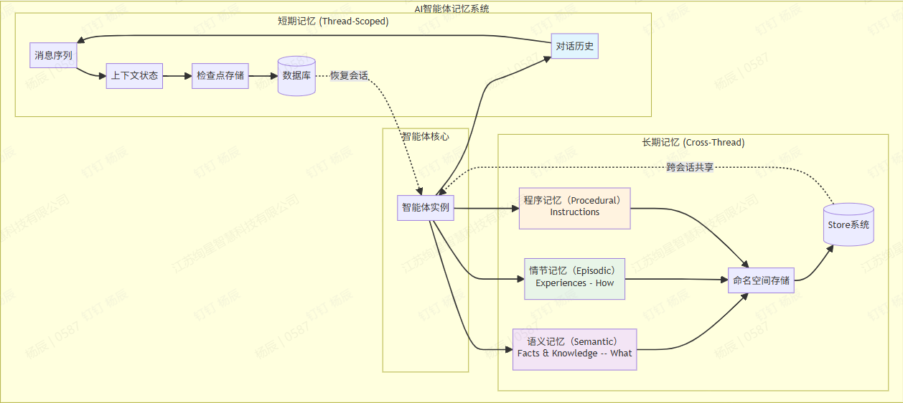

# Memory

## 为什么需要记忆

有了记忆，Agent才能：

- 记住用户喜欢喝美式咖啡而不是拿铁

- 在多轮任务中保持目标一致性

- 从失败中总结经验，实现自我进化

## 什么是记忆

LLM Memory（大语言模型记忆）：指的是LLM{==自身内部或其架构中==}实现的记忆机制，主要解决上下文长度限制和长期依赖建模问题。

RAG：指的是通过外部数据库检索相关信息，并将其注入到LLM上下文中，从而增强生成质量的方法。

{==Agent Memory（智能体记忆）：指的是Agent作为一个独立的“个体”所拥有的、可管理、可演化、可跨任务复用的外部记忆系统。==}

Context Engineering：是所有记忆与信息处理方式的统一入口和核心协调模块。它决定了哪些信息被选中、何时使用、如何组织成上下文输入给LLM。上下文工程是桥梁——所有记忆技术最终都要通过它整合进LLM的推理流程。

## 记忆分类

### 1.短期记忆/工作记忆

短期记忆（Short-term Memory, STM）是智能体维护当前对话和任务的即时上下文系统，主要包括：

- 会话缓冲（Context）记忆：保留最近对话历史的滚动窗口，确保回答上下文相关性；

- 工作记忆：存储当前任务的临时信息，如中间结果、变量值等。

短期记忆实际上并不是真正让模型记住对话，而是将完整的对话历史作为 prompt 的一部分，和当前问题一起输入进大模型中，来让大模型获取到之前的对话。如果对话历史的 token < LLM 的 Content Window，那么就可以有效模拟记忆。

### 2.长期记忆

长期记忆（Long-term Memory, LTM）是智能体用于跨会话、跨任务长期保存知识的记忆形式。它对应于人类的大脑中持久保存的记忆，例如事实知识、过去经历等。长期记忆的实现通常依赖于外部存储或知识库，包括但不限于：

- 摘要记忆：将长对话内容提炼为关键摘要存储；

- 结构化知识库：使用数据库或知识图谱存储结构化信息；

- 向量化存储：通过向量数据库实现基于语义的记忆检索。

长期记忆使智能体能够随着时间累积经验和知识，它特别适用于知识密集型应用和需要长期个性化的场景。

## 记忆来源

- 试验内信息：在同一个任务里多次尝试的经验。

- 跨试验信息：即跨任务/跨尝试的历史经验。

- 外部知识：来自工具、API、知识库等。

前两类是在智能体——环境交互过程中动态生成的，而后者是交互循环之外的静态信息。

## 形式

目前主要有三种形式：词元级文本形式、参数形式以及潜在形式。

- 词元级文本形式中：把记忆存成自然语言或结构化文本，放在向量库、日志、图谱里，需要用时再检索召回。是目前比较主流的记忆实现方式。（如RAG、对话日志等）

- 参数形式：记忆信息被编码进模型的参数权重中，从而隐式地影响智能体的行为。

- 潜在形式：记忆信息被存在于某些内部的非参数化表征空间中，通过动态生成、复用或变换内部激活状态来实现高效推理。

### 1.词元级文本形式

词元级文本形式可以采用非结构化表示（如自然语言，1D），也可采用结构化形式（如图结构2D，树结构2D，多层级结构3D），通常具有更好的可解释性、更简单的实现方式以及更快的读写效率。

根据存储策略又分四类：

- 完整交互记录：基于长上下文策略，将所有智能体——环境交互历史完整存储。

- 近期交互记录：基于局部性原理。

- 检索式交互记忆：基于相关性、重要性或主题选择记忆内容，确保远期但关键的记忆能参与决策，从而克服仅依赖近期信息的局限。

- 外部知识：为获取更多信息，部分智能体通过调用工具将外部知识转化为自身记忆。常见做法是通过API调用、MCP工具访问公开资源。

### 2.参数形式

另一种方式是将记忆表示为参数形式，存储在模型权重里。它不占用上下文长度，因此不受LLM上下文长度限制。主要分为微调方法和记忆编辑方法。

- 微调方法：通过监督微调将领域知识注入LLM参数，使其具备专家级记忆。

- 记忆编辑方法：直接针对特定事实进行精准修改，不影响其他知识，更适合小规模、在线更新。

### 3.潜在形式

潜在形式隐式地存储于模型内部表征空间（例如KV缓存、激活值、隐藏状态、潜在嵌入向量）中，在推理时随着输入逐步生成，是当前上下文的动态编码结果。

### 4.总结

- 对于需频繁回忆近期上下文的任务（如对话、个人助手），文本记忆更有效。

- 对于需要固化隐式、抽象且可泛化的领域知识的场景（如领域角色扮演、数学解题等），参数记忆更合适。

- 对于需要在单次交互中动态跟踪状态、实时整合多模态或复杂上下文的任务（如长视频理解、具身导航、多模态记忆），潜在记忆更具优势。

## 操作

记忆是一个动态系统。Agent和环境交互时，涉及三个关键操作阶段：记忆形成、记忆管理和记忆检索。

### 1.记忆形成

记忆形成就是把原始上下文（比如对话或图像）压缩成紧凑知识的过程。基于信息压缩的粒度和编码逻辑，可分为：语义摘要、知识蒸馏、结构化构建、潜在表征、参数内化。

### 2.记忆管理

一旦形成了新的记忆，下一步就是将其与现有记忆库整合，确保长期知识的紧凑性、一致性和相关性。

记忆管理机制就是来整合新旧记忆，从而实现生成更高层次的记忆，遗忘不重要或者过时的信息，并解决逻辑冲突。

### 3.记忆检索

记忆检索就是在恰当的时机，从特定记忆库中提取相关且简洁的知识片段，以支持当前推理任务的过程。

该过程可分为四个阶段：

1. 检索时机与意图：这是整个检索流程的起点，“何时”以及“为何”触发记忆检索。

2. 查询构建：用户输入往往模糊、不完整或语义复杂，难以直接用于高效检索。因此，必须对原始查询进行语义增强与重构，以生成高质量的检索信号。

3. 检索策略：此阶段执行实际搜索操作，根据记忆存储形式与任务需求，采用不同的检索范式。 

4. 检索后处理：检索返回的结果往往是冗余、不一致或不相关的原始片段。为此，需进行后处理以优化最终输入。如重排序和过滤、聚合与压缩。

## 评估

那么如何评估记忆模块的效果呢？一是直接评估：独立衡量记忆模块本身的能力。二是间接评估：通过端到端的智能体任务表现来评估记忆模块。

### 1.直接评估

此类方法将智能体的记忆视为一个独立组件，并对其有效性进行单独评估。现有研究可分为两类：主观评估与客观评估。

- 主观评估：依赖人工判断，在缺乏客观标准答案的场景中尤为常用。

!!! note "主观评估"
    主观评估涉及两个关键问题：（1）评估哪些维度（2）如何执行评估过程。
    
    评估维度可以是连贯性、合理性。

- 客观评估：基于数值指标，便于不同记忆模块之间的量化比较。主流指标有：结果正确性、引用准确性、时间与硬件开销。

### 2.间接评估

通过任务完成效果间接评估记忆模块。核心逻辑就是：如果任务高度依赖记忆，而Agent又做成了——那记忆模块大概率是OK的。

常见的任务有对话任务、多源问答任务、长上下文应用场景任务。

## Reference

[AI Agent 入门指南（四）：Memory 记忆机制综述](https://zhuanlan.zhihu.com/p/1995813479794353043)

[Agent 的三大模块（一）——记忆 Memory](https://shmily101.github.io/post/agent/002-agent-memory)

[万字解析 Agent Memory 实现](https://blog.csdn.net/HJS123456780/article/details/151077509)

[Agentic AI基础设施实践经验系列（三）：Agent记忆模块的最佳实践](https://aws.amazon.com/cn/blogs/china/agentic-ai-infrastructure-deep-practice-experience-thinking-series-three-best-practices-for-agent-memory-module/)

