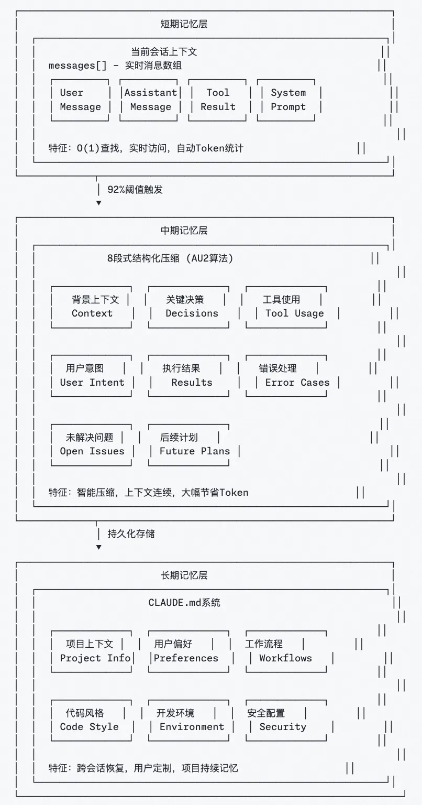

# 上下文工程实践

在上下文工程领域，有三个产品代表了不同的实践方向：

1. LangChain：代表 Agent 框架和工具集合，早期的 Agent 框架，提供了各种Agent开发的基础设施，提出了一套上下文管理的方法论。

2. Claude Code：代表 Code Agent 能力上限，编码 Agent 的能力标杆，在长短记忆、分层多 Agent 协作等方面有独到实践。

3. Manus：重新展现 Agent 能力，让 Agent 回到大众视野，带动 MCP 发展，在工具使用、缓存设计等方面有独到实践。

## 1.LangChain

### 1.1 上下文卸载

并非所有上下文都要保存在消息历史中，可将部分信息卸载到外部系统。

做法：使用文件系统保存工具调用结果，仅在上下文中保留引用，在需要时再通过检索加载完整内容。

### 1.2 上下文缩减

控制上下文窗口长度，防止性能下降。

做法：摘要工具输出；修剪旧的工具调用；自动触发压缩机制。

### 1.3 上下文检索

按需动态检索上下文，而非全量加载。

做法：

- 语义检索+向量检索

- 文件系统+简单命令（bash command:grep/glob）

### 1.4 上下文隔离

做法：多智能体结构，每个子智能体有独立上下文窗口，实现关注点分离。

### 1.5 上下文缓存

缓存关键上下文片段，避免重复处理；提升智能体在长会话、多轮推理下的性能。

## 2.Claude Code

### 2.1 三层记忆架构

在长对话中，上下文管理面临token限制导致信息丢失、传统压缩方法破坏上下文连续性、无法支持复杂多轮协作任务等挑战。

Claude Code构建了三层记忆系统：短期记忆（当前对话）、中期记忆（智能压缩）、长期记忆（CLAUDE.md项目知识库），实现从实时访问到持久化存储的完整覆盖。

关键要点：

- 92%阈值自动触发智能压缩

- 8段式结构化保存核心信息

- 跨会话恢复项目背景和用户偏好

### 2.2 实时 Steering 机制

传统 Agent 无法中断，用户必须等待完整执行结束才能调整方向，导致资源浪费和用户体验差，无法应对动态变化的需求。

Claude Code 的解决方案是采用异步消息队列 + 主循环的双引擎设计，支持实时中断和恢复，用户可以随时调整任务方向，系统自动保存状态并无缝切换。

关键要点：

- 异步消息队列支持实时中断。

- 主循环自适应流程控制。

- 流式输出提供持续交互反馈。

### 2.3 分层多 Agent 协作

复杂任务需要并发处理多个子任务，单 Agent 模式容易出现上下文污染、资源竞争和故障传播，影响整体执行效率和稳定性。

Claude Code 的解决方案是采用主 Agent 负责任务协调，SubAgent 执行专项任务，实现隔离执行环境，调度器控制最多 10 个工具并发，确保任务隔离和资源优化。

### 2.4 动态上下文注入

用户在对话中提及文件或概念时，系统无法自动关联相关信息，导致模型缺乏必要的上下文背景，影响响应质量和准确性。

Claude Code 的解决方案是智能检测用户意图中的文件引用，自动读取相关内容并注入上下文，基于依赖关系推荐相关文件，提供语法高亮和格式化显示，最大20文件8K Token限制。

关键要点：

- 自动识别和注入相关文件内容。

- 智能推荐基于依赖关系分析。

- 容量控制和格式优化提升体验。

## 3.Manus

### 3.1 为什么需要上下文工程

- 模型微调成本高、风险大

- 应用快速演进期更适合依赖通用模型+上下文控制

- 上下文工程是“模型与应用之间最清晰的边界”

### 3.2 上下文缩减：压缩与摘要

#### 3.2.1 压缩

每次工具调用结果有两种格式：

*   完整格式（含全部字段）

*   紧凑格式（去除可重建字段，仅保留路径或引用）

可逆（reversible）缩减，不丢失信息，只是外部化。  

触发机制：

*   当上下文长度达到“腐烂前阈值”（128k~200k tokens）时触发压缩；

*   仅压缩历史 50% 工具调用，保留近期完整内容。

#### 3.2.2 摘要

*   不可逆操作，用于超大上下文；

*   在压缩收益变低时启用；

*   摘要前会将完整内容卸载到外部文件系统；

*   使用结构化模式生成摘要（非自由文本）。

### 3.3 上下文隔离：通信与共享内存模式

两种模式：

| 模式 | 特点 | 适用场景 |
| ---------- | ---------- | ---------- |
| 通过通信共享内存（“agent as tool”） | 主智能体以任务指令调用子智能体 | 明确、独立任务 |
| 通过共享上下文 | 子智能体可见完整上下文，拥有独立 action space | 复杂研究、分析型任务 |

权衡点：

*   共享上下文消耗高（预填充 Token、不可复用 KV 缓存）

*   通信模式简单高效但信息不完整

### 3.4 上下文卸载：分层式行为空间

为避免“上下文混淆”（过多工具导致模型混乱），Manus 将工具空间分为三层：

| 层级 | 内容 | 特点 |
| ------ | ------ | ------ |
| 第1层：函数调用 | 原子函数（读写文件、搜索、Shell 命令 | Schema 安全、缓存友好 |
| 第2层：沙盒工具 | 在虚拟机内运行的系统命令，如 grep、MCP CLI | 可扩展功能、不破坏缓存 |
| 第3层：代码与 API | 通过 Python 脚本或 API 访问外部服务 | 高可组合性、适合重计算任务|

关键特征：

*   所有层最终仍以标准函数调用形式执行；

*   行为空间正交（orthogonal），缓存一致；

*   提升系统模块化与灵活性。

### 3.5 五个核心维度的平衡

上下文工程的五个维度：

> 卸载（offload）- 缩减（reduce）- 检索（retrieve）- 隔离（isolate）- 缓存（cache）

它们相互制衡：

*   卸载 + 检索 → 提高缩减效率

*   稳定检索 → 安全隔离

*   过度隔离 → 降低缓存与推理效率

上下文工程是一门艺术，需要在相互冲突的目标中找到平衡。

### 3.6 避免上下文过度工程

> “最重要的经验：少做加法，多做理解。”

*   过度的上下文管理层、复杂的检索机制常适得其反；

*   最有效的优化往往来自简化架构与信任模型。

## 4.Reference

[震惊！不微调也能让AI变强？Manus上下文工程揭秘，让大模型迭代速度提升10倍！](https://blog.csdn.net/m0_59235245/article/details/157402621#:~:)

[浅谈上下文工程｜从 Claude Code 、Manus 和 Kiro 看提示工程到上下文工程的转变](https://developer.aliyun.com/article/1686825)

[小白入门LLM Context上下文工程：从基础到实践，通俗易懂讲明白](https://blog.hehouhui.cn/archives/beginner-guide-to-llm-context-engineering-basics-to-practice)
