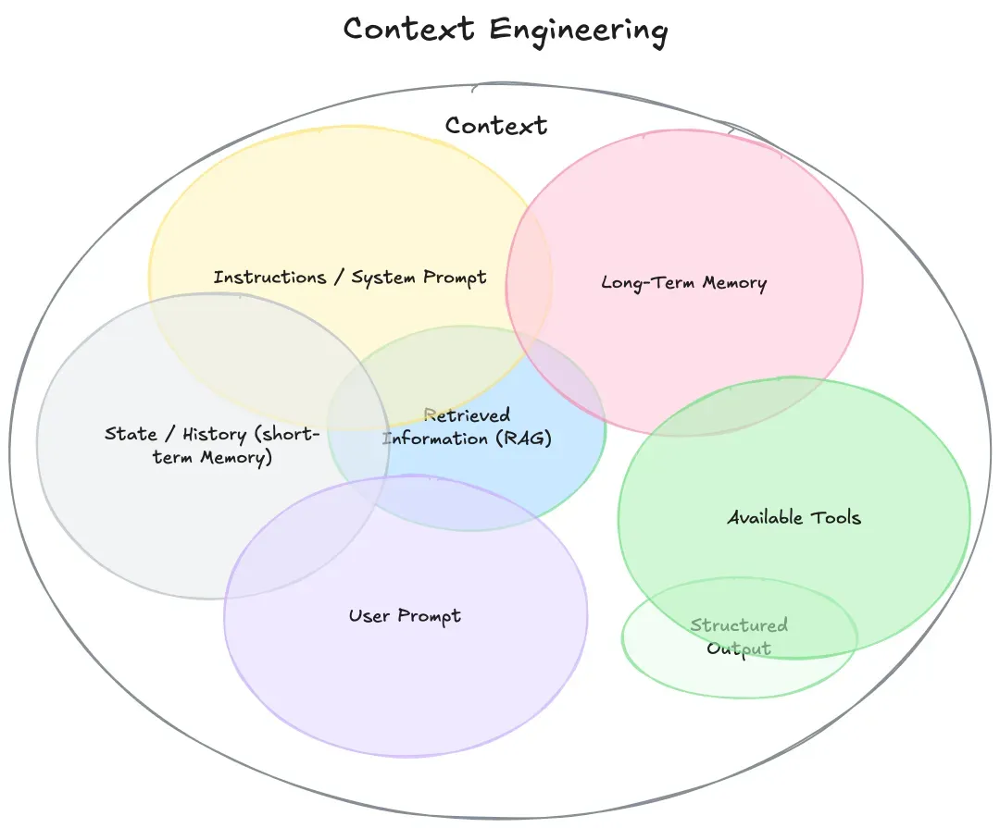

# 上下文工程

## 一、如何定义Context

很多人会认为上下文就是用户的历史聊天记录，显然这是不对的。上下文的内容涵盖了这一部分，从本质上说，上下文是提供给LLM的、用于完成下一步推理或生成任务的全部信息集合。即上图所示。

我们可以将上下文分成三类：

- 引导型上下文：这类上下文主要是明确指示模型的行为规范和操作指南，为模型执行任务提供方向性指引。

- 知识型上下文：这类上下文的核心价值在于向模型传递必要的认知基础，为解决问题提供事实依据和信息支撑。

- 操作型上下文：这类上下文的本质功能是赋予模型外部交互能力并反馈执行结果，使模型具备现实世界行动力。

如下图所示：

## 二、理解上下文工程

上下文工程是一门系统性学科，专注于设计、构建并维护一个动态系统，该系统负责在Agent执行任务的每一步，为其智能地组装出最优的上下文组合，以确保任务能够被可靠、高效地完成。

若把LLMs（或者更广泛的Agentic System）类比为新一代OS，那么LLM处于CPU的位置，上下文窗口则是RAM。

提示词工程本质是上下文工程的子模块，专注于精炼指导性上下文的构建；而RAG技术则承担动态生成信息性上下文的基础设施角色。

## 三、为什么需要上下文工程

- 降低AI失败率：大多数Agent失败不是模型问题，而是上下文不全。

- 保证一致性：AI能遵循你的项目模式和规范。

- 支持复杂特性：有了完整上下文，AI能处理多步实现。

- 自我修正：验证循环让AI能自动修正错误。

## 四、长上下文的Context-Rot问题

随着上下文长度的增加，模型的注意力机制可能会出现“腐蚀”现象，导致对关键信息的关注度下降。

问题表现：

- 产生幻觉后，会被持续带偏。  

- 模糊性导致信息冲突，模型的行为会变得不可预测。  

- 关键信息被稀释，随着上下文的增长，模型的注意力会被分散。  

- 大量重复文本导致的 "行动瘫痪"。  

影响因素：

- 上下文长度超过训练时的常见长度。  

- 模型能力的限制。  LLM 现在就像在一间封闭的屋子中，我们通过发短信和它交流，未来它需要更完善的五感。

- 信息密度不均匀分布。  

- 自然语言的模糊性。 

长上下文带来成本与协同压力，更易暴露四类上下文失效: 污染、干扰、混淆、冲突。它们常彼此耦合，并直接损害推理稳定性与跨代理传递。

- 上下文污染(Context Poisoning)，主要是幻觉进入 Context 导致异常结果。

- 上下文干扰(Context Distraction)，当 Context 接近溢出时，模型训练中获得的知识会被“覆盖"导致模型降智。

- 上下文混淆(Context Confusion)，冗余且不相关的 Context 让输出结果偏离期望。

- 上下文冲突(Context Clash)，当上下文中的信息互相矛盾时，比如上下文存在过去错误的答案。

## 五、未来展望：从上下文工程到环境工程

LLM 现在就像在一间封闭的屋子中，我们通过发短信和它交流，未来它需要更完善的五感。

上下文工程仍是中间态，环境工程是终极目标。

为什么环境工程是终极目标？

1. 环境不仅包含上下文，还包括动态变化的世界状态、规则、交互历史、反馈机制等。

2. AI Agent 不再只是 "被动" 接受上下文，而是 "主动" 感知、探索、影响环境。

3. 环境工程强调 AI 与环境的双向作用，支持持续学习、自适应、协作等更复杂的智能行为。

4. 在环境工程中，AI 的输入输出不再局限于文本或结构化数据，而是包括真实世界的感知、动作和长期影响。

## Reference

[上下文工程Context Engineering，看这一篇就够了！](https://zhuanlan.zhihu.com/p/1945173424726058681)

[【LLM研究综述】《大语言模型上下文工程综述（全文）》](https://zhuanlan.zhihu.com/p/1934605504165950750)

[浅谈上下文工程｜从 Claude Code 、Manus 和 Kiro 看提示工程到上下文工程的转变](https://developer.aliyun.com/article/1686825)
