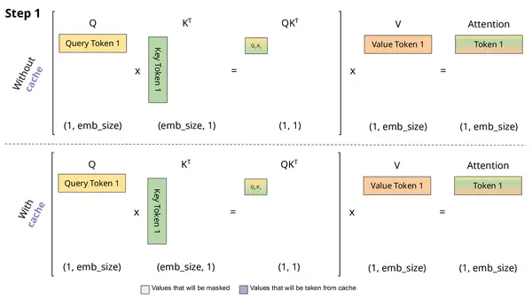

# Prefill 和 Decode

## 1.预填充阶段

Prefill发生在模型接收到完整输入prompt之后，但在开始生成第一个输出token之前。这个阶段的主要任务是处理输入的prompt，计算出所有输入token的上下文表示，并初始化后续解码阶段所需的关键数据结构——KV Cache。

具体的计算流程和复杂度参见：[第二章：推理加速核心：预填充（Prefill）与解码（Decode）的深度解析与实现](https://zhuanlan.zhihu.com/p/1900479313331073118)。

在Prefill阶段，对于Transformer的每一层，模型都会计算得到K和V矩阵。这些K和V矩阵会被缓存起来，这就是KV Cache。KV Cache的结构可以看成一个多维数组，按层、按注意力头、按token位置存储了key和value的信息。

Prefill的特点在于高度的并行性。由于整个输入Prompt在开始时是已知的，模型可以同时计算所有token在每一层的表示。这使得预填充阶段能够充分利用GPU的并行计算能力，显著提高处理速度。

为了进一步优化预填充阶段的性能，主流的技术包括：

- 高效注意力机制（Efficient Attention Mechanisms）：如FlashAttention： 这是一种通过重新组织注意力计算过程，减少GPU内存读写次数，从而显著加速计算的高效注意力机制。它尤其在处理长序列时表现出色。

- 批处理（Batching）：在实际应用中，通常会同时处理多个独立的推理请求。预填充阶段可以将这些请求的Prompt组成一个批次进行处理。通过批处理，可以更有效地利用GPU的计算资源，提高整体的吞吐量。

## 2.解码阶段

Decode在Prefill完成之后开始，模型以自回归的方式逐个生成输出token。每生成一个token，该token就会被添加到已生成的序列中，并作为下一步生成的输入。

Decode从Prefill处理的输入Prompt的最后一个token开始，目标是生成后续的输出序列。假设Prefill处理了 \(n\) 个输入token，Decode的目标是生成接下来的 \(m\) 个输出token \((y_1, y_2, ..., y_m)\)。

在每一步 \(t\)（从 1 到 \(m\)），模型会基于已经生成的序列 \(x_1, ..., x_n, y_1, ..., y_{t - 1}\) 来预测下一个token \(y_t\)。对于decoder-only模型，在解码的每一步，通常只将上一步生成的token作为当前Transformer层的输入（除了第一步，输入是预填充的最后一个token）。然而，模型内部的自注意力机制仍然可以访问包括原始Prompt和所有已生成token在内的完整序列的信息，这是通过KV Cache实现的。

KV Cache在Decode阶段是加速的关键。在Prefill阶段，我们已经为输入Prompt中的所有token计算了key和value向量并存储在KV Cache中。在解码的每一步，假设模型生成了一个新的token \(y_t\)。为了预测下一个token \(y_{t + 1}\)，模型需要计算 \(y_t\) 的key和value向量。然后，这个新的key和value向量会被追加到KV Cache中，扩展缓存的长度。

当模型在某一步需要计算自注意力时，对于当前要预测的token \(y_t\)（需要计算其query向量），它会与KV Cache中所有历史的key向量（包括来自原始Prompt和之前已生成的token）进行比较，计算注意力权重。然后，使用这些权重对KV Cache中对应的value向量进行加权求和，得到上下文信息。

## 3.单步解码的实现与性能分析

在解码阶段的每一步，模型主要进行以下操作：

1. 接收上一步生成的token的Embedding。
   
2. 计算该token在所有Transformer层的query、key和value向量。
   
3. 将当前生成token的key和value向量更新到KV Cache中。

4. 在自注意力计算中，当前token的query向量会与KV Cache中所有历史token的key向量进行比较，计算注意力权重。value向量会根据这些权重进行加权求和，得到上下文向量。

5. 模型最后一层的输出会经过线性层和Softmax函数，得到下一个token的概率分布。

6. 根据解码策略（例如采样）从概率分布中选择下一个token。

单步解码的计算成本主要在于自注意力机制的计算，其复杂度与当前KV Cache的长度（等于原始Prompt长度加上已生成的token数量）成正比。KV Cache的关键作用在于，它避免了在每一步都重新计算原始Prompt的key和value向量。然而，随着生成序列的长度增加，KV Cache的大小也会增长，可能导致内存带宽成为瓶颈。

## 4.Prefill 和 Decode 的协同工作

Prefill和Decode共同完成了LLM的推理过程。Prefill为Decode准备了初始的KV Cache，而Decode则迭代地利用和更新这个缓存来生成最终的输出。

数据流：输入Prompt -> Tokenization -> Embedding -> Prefill(生成KV Cache) -> Decode(逐个生成token) -> Detokenization -> 输出文本。

性能瓶颈：

- Prefill： 对于极长的输入Prompt，自注意力机制的计算量仍然很大，可能成为计算瓶颈。同时，加载模型权重和初始KV Cache的内存开销也需要考虑。
  
- Decode： 解码的串行自回归特性是主要的瓶颈。虽然KV Cache减少了重复计算，但每一步仍然需要进行注意力计算，并且随着生成序列的增长，KV Cache的大小也会增加，可能导致内存带宽瓶颈。此外，生成长序列会显著增加总的推理时间。

## Reference

[大模型推理探秘：揭开 LLM 响应](https://www.zhihu.com/column/c_1900478474017313428)

