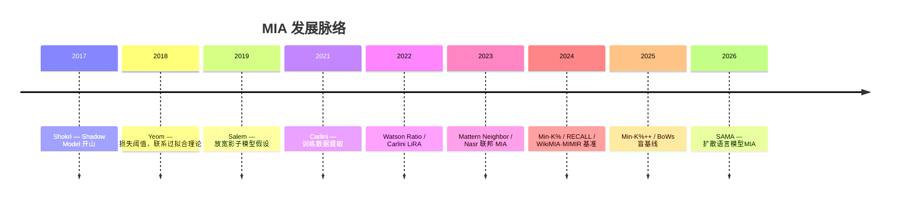
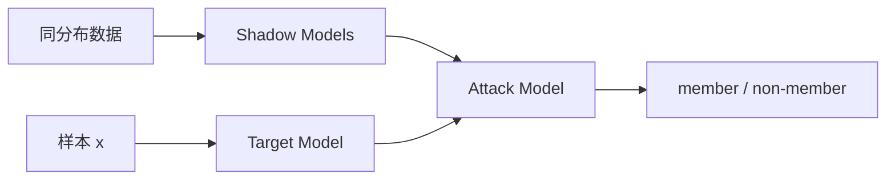

# Membership Inference Attack

成员推断攻击（Membership Inference Attack, MIA）：给定已训练模型与一条样本，判断该样本是否出现在训练集中。

核心假设：模型对训练成员的行为与分布相近的非成员不同——成员通常损失更低、置信度更高（过拟合与记忆）。

---

## 1. 威胁模型

| 类型 | 攻击者能力 | 典型方法 |
|------|------------|----------|
| 黑盒 | 仅 API 查询（logits/loss/标签） | Shokri：shadow model、Yeom：Loss、LiRA |
| 灰盒 | 黑盒 + 同架构参考模型 | Ratio |
| 白盒 | 梯度、参数、中间激活 | [联邦梯度 MIA](https://arxiv.org/abs/1805.04049) |

审计场景更关注 TPR@低 FPR（如 1% FPR），而非整体 AUC。

---

## 2. 发展历史

| 阶段 | 代表工作 | 贡献 |
|------|----------|------|
| 奠基（2017–2019） | Shokri、Yeom、Salem | 黑盒 MIA 框架；Shadow Training；损失阈值 |
| 假设检验（2022–2023） | LiRA、RMIA | 多参考模型似然比；低 FPR 下 SOTA |
| LLM 专用（2021–2025） | Carlini 2021、Ratio、Min-K%、RECALL | 预训练/微调数据检测；参考模型校准 |
| DLM（2026） | SAMA | 掩码多探测 + 符号聚合，解决 DLM 稀疏信号 |

---

## 3. 经典方法（分类模型）

按实现方式分三条线：

### 3.1 影子模型 + 攻击分类器（Shokri 2017）

攻击者无目标训练集，用同分布数据训练多个 Shadow Model，收集 (预测向量, in/out) 训练攻击网络。

Salem 2019（[ML-Leaks](https://arxiv.org/abs/1806.01246)）证明：单个影子模型、架构不一致时攻击仍有效，推动了更轻量的指标法。

### 3.2 指标 / 阈值法（Yeom 2018 起）

不训练攻击模型，用单一统计量判别：

| 指标 | 直觉 | 成员判定 |
|------|------|----------|
| 损失 \(L(x)\) | 过拟合 → 成员损失更低 | \(L(x) < \text{阈值}\) |
| 置信度 / 熵 | 成员预测更自信 | 置信度高 / 熵低 |
| 预测正确性 | 成员更易分类正确 | 预测 = 标签 |

Yeom 将 MIA 与泛化误差建立理论联系，是后续 LLM Loss 攻击的基础。

### 3.3 假设检验（LiRA / RMIA）

LiRA（Carlini 2022）：用多组 IN/OUT 参考模型估计似然比，图像分类上大幅超越 Shadow Model。

RMIA（2023）：对 \(\mathrm{LR}_\theta(x,z)=\Pr(\theta|x)/\Pr(\theta|z)\) 做组合检验，少量参考模型即可在低 FPR 下保持高 TPR。

Ratio / Loss Calibration：用参考模型剥离样本难度，\(\text{score} = \ell^{\text{R}} / \ell^{\text{T}}\)，是 LLM 灰盒 MIA 的强基线。

---

## 4. LLM 上的 MIA（自回归 ARM）

序列损失：\(\ell_i = -\log p(x_i \mid x_{<i})，\mathcal{M}^{\text{T}}\) 为目标模型，\(\mathcal{M}^{\text{R}}\) 为参考基座。成员通常 \(\ell^{\text{T}} < \ell^{\text{R}}\)。

| 方法 | 核心分数 | 适用 |
|------|----------|------|
| Loss | \(-\log p_{\mathcal{M}^{\text{T}}}(\mathbf{x})\) | 微调/小数据；预训练单 epoch 近随机 |
| Ratio | \(\ell^{\text{R}} / \ell^{\text{T}}\) | 灰盒微调审计首选 |
| ZLIB / Lowercase | 损失经压缩长度或大小写变换归一化 | 缓解长度/表面形式偏差 |
| Min-K% / Min-K%++ | 最低 \(k\%\) token 概率聚合 | 预训练数据检测 SOTA |
| Neighbor | 与邻域文本损失对比 | 无需训练集分布 |
| RECALL | 拼接非成员前缀后的条件似然比 | 条件上下文探测 |
| LiRA / RMIA | token 级似然聚合 | 成本高，参考模型需求大 |

预训练 vs 微调：海量数据 + 单 epoch 下多数 MIA 略优于随机；微调、重复样本、多 epoch 显著提高可检测性。审计微调优先 Ratio、Min-K%++、RECALL。

---

## 5. 扩散语言模型（DLM）与 SAMA

DLM 的 MIA 信号稀疏、掩码配置组合爆炸，ARM 方法（Loss、Min-K% 等）难以直接迁移。详见 [SAMA 论文笔记](../../essay/paper/sama.md)（ICLR 2026，掩码多探测 + 符号聚合）。

---

## 6. 防御

| 方向 | 机制 | 效果 |
|------|------|------|
| 差分隐私 | DP-SGD / DP-LoRA | 理论保证最强，效用下降 |
| 正则化 | L2、Dropout、早停 | 减轻过拟合型泄漏 |
| 置信度掩蔽 | Top-K / 仅标签 | 仅影响黑盒，LiRA 仍可部分绕过 |

---

## 7. 相关论文

### 综述

| 论文 | 说明 |
|------|------|
| [Hu et al., 2022](https://arxiv.org/abs/2103.07853) | ACM CSUR，经典 ML MIA 系统综述 |
| [牛俊等, 2022](https://doi.org/10.19363/J.cnki.cn10-1380/tn.2022.11.01) | 信息安全学报，189 篇中英文献梳理 |
| [Large-Scale Models Survey, 2025](https://arxiv.org/abs/2503.19338) | 覆盖 LLM/LMM 全 pipeline（预训练、微调、RAG）的 MIA 综述 |

### 传统 ML 阶段（2017–2023）

| 论文 | 会议/期刊 | 要点 |
|------|-----------|------|
| [Shokri et al., 2017](https://arxiv.org/abs/1610.05820) | IEEE S&P | Shadow Model 开山作 |
| [Yeom et al., 2018](https://arxiv.org/abs/1709.01604) | IEEE CSF | 损失阈值攻击，联系泛化误差 |
| [Salem et al., 2019](https://arxiv.org/abs/1806.01246) | USENIX Security | ML-Leaks，放宽影子模型假设 |
| [Hui et al., 2021](https://arxiv.org/abs/2101.01341) | NDSS | BlindMI，基于数据集差异（MMD）的盲 MIA |
| [Melis et al., 2019](https://arxiv.org/abs/1805.04049) | ICML | 联邦学习中梯度泄露与 MIA |
| [Nasr et al., 2019](https://arxiv.org/abs/1812.00910) | IEEE S&P | 深度学习综合隐私分析（含 MIA） |
| [Watson et al., 2022](https://arxiv.org/abs/2111.08440) | ICLR | Loss Calibration / Ratio |
| [Carlini et al., 2022](https://arxiv.org/abs/2112.03570) | IEEE S&P | LiRA，多参考模型似然比 |
| [Zarifzadeh et al., 2023](https://arxiv.org/abs/2312.03262) | arXiv | RMIA，低 FPR 稳健检验 |

### 自回归 LLM 阶段（2021–2025）

| 论文 | 会议/期刊 | 要点 |
|------|-----------|------|
| [Carlini et al., 2021](https://arxiv.org/abs/2012.07805) | USENIX Security | 从 LLM 提取训练数据；ZLIB / Lowercase |
| [Mattern et al., 2023](https://arxiv.org/abs/2305.18462) | ACL Findings | Neighbor，邻域文本损失对比 |
| [Shi et al., 2024](https://arxiv.org/abs/2310.16789) | ICLR | Min-K%；WikiMIA 基准 |
| [Zhang et al., 2025](https://arxiv.org/abs/2404.02936) | ICLR Spotlight | Min-K%++，理论化 token 级检测 |
| [Xie et al., 2024](https://arxiv.org/abs/2406.15968) | EMNLP | RECALL，非成员前缀条件似然 |
| [Wang et al., 2025](https://arxiv.org/abs/2409.03363) | COLING | Con-ReCall，成员/非成员前缀对比 |
| [Das et al., 2025](https://arxiv.org/abs/2406.16201) | ICLR DATA-FM | BoWs 盲基线，检验分布偏移混杂 |
| [Dang et al., 2024](https://arxiv.org/abs/2402.07841) | arXiv | Mimir 统一评测框架；预训练 MIA 近随机 |
| [He et al., 2025](https://arxiv.org/abs/2502.18943) | USENIX Security | PETAL，预训练 LLM 的 label-only MIA |
| [Chen et al., 2024](https://arxiv.org/abs/2412.13475) | arXiv | 预训练 MIA 大规模复现；多数方法近随机 |

### 扩散模型 / DLM 阶段

| 论文 | 会议/期刊 | 要点 |
|------|-----------|------|
| [Duan et al., 2023](https://arxiv.org/abs/2302.01316) | ICML | SecMI，图像扩散逐步误差比较 |
| [Kong et al., 2024](https://arxiv.org/abs/2305.18355) | ICLR | PIA，Proximal Initialization |
| [Chen et al., 2026](https://arxiv.org/abs/2601.20125) | ICLR | SAMA，DLM 首次系统 MIA |

### 基准与工具

| 资源 | 链接 | 说明 |
|------|------|------|
| WikiMIA | [HuggingFace](https://huggingface.co/datasets/swj0419/WikiMIA) | 预训练数据检测基准（Shi et al.） |
| Mimir | [GitHub](https://github.com/iamgroot42/mimir) | LLM MIA 统一评测仓库（Dang et al.） |
| Min-K%++ | [GitHub](https://github.com/zjysteven/mink-plus-plus) | Min-K%++ 官方实现 |
| RECALL | [GitHub](https://github.com/ruoyuxie/recall) | RECALL 官方实现 |
