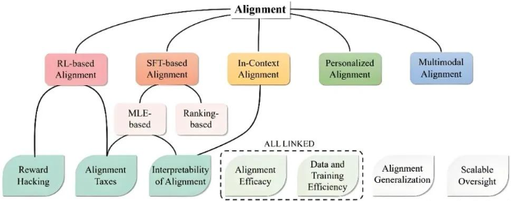
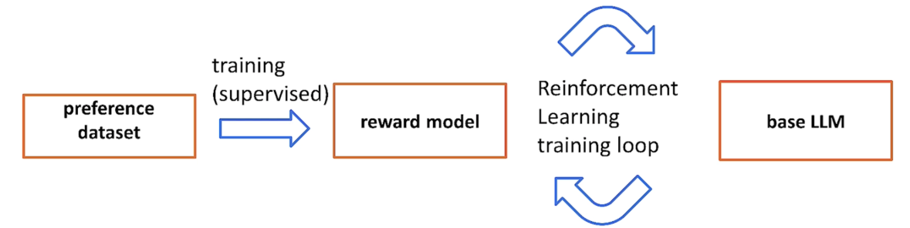

# Alignment

## 1.大模型的对齐是什么？

对齐指的是让大语言模型的行为、输出和决策方式与其设计者(人类操作者)的意图、价值观和指令保持一致的过程。

对齐的目标：

- 听懂人话：确保模型能理解你的真实意图

- 安全：不生成有害/歧视/非法内容

- 价值观正向：输出的内容符合广泛认可的伦理标准

- 诚实可信：不知道就直说不知道，不胡编乱造

- 实用主义：输出简洁清晰、结构合理、符合常识

## 2.为什么要对齐？

1. 安全性：避免有害输出（包括仇恨言论、歧视性内容、暴力、色情等信息）；防止滥用（防止模型被用于进行欺诈、制造垃圾邮件、传播恶意软件、进行社会攻击等）；增强鲁棒性（让模型不容易被恶意提示诱导去做坏事）。

2. 可用性和可靠性：指令遵循（让模型能准确理解并执行用户的具体要求）；保持真实性（让模型不胡编乱造，尽量基于事实推理，减少模型幻觉）；符合用户期望（让模型的输出方符合人类用户的合理预期）；道德判断（在涉及道德两难问题时，能输出符合社会普遍伦理的答案或拒绝回答，而不是给出危险建议）。

3. 可信度和实用性：一个行为符合预期、安全可靠、能够遵循指令的模型才真正有用，才能被用户信任并应用于各种严肃场景。

## 3.SFT

SFT(Supervised Fine-Tuning) 是监督微调，特指在预训练模型(如大语言模型)基础上，通过少量标注数据调整模型参数，使其适应特定任务的技术。SFT需要人工整理标签进行学习，模型结构与Pre-training模型相同，但预训练使用的数据为连续的文本，SFT要人工梳理问题与对应的答案，并且数据一般是特定任务数据集，标注数据内容围绕特定任务展开。

SFT一般只需要对response部分进行loss计算，无需对prompt部分计算loss。

SFT具体实现方法有可以进行全量微调，也可以使用少量参数对大模型进行微调，比如LoRA方法等。

## 4.RLHF

RLHF（Reinforcement Learning from Human Feedback）是人类反馈强化学习，主要用于微调语言模型以使其行为更符合人类的需求或偏好，利用人类提提供的反馈数据指导模型优化，这种方法特别适用于那些难以通过传统监督学习方法获得高质量标签数据的情况。

RLHF的步骤为：

1. 多种策略产生样本并收集人类反馈（SFT）

2. 训练奖励模型（Reward Model）

3. 训练强化学习策略，微调LM（Reinforcement Learning）

## 5.对齐的挑战

- 意图的模糊性: 人类的意图(尤其是隐含的、复杂的意图)本身就不容易清晰定义。

- “价值观”的多样性: 不同文化、不同群体、甚至不同个人之间的价值观可能存在冲突。对齐到谁的价值观?(通常目标是主流、无害、普世的价值观，但这本身也有争论)。

- 过度对齐的风险：如果对齐得“太紧”，可能会导致模型过于保守、缺乏创造力、不敢表达任何可能有争议但合理的观点。

- 评估困难: 如何客观、全面地评估一个模型是否对齐?这本身也是一个研究难点(称为“对齐评估”)。

## Reference

[AI大模型中的对齐（Alignment）是什么？为什么要做对齐？](https://zhuanlan.zhihu.com/p/1916821537769625444)

[SFT 是什么?大模型SFT（监督微调）该怎么做（经验技巧+分析思路）](https://zhuanlan.zhihu.com/p/1933109386949145022)

[RLHF是什么？一文说清RLHF（人类反馈强化学习）的概念和实现过程](https://zhuanlan.zhihu.com/p/1899472091121682346)

