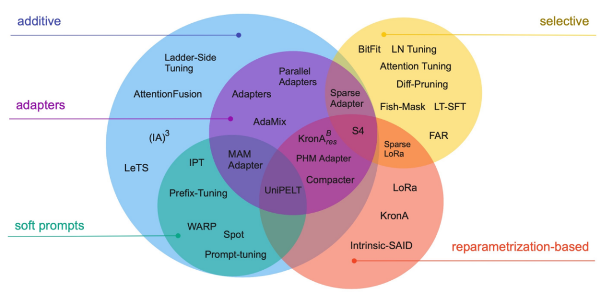

# Fine-tuning 微调

## 1.什么是Fine-tuning？

首先，我们有一个预训练的模型，这个模型已经在大量的数据上训练过，然后再在特定的任务数据上继续训练这个模型，使其适应新的任务。

为什么要微调？通用大模型虽然强大，但在特定领域可能表现不佳。通过微调，可以使模型更好地适应特定领域的需求和特征。

## 2.Full Fine-Tuning 全量微调

全量微调利用特定任务数据调整预训练模型的所有参数，以充分适应新任务。它依赖大规模计算资源，但能有效利用预训练模型的通用特征。

## 3.PEFT 参数高效微调

PEFT(Parameter-Efficient Fine-Tuning)旨在通过最小化微调参数数量和计算复杂度，实现高效的迁移学习。它仅更新模型中的部分参数，显著降低训练时间和成本，适用于计算资源有限的情况。PEFT技术包括Prefix Tuning、Prompt Tuning、Adapter Tuning等等。

### 3.1 Prefix Tuning

与传统的微调范式不同，前缀调整提出了一种新的策略，即在预训练的语言模型输入序列前添加可训练、任务特定的前缀，从而实现针对不同任务的微调。这意味着我们可以为不同任务保存不同的前缀，而不是为每个任务保存一整套微调后的模型权重，从而节省了大量的存储空间和微调成本。

前缀实际上是一种连续可微的虚拟标记（Soft Prompt/Continuous Prompt），与离散的Token相比，它们更易于优化并且效果更佳。这种方法的优势在于不需要调整模型的所有权重，而是通过在输入中添加前缀来调整模型的行为，从而节省大量的计算资源，同时使得单一模型能够适应多种不同的任务。前缀可以是固定的（即手动设计的静态提示）或可训练的（即模型在训练过程中学习的动态提示）。

### 3.2 Prompt Tuning

提示调整是一种在预训练语言模型输入中引入可学习嵌入向量作为提示的微调方法。这些可训练的提示向量在训练过程中更新，以指导模型输出更适合特定任务的响应。

提示调整与前缀调整都涉及在输入数据中添加可学习的向量，这些向量是在输入层添加的，但两者的策略和目的不同：

- 提示调整：旨在模仿自然语言中的提示形式，将可学习向量（通常称为提示标记）设计为模型针对特定任务生成特定类型输出的引导。这些向量通常被视为任务指导信息的一部分，倾向于使用较少的向量来模仿传统的自然语言提示。

- 前缀调整：可学习前缀更多地用于提供输入数据的直接上下文信息，作为模型内部表示的一部分，可以影响整个模型的行为。

### 3.3 P-Tuning

P-Tuning（基于提示的微调）和提示调整都是为了调整大型预训练语言模型（如GPT系列）以适应特定任务而设计的技术。两者都利用预训练的语言模型执行特定的下游任务，如文本分类、情感分析等，并使用某种形式的“提示”或“指导”来引导模型输出，以更好地适应特定任务。

P-Tuning使用一个可训练的LSTM模型（称为提示编码器prompt_encoder）来动态生成虚拟标记嵌入，允许根据输入数据的不同生成不同的嵌入，提供更高的灵活性和适应性，适合需要精细控制和理解复杂上下文的任务。这种方法相对复杂，因为它涉及一个额外的LSTM模型来生成虚拟标记嵌入。

### 3.4 P-Tuning v2

P-Tuning v2是P-Tuning的进一步改进版，在P-Tuning中，连续提示被插入到输入序列的嵌入层中，除了语言模型的输入层，其他层的提示嵌入都来自于上一层。这种设计存在两个问题：

- 第一，它限制了优化参数的数量。由于模型的输入文本长度是固定的，通常为512，因此提示的长度不能过长。

- 第二，当模型层数很深时，微调时模型的稳定性难以保证；模型层数越深，第一层输入的提示对后面层的影响难以预测，这会影响模型的稳定性。

P-Tuning v2的改进在于，不仅在第一层插入连续提示，而是在多层都插入连续提示，且层与层之间的连续提示是相互独立的。这样，在模型微调时，可训练的参数量增加了，P-Tuning v2在应对复杂的自然语言理解(NLU)任务和小型模型方面，相比原始P-Tuning具有更出色的效能。

### 3.5 Adapter Tuning

与LoRA技术类似，适配器调整的目标是在保留预训练模型原始参数不变的前提下，使模型能够适应新的任务。适配器调整的方法是在模型的每个层或选定层之间插入{==小型神经网络模块==}，称为“适配器”。这些适配器是可训练的，而原始模型的参数则保持不变。

适配器调整的关键步骤包括：

- 以预训练模型为基础：初始阶段，我们拥有一个已经经过预训练的大型模型，如BERT或GPT，该模型已经学习了丰富的语言特征和模式。

- 插入适配器：在预训练模型的每个层或指定层中，我们插入适配器。适配器是小型的神经网络，一般包含少量层次，并且参数规模相对较小。

- 维持预训练参数不变：在微调过程中，原有的预训练模型参数保持不变。我们不直接调整这些参数，而是专注于适配器的参数训练。

- 训练适配器：适配器的参数会根据特定任务的数据进行训练，使适配器能够学习如何根据任务调整模型的行为。

- 针对任务的调整：通过这种方式，模型能够对每个特定任务进行微调，同时不影响模型其他部分的通用性能。适配器有助于模型更好地理解和处理与特定任务相关的特殊模式和数据。

- 高效与灵活：由于只有部分参数被调整，适配器调整方法相比于全模型微调更为高效，并且允许模型迅速适应新任务。

例如，如果我们有一个大型文本生成模型，它通常用于执行广泛的文本生成任务。若要将其微调以生成专业的金融报告，我们可以在模型的关键层中加入适配器。在微调过程中，仅有适配器的参数会根据金融领域的数据进行更新，使得模型更好地适应金融报告的写作风格和术语，同时避免对整个模型架构进行大幅度调整。

### 3.6 LoRA

LoRA（Low-Rank Adaptation）是一种旨在微调大型预训练语言模型的技术。其核心理念在于，在模型的决定性层次中引入小型、低秩的矩阵来实现模型行为的微调，而无需对整个模型结构进行大幅度修改。

这种方法的优势在于，在不显著增加额外计算负担的前提下，能够有效地微调模型，同时保留模型原有的性能水准。

LoRA的操作流程如下：

- 确定微调目标权重矩阵：首先在大型模型（例如GPT）中识别出需要微调的权重矩阵，这些矩阵一般位于模型的MHA和FFN部分。

- 引入两个低秩矩阵：然后，引入两个维度较小的低秩矩阵\(A\)和\(B\)。假设原始权重矩阵的尺寸为\(\mathbb{R}^{d\times d}\)，则\(A\)和\(B\)的尺寸可能为\(\mathbb{R}^{d\times r}\)和\(\mathbb{R}^{r\times d}\)，其中\(r\ll d\)。

- 计算低秩更新：通过这两个低秩矩阵的乘积\(AB\)来生成一个新矩阵，其秩（即\(r\)）远小于原始权重矩阵的秩。这个乘积实际上是对原始权重矩阵的一种低秩近似调整。

- 结合原始权重：最终，新生成的低秩矩阵\(AB\)被叠加到原始权重矩阵上。因此，原始权重经过了微调，但大部分权重维持不变。这个过程可以用数学表达式描述为：新权重 = 原始权重 + \(AB\)。

以一个具体实例来说，假设我们手头有一个大型语言模型，它通常用于执行广泛的自然语言处理任务。现在，我们打算将其微调，使其在处理医疗健康相关的文本上更为擅长。采用LoRA方法，我们无需直接修改模型现有的大量权重。相反，只需在模型的关键部位引入低秩矩阵，并通过这些矩阵的乘积来进行有效的权重调整。这样一来，模型就能更好地适应医疗健康领域的专业语言和术语，同时也避免了大规模权重调整和重新训练的必要。

### 3.7 QLoRA

QLoRA（Quantized Low-Rank Adaptation）是一种结合了LoRA方法与深度量化技术的高效模型微调手段。QLoRA的核心在于：

- 量化技术：QLoRA采用创新的技术将预训练模型量化为4位。这一技术包括低精度存储数据类型（4-bit NormalFloat，简称NF4）和计算数据类型（16-bit BrainFloat）。这种做法极大地减少了模型存储需求，同时保持了模型精度的最小损失。

- 量化操作：在4位量化中，每个权重由4个比特表示，量化过程中需选择最重要的值并将它们映射到16个可能的值之一。首先确定量化范围（例如-1到1），然后将这个范围分成16个区间，每个区间对应一个4-bit值。然后，原始的32位浮点数值将映射到最近的量化区间值上。

- 微调阶段：在训练期间，QLoRA先以4-bit格式加载模型，训练时将数值反量化到bf16进行训练，这样大幅减少了训练所需的显存。例如，33B的LLaMA模型可以在24 GB的显卡上进行训练。

量化过程的挑战在于设计合适的映射和量化策略，以最小化精度损失对性能的影响。在大型模型中，这种方法可以显著减少内存和计算需求，使得在资源有限的环境下部署和训练成为可能。

## 4.模型选择

- 优先选择开源模型

- 选择模型要考虑持续更新能力

- 参数量（如7B、72B、175B）需通过测试评估，通常从小到大或者从大到小测试，找到既能达到想要的效果，模型大小又足够轻量的模型

## 5.数据需求

- 数据必须真实，例如真实语音、真实聊天记录；

- 详细打标签：如发言角色、年龄、情绪、专业度、服务态度等；

- 标签分布要合理，训练集与验证集、测试集要保持标签比例一致；

- 避免过度偏好，保证模型在各类场景中都能均衡表现；

- 重点场景加强数据量，尤其是复杂对话、多变细节；

- 根据模型表现，动态调整、增强数据。

## Reference

[【大模型开发 】 一文搞懂Fine-tuning（大模型微调）](https://blog.csdn.net/qq_39172059/article/details/136693607)

[深度理解Fine-Tuning（微调）：从原理到实操](https://juejin.cn/post/7497230252017582131)

[一文搞懂Fine-tuning（大模型微调）](https://zhuanlan.zhihu.com/p/26501304260)

