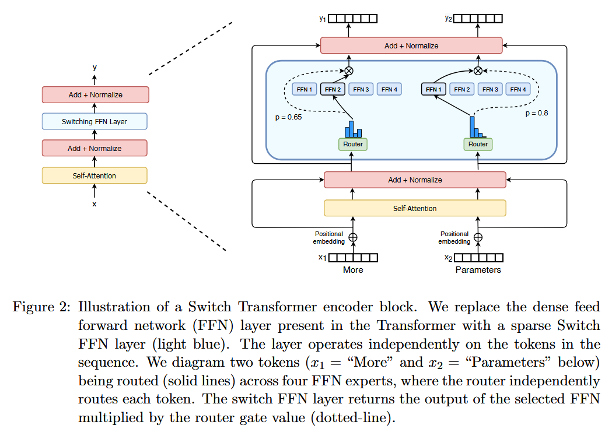
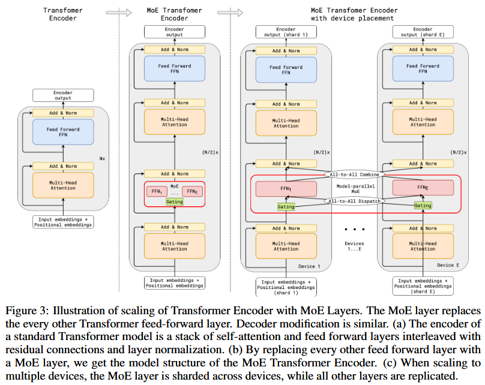
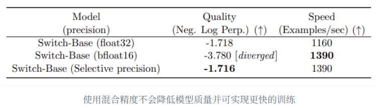
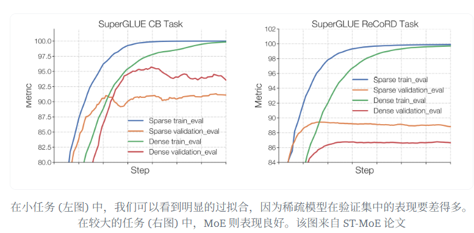
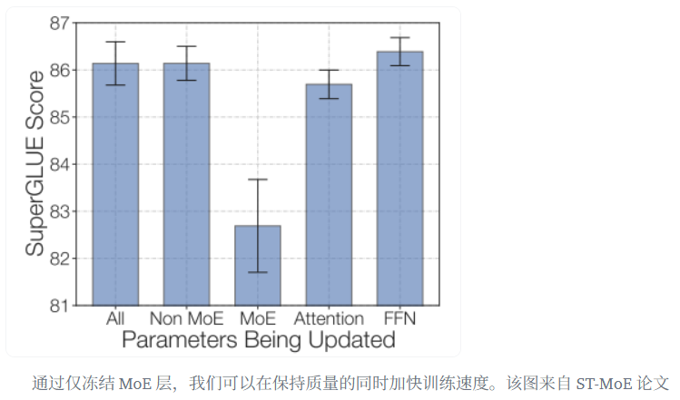
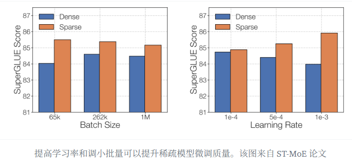

# MoE

## 1.什么是MoE？

MoE由两个关键部分组成：

- 稀疏MoE层：这些层代替了传统Transformer中的FFN层，由若干专家组成，每个专家是一个独立的神经网络。这些专家通常是FFN，也可以是更复杂的网络结构，甚至是MoE层本身，从而形成层级式的MoE结构。

- 门控网络或路由：这个部分用于决定哪些令牌(token)被发送到哪个专家。有时，一个token可以被发送到多个专家。token的路由方式是MoE使用中的一个关键点，因为Router由学习的参数组成，并且与网络的其他部分一同进行预训练。

尽管混合专家模型 (MoE) 提供了若干显著优势，例如更高效的预训练和与稠密模型相比更快的推理速度，但它们也伴随着一些挑战:

- 训练挑战: 虽然 MoE 能够实现更高效的计算预训练，但它们在微调阶段往往面临泛化能力不足的问题，长期以来易于引发过拟合现象。

- 推理挑战: MoE 模型虽然可能拥有大量参数，但在推理过程中只使用其中的一部分，这使得它们的推理速度快于具有相同数量参数的稠密模型。然而，这种模型需要将所有参数加载到内存中，因此对内存的需求非常高。

## 2.MoE模型早期发展历程

MoE最早起源于1991年的论文[Adaptive Mixture of Local Experts](https://direct.mit.edu/neco/article-abstract/3/1/79/5560/Adaptive-Mixtures-of-Local-Experts?redirectedFrom=fulltext)。与集成学习方法类似，旨在为由多个单独网络组成的系统建立一个监管机制。每个专家处理训练样本的不同子集，专注于输入空间的特定区域，而门控网络则负责选择专家来处理特定的输入，它决定了分配给每个专家的权重。

[Learning Factored Representations in a Deep Mixture of Experts](https://arxiv.org/abs/1312.4314)探索了将 MoE 作为更深层网络的一个组件。这种方法允许将 MoE 嵌入到多层网络中的某一层，使得模型既大又高效。

[Outrageously Large Neural Networks: The Sparsely-Gated Mixture-of-Experts Layer](https://arxiv.org/abs/1701.06538)引入稀疏性，在保持极高规模的同时实现了快速的推理速度。

## 3.什么是稀疏性？

在Dense LLM中，所有的参数都会对所有输入数据进行处理。稀疏性意味着并非所有参数都会在处理每个输入时被激活或使用，而是根据输入的特定特征或需求，只有部分参数集合被调用和运行。

存在这样的一个问题：例如，在混合专家模型 (MoE) 中，尽管较大的批量大小通常有利于提高性能，但当数据通过激活的专家时，实际的批量大小可能会减少。比如，假设我们的输入批量包含 10 个令牌， 可能会有 5 个令牌被路由到同一个专家，而剩下的 5 个令牌分别被路由到不同的专家。这导致了批量大小的不均匀分配和资源利用效率不高的问题。

那么该如何解决呢？一个可学习的门控网络（G）决定将输入的哪一部分发送给哪些专家（E）：

\[
y = \sum_{i = 1}^n G(x)_i E_i(x)
\]

根据上述公式，虽然所有专家都会对所有输入进行运算，但通过G的输出G(x)进行加权乘法，当G(x)为0时就没必要计算相应的专家操作，这样就可以节省计算资源。

那么有哪些门控函数呢？一个典型的门控函数是带有Softmax函数的简单网络：

\[
G_{\sigma}(x) = Softmax(x\cdot W_g)
\]

[Outrageously Large Neural Networks: The Sparsely-Gated Mixture-of-Experts Layer](https://arxiv.org/abs/1701.06538)还探索了其他的门控机制，比如带噪声的TopK门控（Noisy Top-K Gating），这种门控引入了一些可调整的噪声，然后保留前k个值。

添加噪声：

\[
H(x)_i = (x \cdot W_g)_i + StandardNormal() \cdot Softplus((x \cdot W_{noise})_i)
\]

选择保留前k个值：

\[
\operatorname{KeepTopK}(v,k)_i = \begin{cases} v_i & \text{if } v_i \text{ is in the top } k \text{ elements of } v, \\ -\infty & \text{otherwise.} \end{cases}
\]

应用Softmax函数：

\[
G(x) = Softmax(KeepTopK(H(x), k))
\]

通过使用较低的k值，我们可以比激活多个专家时更快地进行训练和推理。为什么不仅选择最顶尖的专家呢？最初的假设是，需要将输入路由到不止一个专家，以便门控学会如何进行有效的路由选择，因此至少需要选择两个专家。[Switch Transformers](https://arxiv.org/abs/2101.03961)就这点进行了更多的研究（见后文）。

添加噪声的目的是为了专家间的load balance。

## 4.MoE中Token的load balance

正如之前讨论的，如果所有的token都被发送到只有少数几个受欢迎的专家，那么训练效率将会降低。在通常的混合专家模型 (MoE) 训练中，门控网络往往倾向于主要激活相同的几个专家。这种情况可能会自我加强，因为受欢迎的专家训练得更快，因此它们更容易被选择。为了缓解这个问题，引入了一个辅助损失，旨在鼓励给予所有专家相同的重要性。这个损失确保所有专家接收到大致相等数量的训练样本，从而平衡了专家之间的选择。接下来的部分还将探讨专家容量的概念，它引入了一个关于专家可以处理多少令牌的阈值。

## 5.MoEs and Transformers

Transformer 类模型明确表明，增加参数数量可以提高性能，因此谷歌使用 [GShard](https://arxiv.org/abs/2006.16668) 尝试将 Transformer 模型的参数量扩展到超过 6000 亿并不令人惊讶。

GShard 将在编码器和解码器中的每个 FFN 层中的替换为使用 Top-2 门控的混合专家模型 (MoE) 层。下图展示了编码器部分的结构。这种架构对于大规模计算非常有效: 当扩展到多个设备时，MoE 层在不同设备间共享，而其他所有层则在每个设备上复制。

为了保持负载平衡和训练效率，GShard 的作者除了引入了上一节中讨论的类似辅助损失外，还引入了一些关键变化:

- 随机路由: 在 Top-2 设置中，始终选择排名最高的专家，但第二个专家是根据其权重比例随机选择的。
  
- 专家容量: 可以设定一个阈值，定义一个专家能处理多少令牌。如果两个专家的容量都达到上限，令牌就会溢出，并通过残差连接传递到下一层，或在某些情况下被完全丢弃。专家容量是 MoE 中最重要的概念之一。为什么需要专家容量呢？因为所有张量的形状在编译时是静态确定的，无法提前知道多少令牌会分配给每个专家，因此需要一个固定的容量因子。

GShard 的工作对适用于 MoE 的并行计算模式也做出了重要贡献，但这里不做展开。

注意: 在推理过程中，只有部分专家被激活。同时，有些计算过程是共享的，例如自注意力 (self-attention) 机制，它适用于所有token。这就解释了为什么我们可以使用相当于 12B 稠密模型的计算资源来运行一个包含 8 个专家的 47B 模型。如果我们采用 Top-2 门控，模型会使用高达 14B 的参数。但是，由于自注意力操作 (专家间共享) 的存在，实际上模型运行时使用的参数数量是 12B。

## 6.Switch Transformers

尽管混合专家模型 (MoE) 显示出了很大的潜力，但它们在训练和微调过程中存在稳定性问题，[Switch Transformers](https://arxiv.org/abs/2101.03961)深入研究了这些问题。

Switch Transformers 提出了一个 Switch Transformer 层，它接收两个输入 (两个不同的token) 并拥有四个专家。

与最初使用至少两个专家的想法相反，Switch Transformers 采用了简化的单专家策略。这种方法的效果包括:

- 减少门控网络 (路由) 计算负担
- 每个专家的批量大小至少可以减半
- 降低通信成本
- 保持模型质量

Switch Transformers 也对专家容量这个概念进行了研究:

\[
\text{Expert Capacity} = \left( \frac{\text{tokens per batch}}{\text{number of experts}} \right) \times \text{capacity factor}
\]

上述建议的容量是将批次中的令牌数量均匀分配到各个专家。如果我们使用大于 1 的容量因子，我们为令牌分配不完全平衡时提供了一个缓冲。增加容量因子会导致更高的设备间通信成本，因此这是一个需要考虑的权衡。特别值得注意的是，Switch Transformers 在低容量因子 (例如 1 至 1.25) 下表现出色。

Switch Transformer 的作者还重新审视并简化了前面章节中提到的负载均衡损失。在训练期间，对于每个 Switch 层的辅助损失被添加到总模型损失中。这种损失鼓励均匀路由，并可以使用超参数进行加权。

作者还尝试了混合精度的方法，例如用 bfloat16 精度训练专家，同时对其余计算使用全精度进行。较低的精度可以减少处理器间的通信成本、计算成本以及存储张量的内存。然而，在最初的实验中，当专家和门控网络都使用 bfloat16 精度训练时，出现了不稳定的训练现象。这种不稳定性特别是由路由计算引起的，因为路由涉及指数函数等操作，这些操作对精度要求较高。因此，为了保持计算的稳定性和精确性，保持更高的精度是重要的。为了减轻不稳定性，路由过程也使用了全精度。

Switch Transformers 采用了编码器 - 解码器的架构，实现了与 T5 类似的混合专家模型 (MoE) 版本。[GLaM](https://arxiv.org/abs/2112.06905) 这篇工作探索了如何使用仅为原来 \(\displaystyle{\frac{1}{3}}\) 的计算资源 (因为 MoE 模型在训练时需要的计算量较少，从而能够显著降低碳足迹) 来训练与 GPT-3 质量相匹配的模型来提高这些模型的规模。作者专注于仅解码器 (decoder-only) 的模型以及少样本和单样本评估，而不是微调。他们使用了 Top-2 路由和更大的容量因子。此外，他们探讨了将容量因子作为一个动态度量，根据训练和评估期间所使用的计算量进行调整。

## 7.用Router-z-loss稳定模型训练

之前讨论的平衡损失可能会导致稳定性问题。我们可以使用许多方法来稳定稀疏模型的训练，但这可能会牺牲模型质量。例如，引入 dropout 可以提高稳定性，但会导致模型质量下降。另一方面，增加更多的乘法分量可以提高质量，但会降低模型稳定性。

[ST-MoE](https://arxiv.org/abs/2202.08906) 引入的 Router z-loss 在保持了模型性能的同时显著提升了训练的稳定性。这种损失机制通过惩罚门控网络输入的较大 logits 来起作用，目的是促使数值的绝对大小保持较小，这样可以有效减少计算中的舍入误差。这一点对于那些依赖指数函数进行计算的门控网络尤其重要。

\[
L_z(x) = \frac{1}{B} \sum_{i=1}^B \left( \log \sum_{j=1}^N e^{x_j^{(i)}} \right)^2
\]

这里B是token的数量，N是专家的数量，x是进入路由的logits。

## 8.专家学习特点

ST-MoE 的研究者们发现，编码器中不同的专家倾向于专注于特定类型的Token或浅层概念。例如，某些专家可能专门处理标点符号，而其他专家则专注于专有名词等。与此相反，解码器中的专家通常具有较低的专业化程度。

此外，研究者们还对这一模型进行了多语言训练。尽管人们可能会预期每个专家处理一种特定语言，但实际上并非如此。由于Token路由和负载均衡的机制，没有任何专家被特定配置以专门处理某一特定语言。

## 9.微调策略

1. 增加更多专家可以提升处理样本的效率和加速模型的运算速度，但这些优势随着专家数量的增加而递减 (尤其是当专家数量达到 256 或 512 之后更为明显) 。同时，这也意味着在推理过程中，需要更多的显存来加载整个模型。值得注意的是，Switch Transformers 的研究表明，其在大规模模型中的特性在小规模模型下也同样适用，即便是每层仅包含 2、4 或 8 个专家。

2. 稠密模型和稀疏模型在过拟合的动态表现上存在显著差异。稀疏模型更易于出现过拟合现象，因此在处理这些模型时，尝试更强的内部正则化措施是有益的，比如使用更高比例的 dropout。例如，我们可以为稠密层设定一个较低的 dropout 率，而为稀疏层设置一个更高的 dropout 率，以此来优化模型性能。

3. 在微调过程中是否使用辅助损失是一个需要决策的问题。ST-MoE 的作者尝试关闭辅助损失，发现即使高达 11% 的Token被丢弃，模型的质量也没有显著受到影响。Token丢弃可能是一种正则化形式，有助于防止过拟合。

Switch Transformers 的作者观察到，在相同的预训练困惑度下，稀疏模型在下游任务中的表现不如对应的稠密模型，特别是在重理解任务 (如 SuperGLUE) 上。另一方面，对于知识密集型任务 (如 TriviaQA)，稀疏模型的表现异常出色。作者还观察到，在微调过程中，较少的专家的数量有助于改善性能。另一个关于泛化问题确认的发现是，模型在小型任务上表现较差，但在大型任务上表现良好。

一种可行的微调策略是尝试冻结所有非专家层的权重。实践中，这会导致性能大幅下降，但这符合我们的预期，因为混合专家模型 (MoE) 层占据了网络的主要部分。我们可以尝试相反的方法: 仅冻结 MoE 层的参数。实验结果显示，这种方法几乎与更新所有参数的效果相当。这种做法可以加速微调过程，并降低显存需求。

在微调稀疏混合专家模型 (MoE) 时需要考虑的最后一个问题是，它们有特别的微调超参数设置——例如，稀疏模型往往更适合使用较小的批量大小和较高的学习率，这样可以获得更好的训练效果。

## 10.DeepseekMoE

TBD

## 11.总结

混合专家模型 (MoEs):

- 与稠密模型相比，预训练速度更快。

- 与具有相同参数数量的模型相比，具有更快的推理速度。

- 需要大量显存，因为所有专家系统都需要加载到内存中。

- 在微调方面存在诸多挑战，但[近期的研究](https://arxiv.org/abs/2305.14705)表明，对混合专家模型进行指令调优具有很大的潜力。

## 12.Reference

[Adaptive Mixture of Local Experts](https://direct.mit.edu/neco/article-abstract/3/1/79/5560/Adaptive-Mixtures-of-Local-Experts?redirectedFrom=fulltext)

[Learning Factored Representations in a Deep Mixture of Experts](https://arxiv.org/abs/1312.4314)

[Outrageously Large Neural Networks: The Sparsely-Gated Mixture-of-Experts Layer](https://arxiv.org/abs/1701.06538)

[GShard: Scaling Giant Models with Conditional Computation and Automatic Sharding](https://arxiv.org/abs/2006.16668)

[Switch Transformers: Scaling to Trillion Parameter Models with Simple and Efficient Sparsity](https://arxiv.org/abs/2101.03961)

[GLaM: Efficient Scaling of Language Models with Mixture-of-Experts](https://arxiv.org/abs/2112.06905)

[ST-MoE: Designing Stable and Transferable Sparse Expert Models](https://arxiv.org/abs/2202.08906)

[混合专家模型 (MoE) 详解](https://huggingface.co/blog/zh/moe)

[【重读经典MoE】Adaptive Mixtures of Local Experts](https://zhuanlan.zhihu.com/p/1940075819864154660)

[【论文精炼】OUTRAGEOUSLY LARGE NEURAL NETWORKS: THE SPARSELY-GATED MIXTURE-OF-EXPERTS LAYER | 超大规模神经网络：稀疏门控专家混合层](https://www.cnblogs.com/noluye/p/14597977.html)

[MoE环游记：1、从几何意义出发](https://kexue.fm/archives/10699)
