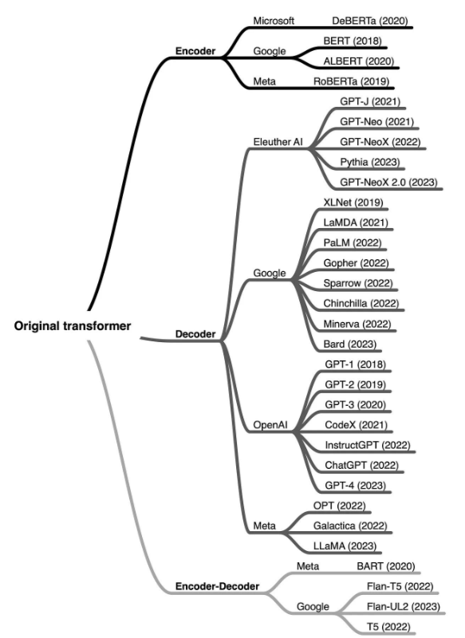

# LLM架构

在Transformer中，编码器负责理解和提取输入文本中的相关信息，用Self-Attention来理解文本中的上下文关系。

编码器的输出是输入文本的连续表示，通常被称为嵌入Embedding，这个Embedding然后被传递给解码器，解码器的任务是根据从编码器接收到的Embedding来生成翻译后的文本。解码器也使用自注意力机制，以及编码器-解码器注意力机制。

分类依据：

| 模型类别         | 核心模块组合           | 核心特征                                 | 典型任务场景                     | 代表模型                                     |
|----------------|----------------------|------------------------------------------|--------------------------------|---------------------------------------------|
| 自编码模型      | 仅使用 Encoder        | 双向注意力，擅长捕捉上下文语义关联，聚焦“语言理解” | 文本分类、情感分析、问答         | BERT、RoBERTa、ALBERT、DeBERTa               |
| 自回归模型      | 仅使用 Decoder        | 单向注意力，从左到右生成文本，聚焦“语言生成”     | 长文本生成、摘要、对话           | GPT系列（GPT-1、2、3、4）、OPT          |
| 序列到序列模型  | 同时使用 Encoder+Decoder | 结合双向理解与单向生成能力，聚焦“序列转换”       | 机器翻译、文本摘要（生成式）     | T5、BART                            |

自回归指输出的内容是根据已生成的token做上下文理解后逐token输出的。

总的来说：

- encoder-only类型的更擅长做分类

- encoder-decoder类型的擅长输出强烈依赖输入的，比如翻译和文本总结

- 其他类型的就用decoder-only，如各种Q&A

发展时间线：

- 2018年：自编码模型代表BERT、自回归模型代表GPT-1先后推出，分别奠定NLU（自然语言理解）和NLG（自然语言生成）的技术基础。

- 2019年：序列到序列模型T5、BART推出，尝试用“文本到文本”统一所有NLP任务。

- 2020-2023年：自回归模型（GPT-3、4、OPT）凭借强大的生成能力成为LLM主流。Encoder-Decoder模型则在特定任务中保持优势（如翻译）。

## 1.Encoder-Only

encoder-decoder的LLMs更擅长对文本内容进行分析、分类，专注自然语言理解，包括文本分类、情感分析、命名实体识别。如BERT，BERT的训练基于MLM（mask language modeling，掩码语言模型）、NSP（next sentence prediction）。

MLM是在大量的文本语料库中将数据中的某部分遮住mask，让BERT根据上下文内容来预测mask的内容，一般随机遮挡15%，80%的时间用[MASK]取代，10%时间用随机token，10%时间不变。

NSP是将原句子打乱成不同顺序的句子，让BERT找出正确语序的原句。

## 2.Decoder-Only

Decoder主要是为了预测下一个输出的内容/token是什么，并把之前输出的内容/token作为上下文学习，在长文本生成、对话任务中表现突出。代表是GPT（Generative Pre-trained Transformer）系列。

Decoder-only的decoder和encoder相似，只不过使用了Mask Self-Atttention，阻止模型关注后面位置的信息。

自回归模型任务适配灵活，通过提示学习可支持zero-shot和few-shot任务；缺点是单向注意力局限，无法利用后文信息，可能导致生成内容逻辑矛盾，且早期模型依赖微调，成本较高，文本需逐token生成，生成速度慢。

## 3.Encoder-Decoder

这种架构的LLMs主要用于NLP，即理解输入的内容，又能处理并生成内容，尤其擅长处理输入和输出序列之间存在复杂映射关系的任务，以及捕获两个序列元素之间关系重要性的任务，代表有BART和T5（Text-to-Text Transfer Transformer）。

但是序列到序列架构参数量大，训练成本高，且Decodr逐token生成，需与Encoder交互，效率低于Decoder-Only模型，推理速度慢。

## 4.总结

| 核心问题 | 答案 |
|---------|------|
| 1. LLM 主要类别架构有哪些？ | 三类：Encoder-Only（自编码模型）、Decoder-Only（自回归模型）、Encoder-Decoder（序列到序列模型）。 |
| 2. 自编码模型的基本原理是什么？ | 在输入中随机 MASK 部分单词，模型通过双向上下文预测被 MASK 的词，聚焦语言理解任务。 |
| 3. 自回归模型的基本原理是什么？ | 从左到右学习文本，仅利用上文信息预测下一个 token，聚焦语言生成任务。 |
| 4. 序列到序列模型的基本原理是什么？ | 同时使用 Encoder（理解输入）和 Decoder（生成输出），将每个任务视作“序列到序列的转换”，聚焦转换任务。 |
| 5. LLM 为何主流选择 Decoder-Only 架构？ | 1. 训练 / 推理效率高（同等参数量下成本更低）；2. 无双向注意力的低秩问题，表达能力更强；3. 任务适配灵活（支持零样本 / 少样本学习）。 |

LLM 的三类架构（Encoder-Only、Decoder-Only、Encoder-Decoder）分别对应 “理解、生成、转换” 三大核心任务，共同构成了 NLP 技术的完整版图。自编码模型（如 BERT）奠定了语言理解的基础，序列到序列模型（如 T5）在转换任务中保持优势，而 Decoder-Only 架构（如 GPT 系列）凭借 “效率、能力、灵活度” 的三重优势，成为当前 LLM 的主流选择。

未来，随着多模态技术的发展（如 GPT-4V、Gemini），Decoder-Only 架构可能进一步融合图像、音频等模态的理解能力，而 Encoder-Decoder 模型则可能在特定垂直领域（如专业机器翻译）持续优化。

## .Reference

[LLM的3种架构：Encoder-only、Decoder-only、encoder-decoder](https://zhuanlan.zhihu.com/p/642923989)

[LLM 主要类别与架构全景解析](https://www.cnblogs.com/auguse/articles/19061388)

