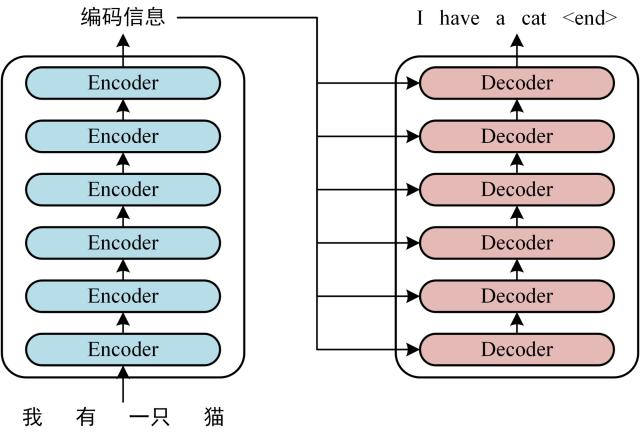
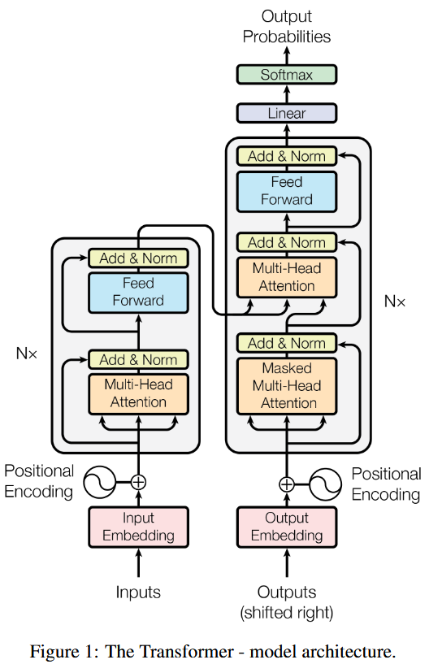
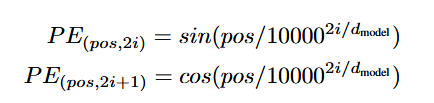
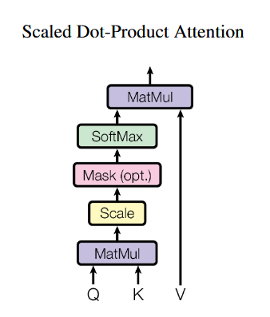
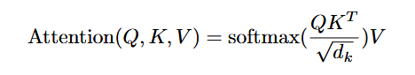
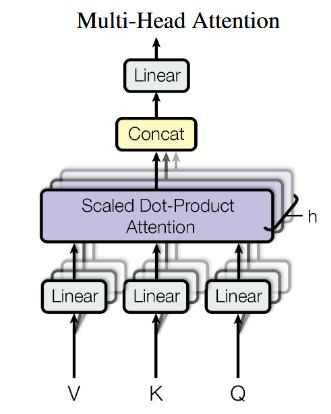
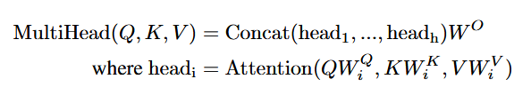
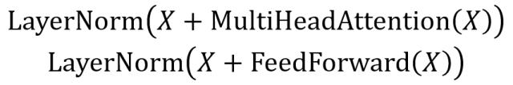
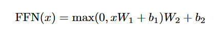
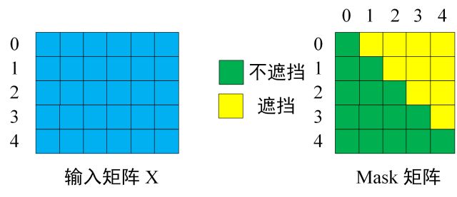

# Transformer

> 论文地址：<https://arxiv.org/abs/1706.03762>

## 1.Transformer 整体架构

Transformer 由Encoder和Decoder两个部分组成，都分别包含6个block。Transformer的工作流程如下：

- Step1: 获取输入句子的每一个单词的表示向量\( X \), \( X \)由单词的Embedding和单词位置的Embedding相加得到。

- Step2: 将得到的单词表示向量矩阵传入Encoder中，经过6个Encoder block后可以得到句子所有单词的编码信息矩阵\( C \)，单词向量矩阵用\( X_{n\times d} \) 表示，\( n \)是句子单词个数，\( d \)是表示向量的维度（论文中\( d \) = 512）。每个Encoder block输出的矩阵维度与输入完全一致。

- Step3: 将Encoder输出的编码信息矩阵\( C \)传递给Decoder中，Decoder依次会根据当前翻译过的单词\(1\sim i\)翻译下一个单词\(i + 1\)，在使用过程中，翻译到单词\(i + 1\)的时候需要通过Mask（掩码）操作遮盖住\(i + 1\)之后的单词。

## 2.Transformer 的输入

Transformer中单词的输入表示\( X \) 由单词Embedding和位置Embedding相加得到。

### 2.1 单词 Embedding

单词的Embedding有很多方式可以获取，例如Word2Vec、Glove等算法预训练得到，也可以在Transformer中训练得到。

### 2.2 位置 Embedding

因为Transformer不采用RNN结构，而是使用全局信息，不能利用单词的顺序信息，而这部分信息对于NLP来说非常重要。所以Transformer中使用位置Embedding保存单词在sequence中的相对或绝对位置。

Positional Embedding的维度与单词Embedding是一样的，PE可以通过训练得到，也可以用公式得到，Transformer中使用如下公式：

其中，\(pos\)表示单词在句子中的位置，\(d_{model}\)表示PE的维度，\(2i\)表示偶数的维度，\(2i + 1\)表示奇数维度。该公式的优点是：

- 使PE能够使用比训练集里面所以句子更长的句子，即使用已有的\(n\)长度的句子可以算出\(n + 1\)的Embedding。

- 可以让模型容易地计算出相对位置，对于固定长度的间距\(k\),\(PE(pos + k)\)可以用\(PE(pos)\)计算得到。可以用两角和的正弦余弦公式展开。

## 3.Self-Attention（自注意力机制）

### 3.1 Self-Attention 结构

上图是Self-Attention的结构，在计算时需要用到矩阵\(Q\)（查询）、\(K\)（键值）、\(V\)（值）。在实际中，Self-Attention接收的是输入（单词的表示向量\(x\)组成的矩阵\(X\)）或者上一个Encoder block的输出，而\(Q,K,V\)正是通过Self-Attention的输入进行线性变换得到的。

### 3.2 Q、K、V 的计算

Self-Attention的输入用矩阵\(X\)表示，可以分别用权重矩阵\(W_q,W_k,W_v\)计算得到\(Q,K,V\)。

### 3.3 Self-Attention 的输出

公式中计算矩阵\(Q\)和\(K\)每一行的内积，为了防止内积过大，因此除以\(d_k\)的平方根。\(Q\)乘以\(K\)的转置后，得到的矩阵行列数都为\(n\),\(n\)为句子单词数，这个矩阵可以表示单词之间的\(attention\)强度。

!!! note "为什么要除以\(d_k\)的平方根？"
    TODO

得到\(QK^T\)之后，使用Softmax计算每一个单词对于其他单词的attention系数，公式中的Softmax是对矩阵的每一行进行Softmax，即每一行的和都变为1。

!!! note "为什么要进行Softmax?"
    TODO

得到Softmax矩阵之后可以和\(V\)相乘，得到最终的输出\(Z\)。

Softmax矩阵的第一行表示单词1和其他所有单词的attention系数，最终单词1的输出\(Z_1\)等于所有单词\(i\)的值\(V_i\)根据attention系数的比例加和得到的。

### 3.4 Multi-Head Attention(MHA)

MHA是由多个Self-Attention组成的，从上图可以看到首先将输入\(X\)分别传递到\(h\)个不同的Self-Attention中，计算得到\(h\)个输出矩阵\(Z\)。论文中\(h=8\)，得到8个输出矩阵\(Z_1\)到\(Z_8\)之后，MHA将它们拼接在一起，然后传入一个Linear层（\(W^O\)用来进行变换），得到MHA最终的输出\(Z\)。可以看到MHA输出的矩阵\(Z\)与其输入的矩阵\(X\)的维度是一样的。

## 4.Encoder 结构

Encoder是由MHA，Add&Norm，FFN，Add&Norm组成的。

### 4.1 Add & Norm

Add&Norm层由Add和Norm两部分组成，其中\(X\)表示MHA或者FFN的输入，\(MultiHeadAttention(X)\)和
\(FeedForward(X)\)表示输出（输入与输出维度相同所以可以直接相加）。

Add指\(X + MultiHeadAttention(X)\)，是一种残差连接，通常用于解决多层网络训练的问题，可以让网络只关注当前差异的部分，在ResNet中经常用到。

Norm指Layer Normalization，通常用于RNN结构，Layer Normalization会将每一层神经元的输入都转成均值方差一样的，这样可以加快收敛。

!!! note "为什么不用 BatchNorm 呢？"
    TODO

### 4.2 Feed Forward(FFN)

FFN比较简单，是一个两层的全连接层（FC），第一层的激活函数为\(ReLU\)，第二层不使用激活函数，公式如下：

\(X\)是输入，FFN最终得到的输出矩阵的维度与\(X\)一致。

!!! note "什么是全连接层？"
    TODO

FFN的作用：实际上就是一个线性变换层，用来完成输入数据到输出数据的维度变换。通过第一个FC层将输入词向量的512维变换到2048维，随后通过第二个FC层再将2048维变换回512维，从而保证FFN的输入输出维度一致。因此作用可以总结为：

- 增强特征提取能力：变换到高维空间。

- 提高计算效率：FC层的计算可以并行。

- 防止模型退化：FFN引入了\(ReLU\)这种非线性激活函数，保证了模型能够保持其表达能力，有效捕捉到输入数据中的复杂特征。

!!! note "为什么用\(ReLU\)激活函数？"
    \(ReLU\)激活函数的作用是为模型施加非线性因素，从而可以使模型拟合出更加复杂的关系，这样子可以增加模型的表达能力，使模型能够捕获到复杂的特征和模式。

### 4.3 组成 Encoder

通过上面描述的 Multi-Head Attention, Feed Forward, Add & Norm 就可以构造出一个 Encoder block，Encoder block 接收输入矩阵\(X_{(n\times d)}\)，并输出一个矩阵\(O_{(n\times d)}\)。通过多个 Encoder block 叠加就可以组成 Encoder。

第一个 Encoder block 的输入为句子单词的表示向量矩阵，后续 Encoder block 的输入是前一个 Encoder block 的输出，最后一个 Encoder block 输出的矩阵就是编码信息矩阵\(C\)，这一矩阵后续会用到 Decoder 中。

## 5.Decoder 结构

Decoder block的结构与Encoder block的结构相似，但是有一些区别：

- 包含两个MHA层。
  
- 第一个MHA层采用了Masked操作。

- 第二个MHA层的\(K,V\)矩阵使用Encoder的编码信息矩阵\(C\)进行计算，而\(Q\)使用上一个Decoder block的输出计算。

- 最后有一个Softmax层计算下一个翻译单词的概率。

### 5.1 第一个 Multi-Head Attention

第一个MHA采用了Masked操作，因为在翻译的过程中是顺序翻译的，即翻译完第\(i\)个单词，才可以翻译第\(i + 1\)个单词。通过Masked操作可以防止第\(i\)个单词知道\(i + 1\)个单词之后的信息。

Masked操作是在Self-Attention的Softmax之前使用的。

首先是根据输入矩阵\(X\)得到Mask矩阵\(M\)，然后接下来的操作和之前的Self-Attention一样，通过输入矩阵\(X\)和对于的权重矩阵计算得到\(Q,K,V\)矩阵，然后计算\(QK^T\)。在得到\(QK^T\)之后需要进行Softmax，计算attention score，我们在Softmax之前需要使用\(M\)遮挡住每一个单词之后的信息得到Mask \(QK^T\)矩阵。之后在Mask \(QK^T\)上进行Softmax，每一行的和都为1，但是单词0在其他单词上的attention score都为0。最后使用Mask \(QK^T\)与矩阵\(V\)相乘，得到输出\(Z\)，则单词1的输出向量\(Z_1\)是只包含单词1的信息的。

通过上述步骤就可以得到一个Mask Self-Attention的输出矩阵\(Z_i\)，然后和Encoder类似，通过MHA拼接多个输出\(Z_i\)然后计算得到第一个MHA的输出\(Z\)，\(Z\)和输入\(X\)维度一样。

### 5.2 第二个 Multi-Head Attention

Decoder block第二个Multi-Head Attention变化不大，主要的区别在于其中Self-Attention的\(K,V\)矩阵不是使用上一个Decoder block的输出计算的，而是使用Encoder的编码信息矩阵\(C\)计算的。

根据Encoder的输出\(C\)计算得到\(K,V\)，根据上一个Decoder block的输出\(Z\)计算\(Q\)（如果是第一个Decoder block则用输入矩阵\(X\)计算），后续的计算方法与之前一样。

这样做的好处是在Decoder时，每一位单词都可以利用到Encoder所有单词的信息（这些信息无需Mask）。

### 5.3 Softmax 预测输出单词

Decoder block最后的部分是利用Softmax预测下一个单词，Softmax根据输出矩阵的每一行预测下一个单词，这就是Decoder block的结构，和Encoder一样，Decoder由多个Decoder block组成。

## 6.总结

- Transformer与RNN不同，可以并行训练。

- Transformer本身不能利用单词的顺序信息，因此需要加入位置。

- Transformer的重点是Self-Attention结构。

- Transformer中的MHA中有多个Self-Attention，可以捕获单词之间多种维度上的相关系数attention score。

## 7.Reference

[Transformer模型详解（图解最完整版）](https://zhuanlan.zhihu.com/p/338817680)

[Transformer 论文通俗解读：FFN 的作用](https://blog.csdn.net/dongtuoc/article/details/140341886)

