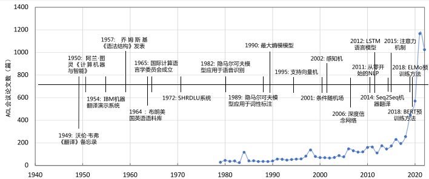
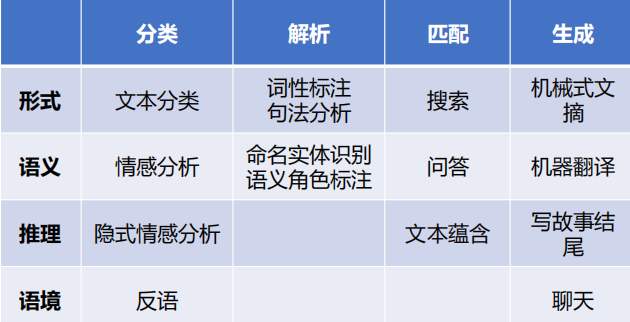

# Natural Language Processing

## 0.绪论

自然语言处理（Natural Language Processing，NLP）是实现人与计算机之间用自然语言进行有效交流的理论与方法。

其分为两个层次：（1）自然语言理解（Natural Language Understanding，NLU）：理解自然语言的意义；（2）自然语言生成（Natural Language Generation，NLG）：用自然语言文本来表达给定的意图、思想等。

自然语言处理的应用包括：机器翻译、智能助手、文本校对、舆情分析、知识图谱等。

自然语言处理的研究历史悠久，1947年 Warren Weaver 提出了利用计算机翻译人类语言的可能。可分为：20世纪50年代末到60年代的初创期、20世纪70年代到80年代的理性主义时代、20世纪90
年代到21世纪初的经验主义时代以及2006年至今的深度学习时代。

自然语言处理的主要难点有：语音歧义、词语切分歧义、词义歧义、结构歧义、指代和省略歧义、语用歧义。

自然语言处理可以归结为四个基本问题：结构预测问题、文本分类问题、文本匹配问题、序列到序列问题。

自然语言处理的基本范式包括基于规则的方法、基于机器学习的方法、基于深度学习的方法以及基于大模型的方法四种范式。在机器学习和深度学习范式下，甚至对模型预测目标进行微小修正，通常都需要对模型进行重新训练。对于未知任务的零样本学习能力很少在上述范式中进行讨论和研究。随着ChatGPT的发布，大模型所展现出来的文本生成能力以及对未知任务的泛化能力使得未来的自然语言处理的研究范式很可能会发生非常大的变化。

那么语义在计算机内部是如何表示的呢？

- 基于符号（字符串）表示的专家知识：此类方法符合人类的直觉，可解释性、可干预性好，但是知识完备性不足，需要专家构建与维护，不便于计算。
- 基于规则的方法：通过词汇、形式文法等制定的规则引入语言学知识，从而完成相应的自然语言处理任务。但是大规模规则构建代价大、难度高。
- 基于向量表示的统计模型：使用高维、离散、稀疏的向量表示词。缺点是有严重的数据稀疏问题，并且无法处理多词一义的现象。
- 基于机器学习的方法：将自然语言处理任务转化为某种分类任务。需要经历数据构建、数据预处理、特征构建以及模型学习的过程。
- 基于嵌入表示的深度学习模型：词嵌入（word embedding）使用一个低维、连续、稠密的向量表示词。该方法将特征学习和预测模型融合，通过优化算法使得模型自动地学习出好的特征表示，并基于此进行结果预测。
- 基于大模型的方法：将大量各类型自然语言处理任务，统一为生成式自然语言理解框架。主要包括大规模语言模型构建、通用能力注入和特定任务使用三个阶段。

!!! note "基于深度学习的方法"
    基于深度学习的方法流程包括数据构建、数据预处理和模型学习三个部分。在数据预处理方面也大幅度简化，仅包含非常少量的模块。通过多层的特征转换，将原始数据转换为更抽象的表示。这些学习到的表示可以在一定程度上完全代替人工设计的特征 ，这个过程也叫做表示学习（Representation Learning）。首先利用自监督任务对模型进行预训练，通过海量的语料学习到更为通用的语言表示，然后根据下游任务对预训练网络进行调整。这种预训练范式在几乎所有自然语言处理任务上都表现非常出色。
    预训练（Pre-train）+微调（Fine-tune）成为NLP的新范式。

!!! note "基于大模型的方法"
    在大规模语言模型构建阶段，通过大量的文本内容，训练模型长文本的建模能力，使得模型具有语言生成能力，并使得模型获得隐式的世界知识。在通用能力注入阶段，利用包括阅读理解、情感分析、信息抽取等现有任务的标注数据，结合人工设计的指令词对模型进行多任务训练，从而使得模型具有很好的任务泛化能力。特定任务使用阶段则变得非常简单，由于模型具备了通用任务能力，只需要根据任务需求设计任务指令，将任务中所需处理的文本内容与指令结合，然后就可以利用大模型得到所需结果。

## 1.文本的表示

传统的基于向量表示的统计模型存在严重的数据稀疏问题，并且无法解决多词一义的问题。前人的解决方法包括：增加额外的特征如词性特征或者前后缀特征，采用语义词典或者是词聚类特征。

分布语义假设也指出：词的含义可由其上下文词的分布进行表示。由此我们可以得到一个词的分布词向量，语义相似度通过计算向量相似度获得，但是仍然存在高维、稀疏、离散的问题。

分布表示训练速度慢，增加新语料库（corpus）困难，且不易扩展到短语、句子表示。

!!! note "互信息"
    点互信息（Pointwise Mutual Information, PMI）：衡量的是两个具体事件（比如单词A和单词B）同时出现的概率，比它们随机独立出现时要高多少。公式为：$PMI(x,y)=\log{\displaystyle{\frac{P(x,y)}{P(x)P(y)}}}=\log{\displaystyle{\frac{P(x|y)}{P(x)}}}=\log{\displaystyle{\frac{P(y|x)}{P(y)}}}$。
    
    如果\(PMI>0\)，说明\(x\)和\(y\)倾向于共现（正相关）；如果\(PMI=0\)，说明相互独立；如果\(PMI<0\)，说明互斥（负相关）。

    点互信息可以用来判断两个词语的相关程度，比如NLP中的固定短语搭配的选取、进行情感分析（计算某个词语和“好”的PMI来判断褒贬）、推荐系统的商品偏好设计等。

    而互信息（Mutual Information, MI）则是\(PMI\)的加权平均。MI衡量的是两个随机变量（或分布）在整体上共享了多少信息，即知道\(X\)的值后，能多大程度上降低\(Y\)的不确定性（熵）。公式为：\(MI(X,Y)=\displaystyle{\sum_{x\in X}\sum_{y\in Y}P(x,y)\cdot PMI(x,y)}\)。

    \(MI\)始终大于等于0，且具有对称性。它能捕捉非线性关系（而皮尔逊相关系数只能捕捉线性关系）。

    应用场景：（1）特征选择：在分类任务中计算某个特征词和类别标签之间的\(MI\)。（2）图像匹配：医学影像中，利用两幅图像的\(MI\)最大化为目标，判断它们是否对齐。

    正点互信息（Positive PMI, PPMI）：\(PMI\)对小概率事件（低频词）及其敏感，并且负值在后续做向量加法或矩阵分解时，会严重干扰语义空间的几何结构，导致相似度计算跑偏。公式为：$PPMI(x,y)=\max{(PMI(x,y),0)}$。

分布式表示直接使用低维、稠密、连续的向量表示词，通过自监督的方法直接学习词向量，也称词嵌入（word embedding）。

## 2.自然语言处理任务

### 2.1 什么是语言模型？

Language Model用以描述一段自然语言的概率或给定上文时下一个词出现的概率。即：

\[
P(w_1,\cdots,w_l),\qquad P(w_{l+1}|w_1,\cdots,w_l)
\]

自然语言模型经历了统计语言模型、神经语言模型、预训练语言模型到大语言模型（Large Language Model）的发展。

### 2.2 子词切分

子词切分就是将一个单词切分为若干连续的片段。

??? note "基于子词的分词算法"
    词级分词面临未登录词（Out-of-Vocabulary, OOV）问题，字符级分词又丢失了词内结构信息。子词切分介于二者之间：高频词保持完整，低频词拆成更小的片段，从而在词表大小与表达能力之间取得折中。目前主流大模型采用的子词分词算法主要有以下四种。

    1. BPE（Byte-Pair Encoding）

    最初由 Gage（1994）提出用于数据压缩，Sennrich 等人（2016）将其引入神经机器翻译。训练过程是自底向上的贪心合并：

    1. 将语料中每个词拆成字符序列，并在词尾附加结束符（如 `</w>`），用以区分词内位置与词边界。
    2. 统计相邻符号对的出现频率，将最高频的一对合并为新符号，加入词表。
    3. 重复步骤 2，直到词表达到预设大小。

    例如语料中反复出现 `l o w </w>`，经若干轮合并后可能得到 `low</w>` 作为一个整体 token。推理时按训练得到的合并规则（按学习顺序）对输入做贪心合并。

    BPE 的优点是实现简单、训练快；缺点是合并策略完全由频率驱动，不保证概率意义上最优，且对空格、标点等字符的处理依赖预训练语料的字符集。代表模型：GPT-1、RoBERTa。

    2. BBPE（Byte-level BPE）

    BBPE 是 BPE 在字节空间上的推广：不再以 Unicode 字符为最小单位，而是先将文本按 UTF-8 编码为字节序列（0–255），再在字节上执行 BPE 合并。

    这样做有两个直接好处：

    - 词表底座固定为 256 个字节，任意语言、任意 Unicode 字符都能被编码，彻底消除 OOV。
    - 对多语言、代码、emoji、生僻字等混合文本更稳健，无需为每种语言单独维护字符集。

    GPT-2 率先采用 byte-level BPE；此后 LLaMA、ChatGLM、ChatGPT、GPT-4 等主流大模型基本都沿用这一路线。代价是：同样语义的文本，字节级切分得到的序列往往比字符级更长，训练与推理的序列长度开销更大。

    3. WordPiece

    WordPiece 由 Google 提出，最早用于语音识别，后被 BERT 系列采用。表面流程与 BPE 类似（同样是自底向上合并），但合并准则不同：BPE 选最高频符号对，WordPiece 选使语料似然提升最大的符号对。

    具体地，若将符号 $$x$$ 与 $$y$$ 合并为 $$z$$，其得分近似为：

    $$
    \mathrm{score}(x,y)=\frac{f(x,y)}{f(x)\cdot f(y)}
    $$

    即合并后的共现频率相对于各自独立频率的增益。得分越高，说明 $$x$$ 与 $$y$$ 越值得绑定为一个子词。

    编码时 WordPiece 采用最长前缀匹配：从左到右，在词表中查找当前剩余字符串的最长前缀作为下一个 token；若某字符不在词表中，则标记为 `[UNK]`。词内非首个子词通常加前缀 `##`（如 `playing` → `play` + `##ing`）。

    代表模型：BERT、DistilBERT、MobileBERT。

    4. Unigram（Unigram Language Model）

    Unigram 由 SentencePiece 框架引入，思路与前三者相反：先给定一个很大的候选词表，再逐步裁剪，属于自顶向下的方法。它假设每个子词独立出现，整句概率为各子词概率之积：

    $$
    P(x)=\prod_{i=1}^{n}P(x_i),\qquad\sum_{x\in V}P(x)=1
    $$

    训练大致步骤：

    1. 用高频子串等启发式方法初始化一个足够大的词表 $$V$$，并为每个子词估计概率 $$P(x)$$。
    2. 用 EM 算法（或近似）在当前词表下最大化语料似然。
    3. 计算每个子词对总似然的损失贡献（loss）：去掉该子词后似然下降越多，说明它越重要。
    4. 丢弃 loss 最小（最不重要）的约 10%–20% 子词，保留单字符以保证可覆盖性。
    5. 重复 2–4，直到词表缩减到目标大小。

    编码时，同一句话可能有多种切分；Unigram 用 Viterbi 算法找概率最大的切分，也可按概率采样多种切分做数据增强。这种概率视角使 Unigram 对噪声和多语言场景更灵活。

    代表模型：ALBERT、T5、mBART、XLNet（均通过 SentencePiece 使用 Unigram）。

    对比小结

    | 算法 | 方向 | 合并/裁剪准则 | 最小单位 | 代表模型 |
    |------|------|---------------|----------|----------|
    | BPE | 自底向上 | 最高频符号对 | 字符 | GPT-1、RoBERTa |
    | BBPE | 自底向上 | 最高频符号对 | 字节 | LLaMA、ChatGLM、BLOOM、GPT-4 |
    | WordPiece | 自底向上 | 最大似然增益 | 字符 | BERT 系列 |
    | Unigram | 自顶向下 | 对似然贡献最小者删除 | 字符/子串 | T5、ALBERT、XLNet |

    当前开源与闭源大模型中，BBPE（或等价的 byte-level BPE）已成为事实标准；WordPiece 与 Unigram 更多见于编码器或早期 Seq2Seq 预训练模型。

### 2.3 句法分析

句法分析主要是分析句子的句法成分，如主谓宾定状补等。

### 2.4 语义分析

语义分析包括：词义消歧（Word Sense Disambiguation, WSD）、语义角色标注（Semantic Role Labeling, SRL）、语义依存图。

### 2.5 信息抽取

信息抽取就是从非结构化的文本中自动提取结构化信息。

### 2.6 情感分析

情感分析（Sentiment Analysis）包括：（1）个体对外界事物的态度、观点或倾向性。（2）人自身的情绪。

### 2.7 问答系统

问答系统主要是指用户以自然语言形式描述问题，从异构数据中获得答案。

## 3.自然语言处理的基本问题

### 3.1 文本分类

- 文本分类：将输入文本映射为所属类别，通常输出一个概率。

### 3.2 文本匹配

- 文本匹配：判断两段文本之间的匹配关系。

!!! tip "文本匹配的两种方案"
    - 双塔结构：两端文本分别通过两个模型映射为向量，然后判断两个向量之间的匹配关系。
    
    - 单塔结构：将两段文本直接拼接，然后进行匹配关系分类。

### 3.3 结构预测

- 结构预测：输出类别之间具有较强的相互关联性，是NLP的本质问题。

三种典型的结构预测问题：

- 序列标注：为输入文本序列中的每个词标注相应的标签，如词性标注

- 序列分割：在文本序列中切分出子序列，可以转化为序列标注问题

- 图结构生成：输入自然语言，输出以图表示的结构

### 3.4 序列到序列

序列到序列是将输入序列转换为输出序列，输入和输出的序列不要求等长，也不要求词表一致，泛化为编码器——解码器模型（Encoder-Decoder），本质上也是分类问题。

典型任务有：机器翻译、文本摘要、回复生成、图片描述生成、语音识别等。

## 4.自然语言处理的评价指标

- 准确率（Accuracy）：最简单直观的评价指标，常被用于文本分类、词性标注等问题。

- F值：针对某一类别的评价，包含精确率（Precision）和召回率（Recall）。

- 机器翻译的评价：BLEU（BiLingual Evaluation Understudy）值统计机器译文与参考译文中N-gram匹配的数目占机器译文中所有N-gram总数的比率。

Text Preprocess: Learn various text preprocessing steps like tokenization (splitting text into words or sentences), stemming (reducing words to their root form), lemmatization (similar to stemming but considers the context), stop word removal, etc.

Feature Extraction Techniques: Become familiar with techniques to convert text data into a format that can be understood by machine learning algorithms. Key methods include Bag-of-words (BoW), Term Frequency-Inverse Document Frequency (TF-IDF), and n-grams.

Word Embedding: Word embeddings are a type of word representation that allows words with similar meanings to have similar representations. Key methods include Word2Vec, GloVe, and FastText.

Recurrent Neural Networks (RNNs): Understand the working of RNNs, a type of neural network designed to work with sequence data. Explore LSTMs and GRUs, two RNN variants that are capable of learning long-term dependencies.
