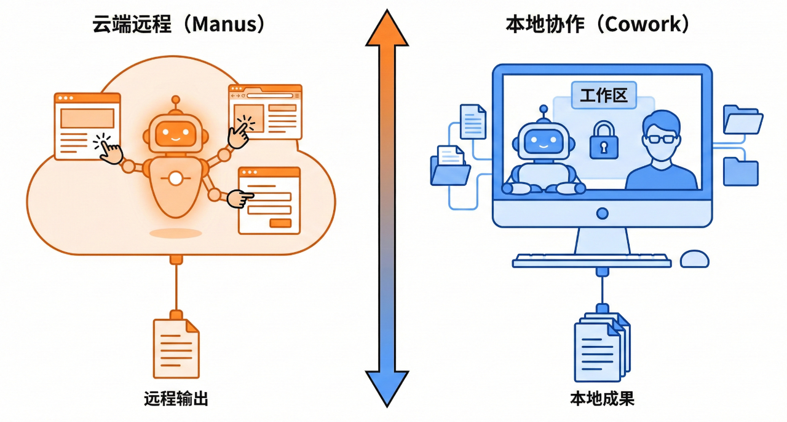

## 什么是 OpenClaw

**一个开源免费、本地运行的个人AI智能体（Agent）**。

## 印象派：更像Manus还是Cowork？

- **Manus**: 云端远程型

工作方式是：给Agent一台“远程电脑”，它在云端点网页、调工具、跑脚本，最后产出文本或文件。

- **Cowork**: 本地协作型

工作方式是：把自己的电脑“共享”给它，设定一个“工作区”。它在一定的权限控制与人类监督下完成工作任务。

{==从形态上看，OpenClaw的确更接近Cowork，而非Manus——属于“本地优先+外部/本地模型+本地资源访问”的路线。==}

## 独特之处

- **入口形态**：OpenClaw的入口不限定在某个官方工作台，而是在你日常使用的工作聊天入口，比如WhatsApp/Telegram/Discord/飞书/钉钉等。

- **主动性**：OpenClaw可以根据你的预设条件（比如定时）或者数据变化主动联系你。例如，每天早晨发送简报、待办事项提醒，或者在监测到某项数据异常时第一事件启动Agent并发消息告知。这让交互体验从“工具”变成了真正的“协作”。

- **长期记忆能力**：OpenClaw内置了完善的长期记忆机制。会自动总结每次对话的关键信息并存入长期记忆库。你甚至可以调整其检索机制——比如向量与关键词检索的权重比。OpenClaw 的透明记忆系统：基于纯 Markdown 文件 + SQLite 向量索引的混合搜索，实现持久化、可搜索、完全可控的 AI Agent 记忆——不同于 ChatGPT/Claude 的云端黑盒，所有数据本地存储，用户拥有完全所有权。

- **高可扩展性**：OpenClaw采用{==核心精简、边缘丰富==}的插件化架构。消息渠道（Channels）、工具（Tools）、技能（Skills）、自动化钩子（Hooks）、模型（Providers）、命令行（CLI）均可通过插件等方式扩展，并遵循零侵入、热更新、安装简单。你甚至可以让它自行编写插件，自行安装，扩展自己的能力！

除了软件模块扩展，OpenClaw一个强大的功能在于：可以把多个电脑或手机设备变成OpenClaw的能力节点（Nodes），用来扩展摄像头、屏幕录制、地理位置、交互式UI等额外能力。

- **高权限边界**：这是OpenClaw强大也最备受争议的地方。相对Cowork的以“指定工作区/文件夹授权”控制访问边界，OpenClaw则被赋予了更高的操作电脑的权限。它能执行Shell命令、读写文件、运行脚本、控制浏览器，调用第三方API、甚至控制你家里的设备。

## 创意使用场景

- 收件箱清理（Gmail插件）

- 会议日常安排（Calendar API）

- 日常提醒（定时任务+聊天渠道）

- 设备控制（本地状态+IoT API）

- 更高阶的自主应变

## 是如何运转的

OpenClaw本身的架构是比较复杂的，涉及较多的层次与模块，加上偏”分布式“的设计以及扩展性、安全性的众多考虑，已经远远超出一个普通 Agent 的范畴。

- **Gateway/Routers(中央网关)**：“大脑中枢+交通枢纽”，也是整个系统的核心。

它负责管理会话、调度Agent任务、维持与各个聊天渠道的消息连接、管理配对设备与权限、协调其他Nodes能力等。几乎所有的用户消息与控制命令都需要从这里经过。

- **Agent(智能体)**：“任务执行者”，也就是实际干活的主体。

Agent在接收到消息与任务后，动用自己的脑袋（LLM/大模型）、手脚（Tools）、专业知识（Skills），尽可能的完成任务，其中可能会访问Web、运行命令、读写文件、编写代码，调用其他Nodes能力（比如摄像头）。

OpenClaw支持多Agent模式，可以互不干扰，或者相互协作。

每个Agent有自己的工作区，也就是自己的“办公桌”，放置专属配置与产物。

- **Nodes（远程能节点）**：“分布式触手”，与运行Gateway的主机协作的设备。

Nodes 就是在主机之外的其他“能力”节点。你的旧手机、闲置电脑都可以作为 Node 加入网络，以提供更多的能力，比如摄像头、屏幕录制、系统控制、屏幕共享、显示可交互式的“富”界面等。Nodes 需要在远程设备上运行相应的Node 客户端 App。

借助 Nodes，你可以要求Agent：

1. 调用某个 iPhone 的摄像头拍照，然后做后续处理

2. 搜集服务器的数据，生成仪表盘界面（A2UI描述），然后推送到你的 iPad 上做展示（WhatsApp 等消息客户端无法支持复杂UI）

- **Clients（客户端）**：“管理与控制者”，用来给 Gateway 下达“指令”。

OpenClaw 提供了多种形式的管理 UI，其功能类似，但使用形式不同。如果你喜爱命令行，使用OpenClaw CLI 最方便；如果想可视化，可以用 Web UI；此外Mac用户还有一个常驻菜单栏的“管家”。

除了以上的核心组件与机制之外，OpenClaw的Plugins机制、基于事件的Hooks、多智能体协作、长期记忆机制、分层安全机制等设计，我们将在后续做更深入的探讨与演示。
