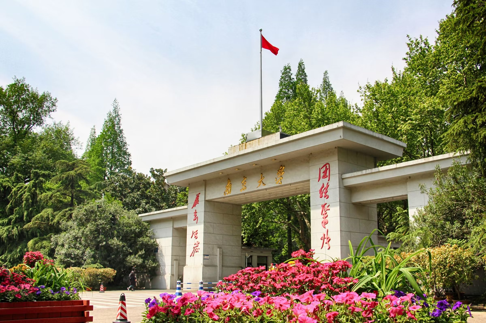
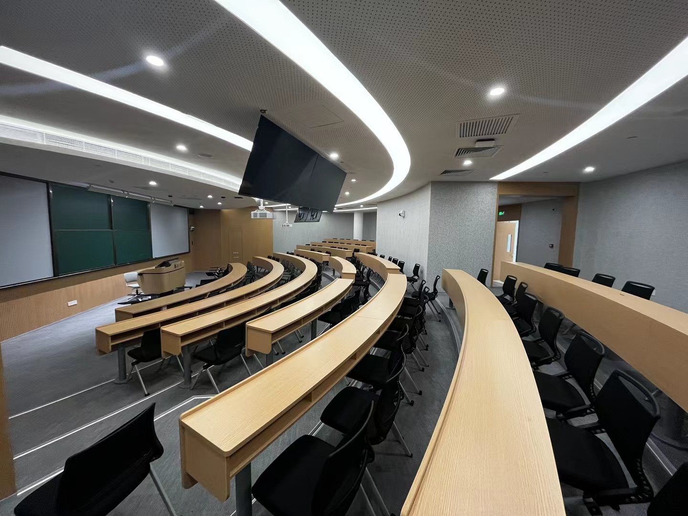
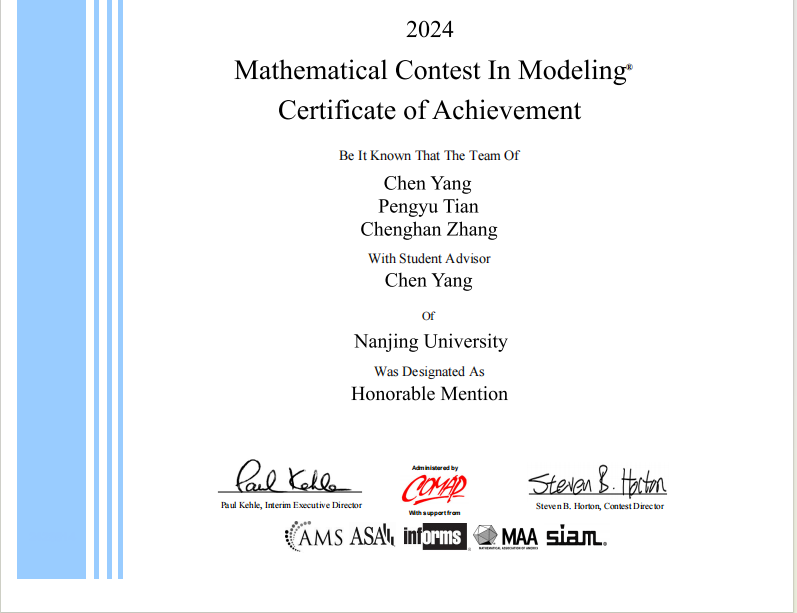
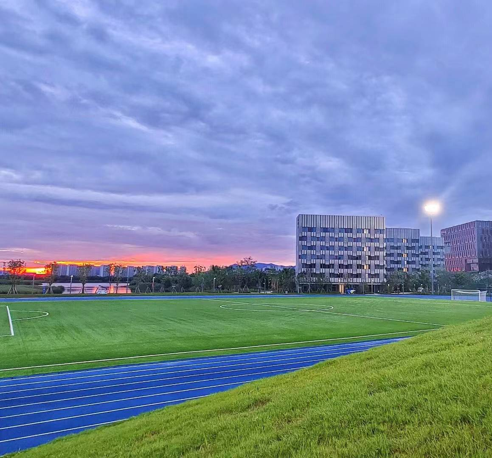
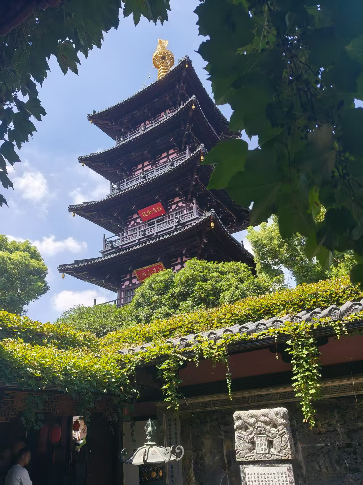
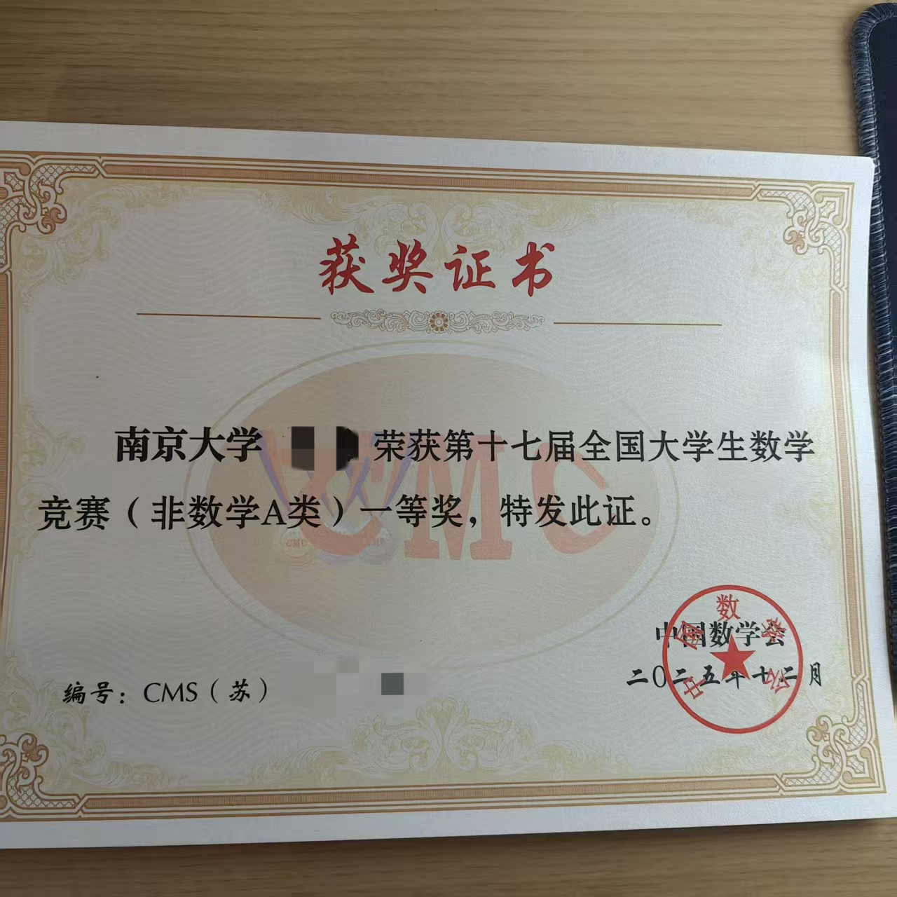
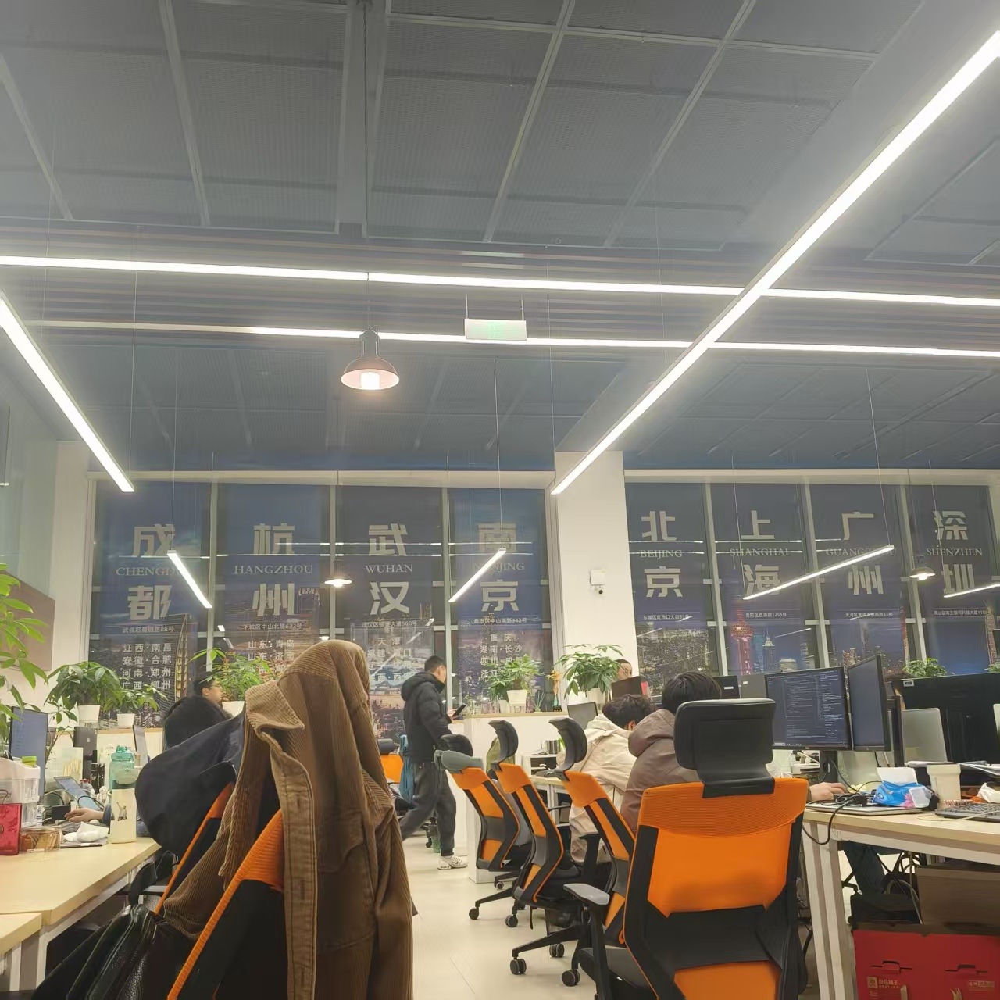
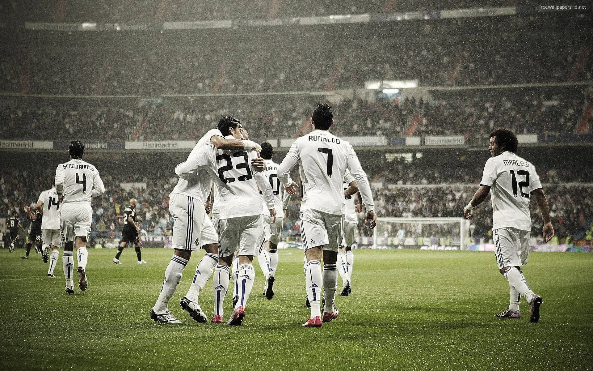

# 本科四年总结

## 序

回首望去，四年时间如白驹过隙，当我在图书馆写下这一篇的序言时，不由得感慨万千，心想自己好不容易有了去处，终于又可以读上三年书，又渐渐平静下来。

## 初载

22年之秋，竟已是四年之前，彼时我被诱捕（坑蒙拐骗）进入技科，四个方向（智能科学与技术、智能软件与工程、集成电路、数字经济）听起来词藻华丽、前程似锦，实则进入了第一年大类招生的双重陷阱（专业是新开的，分流是内卷的），大四听到智软不招本科生并被机器人与自动化替代时，真是贻笑大方，得亏我已经离开了智软。

我们这一届正好赶上了学校的寻根之旅，大一在鼓楼学习，大二则会去苏州（其他专业则去仙林）。鼓楼校区面积不算很大，分为北园和南园，北园是上课的地方，南园是宿舍和食堂，我们有幸住在了最豪华的陶三，大家都普遍认为最难吃大学食堂榜单上必有南大鼓楼校区，实际也确实如此，不过校区位于市中心，附近汉口路食堂和广州路食堂还是能满足同学们的需求。刚入大学，对于南京这座六朝古都还是陌生的感觉，依稀记得去过了很多次玄武湖，很多次夫子庙。第一次去玄武湖是和室友第一天认识晚上去的，就当是破冰了，但是我们宿舍都挺i的，相顾无言哈哈哈，后来一位同学去了计算机拔尖班，大二的时候我又找了一位同学做室友，没想到的是最后我竟然又和那位计拔的室友做同学了，另一位室友也保研来到软院读博了，大家又回到了南京。鼓楼校区给我的感觉就是年代感、古朴、宁静，像是在台风眼中的漩涡，形成自己的一片区域，波澜不惊。

大一实在是没好好学习，对于一个小县城出来的从没碰过电脑完全不知道电脑操作的小镇做题家来说，[CPL](https://docs.cpl.icu/#/)（全称C语言程序设计）这门课简直是地狱，上课听不懂跟不上，OJ看不懂做不好，彼时的我连CSDN是啥都不知道（后来知道这也是个垃圾信息大于有用信息的网站），期末机试完美爆零，项目也没做出来，最后补考竟然及格了，免于重修之苦。当然原罪是我太菜，怪不得培养方案烂、课程对新手不友好😭。作为一个智软的学生大一竟然还还学了物理、微观经济学等等，后来发现根本用不到（大类学习都是如此）。大一上以CPL和物理考得都很垃圾收尾，绩点也因此不高。大一下学习的离散数学是我觉得最入门、最有用的一门课，也开始学习一些专业课，不过当时代码基础太差，也是将就着学。

比较幸运的是，我加入了知恬书画社管理层，还加入了院足球队。书画社一学期也没几次活动，来的人也寥寥无几，不过社长倒是个有趣之人，而且竟是软院的学长，我发现其实理工科擅长书画的同学更多，也不太清楚为什么，当然也可能只是凑巧。书画社人员更新很快，我们那一届的人下一年就都离开了，苏州这边更是没什么氛围，我唯一的遗憾是在大学没能上一门与书法相关的课程（真是可远观而不可亵玩了，仙林有但是我在苏州）。在足球队是大学里最值得回忆的经历，大家自发地在一起组织踢球，然后参加新生杯，虽然我们没有小组出线，但其实球队本身实力不弱，不过由于磨合不够、没有学长带队、缺乏经验，很遗憾我们未能更进一步，后面下一届和下下一届的小登都很强，24届小登甚至拿了新生杯冠军。

大一一年，我的评价是迷迷糊糊就过去了，啥也没学到，现在回过头看来，大一的课程重要性是最大的，只恨自己没好好学（悔不当初呀）。

## 再载

已来不及追忆北大楼的青藤、食堂的难吃、市中心的便捷，下一刻将迎来苏州校区的第一届学生——就是我们。如果要评价苏州校区，我给到夯！不过交通除外（离太湖距离2公里多，位于苏州市偏远地区，门口只有有轨电车，附近无商圈）。宿舍环境、教学设备、体育场、食堂，都是顶级的！虽说是去开荒，吸了一段时间甲醛，但是这三年过得还是很滋润的。

大二学习上逐渐熟悉了节奏，开始学习人工智能相关课程，但操作系统学得仍然是依托，后来大三编译原理也是，这几门课让我知道自己不适合体系结构研究和编程语言底层研究，自己的开发能力也是一般，也为我后来选择AI方向做了铺垫。加上后来的机器学习、自然语言处理等课程我学得挺好，LLM发展和应用带来巨大冲击和变革，后面决定考研也是为了走这条路。大二下来绩点也是没有什么大变化，够不到保研。

在寒假时，我报名了返校宣讲，正是因为这个契机，我遇到了我的女朋友。两个人的缘分从此开始，写这些文字时我们已经六百多天啦🥳！寒假还和室友组队参加了美赛，三个人最后一天也没熬夜直接开摆收获H奖。

苏州那边还是挺无聊的，平时只能写写字踢踢球放松，大二下体育老师朱老师组织我们参加了苏州市大学生运动会，结果可想而知，我们当时体量太小，而对手有苏州市大学生足球联赛冠军苏州大学，结局就是被狠狠10：0了。

大二一年，我的感觉是平稳中收获悸动，算是十分舒适的一年。

## 三载

时间步入大三，一切都被按下了加速键，大三上我尽可能多修了几门选修课，给后面腾出时间准备考研，那个时候已经知道自己保不了，排名50%左右。和女朋友异地每个月去南京见她，南京已经快被我两逛完了，什么红山动物园、玄武湖、夫子庙、秦淮河、科巷、中山植物园、栖霞山呀，都去过plusplus次了。

大二暑假在老王的带领下染上了健身，开始疯狂撸铁。我一开始是为了减肥，大二最后到90kg了（虽然现在也是这个吨位😂，不过现在是在增肌期，也已经在减肥了），一学期努力减到80kg了，最轻的时候78kg。最初在宿舍楼下小健身房锻炼，卧推到50kg瓶颈了，后来体育场完工去体育场练，有一段时间开始增重（其实是考研没控制饮食），然后卧推突破到70kg了，后来就开始小有成效了。

大三寒假一到，我就开始为考研做准备，先把微积分和线代学校的书复习了一遍，初步定的考的是南软，因为自己本身是智软且南软两年制据说导师放实习，不过后来改三年制了，而且市中心租房不便宜，综合考虑选择了南计，其实也有一些私心，想去南京和女朋友在一起。大三下到大四上基本上就是在学习学习疯狂学习，感觉自己回到了高三的时候，每天只有一个念头就是要考上，但是在此期间荒野乱斗打到了6万杯，英雄全集齐（还挺欧）。在女朋友、家人和朋友的支持和陪伴下，我也成功坚持了下来，最后成功上岸，和南大续费三年。中途参加了全国大学生数学竞赛圆了一个高中的省一梦哈哈哈（不过大学拿省一含金量低些），差了几分没能去国赛。如果让我选择，我大概是不会再考研的了，二战什么的是不可能的，考不上就去工作。

大三一年，感觉过的是最快的，也突然面临着人生的选择，工作？考研？当面对人生命题时，我不得不仔细思考，25年5月份的时候和一位表哥（现在阿里就职）聊了聊，当时想投投暑期实习去秋招，或者是继续all in考研，最后选择了考研，因为那时候比较迟了，看八股准备实习和秋招大概率找不到好工作（大厂肯定去不了），选择考研然后做LLM方向，是更好的选择。现在回想起来，如果我去做开发，估计也是做不下去，大家也都知道，前端都转Agent全栈了😀。

## 卒载

2025年12月21日下午5点，出考场，又结束了人生一场大型考试，这种考试的感觉已经麻木了，剩下的只有舒畅。一年以来身心俱疲，此时终于可以休息休息了！

坐在出租车上回学校，望着窗外霓虹闪烁，耳机里放着王道咸鱼学长推荐的《山脚》，这结束的又岂止是考研初试的过程，是一个人经历二次淬炼的过程呀！

但是脚步还未停下，休息了一周准备找个实习做，给自己春招留个保底，如果考研没考上还有工作的机会。我开始刷牛客，看Java八股，当时对于开发和AI两者都想抓，结果Java没项目可写，AI倒是有课设，最后选择投AI岗，华为的AI机试没过，然后学校推的一个绚星的实习拿到了，合合信息面过了杳无音信（避雷，至少给我个回复吧，感觉是HR刷KPI的），最后去了绚星。

在绚星具体业务没做什么，但是学到了很多东西，对于Agent和行业相关了解了很多，也开始真正构建自己对于AI的认知。mentor人很好，团队也很nice，白嫖了好几次饭，最后提出离职回去准备复试mentor还给我留了hc（哭😭）。

三月份准备复试，复试相比于初试学习强度没那么大，最后成功拿下！和mentor告别，也为这一年多的奋斗画上了完美的句号。

4月17日在苏州校区拍了毕业照，黄领道袍哈哈哈，当自己穿上这一身服饰时，只感觉我也能回古代做个秀才了（也可能是进士，幻想ing）。

大四收尾，还有毕业论文的折磨（这论文给AI写都比我像人写的）。

## 跋

鼓楼烟雨到姑苏，四载浮沉一砚书。千灯照卷同携手，春风黄领再征途。

那个当初对大学充满憧憬的少年，如今即将步入新的牛马生活。

这是最好的时代，也是最坏的时代。我希望可以把主动权握在自己手中。

四年不算短，也不算长，它见证了我太多教训和收获，让我不再天真单纯。

路程还要继续，收拾好行装，奔赴远方吧！

