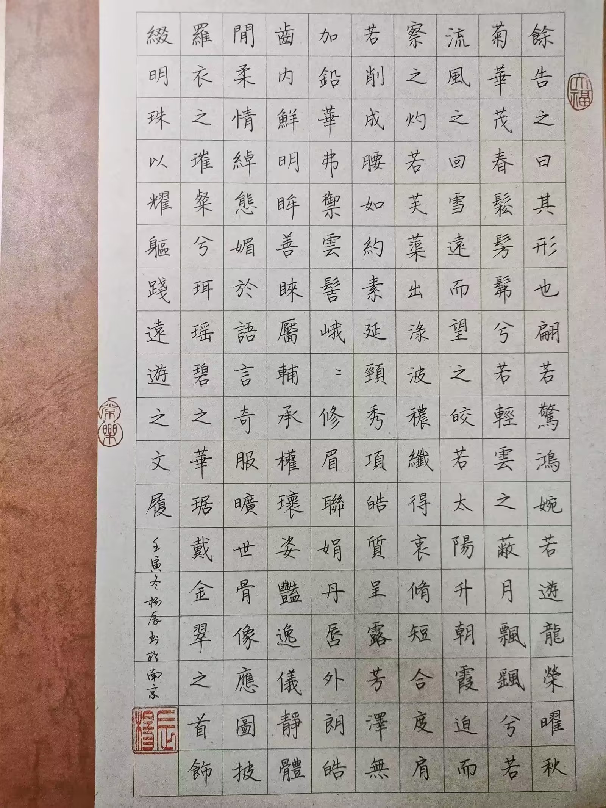

# 兴趣爱好

我从小学3年级开始学习书法，最早跟随爷爷在家学习，后来到兴趣班学习，从颜真卿的《颜勤礼碑》开始学习楷书，然后行楷学习赵孟頫的《帝师胆巴碑》，后来学习《圣教序》，《圣教序》的字体法度严谨，非常适合楷书到行书的过渡，而且因为是集字，所以适合二次创作，并且可以切换到其他行书字体，后来我自学了赵孟頫的行书，比如《洛神赋》、《秋兴赋》、《赤壁赋》、《闲居赋》等等，也尝试过王羲之、米芾、苏轼、智永等书家。

上大学后从孙过庭的《书谱》开始学习草书，孙过庭的草书十分飘逸又不失美感，非常适合草书入门。我最擅长赵体，数年的临摹和创作不仅扩展了我的视野，也让我对中华优秀传统文化有深入理解，书法之道亦是为人之道，刚正与圆滑，洒脱与拘谨，留白与密集，晕染与枯涸，无不映射着古人的智慧。

我从初中开始踢球，彼时正是16-18欧冠三连的皇马，承载了我的青春回忆。那个时期的银河战舰，拥有BBC三叉戟（贝尔、本泽马、C罗），典礼中场（克罗斯、莫德里奇、卡塞米罗），后防有水爷拉莫斯、学霸瓦拉内、队宠马塞洛、纳乔、卡瓦哈尔，门将有纳堵墙（纳瓦斯），还有伊斯科、阿森西奥、巴斯克斯等等。这是一支具有绝对统治力的球队，也是最纯白的年代。

我担任过门将和后卫的角色，当然也有着一颗前锋的心，高中经常和同学踢球，到了大学，接触到天南海北的爱好者，我开始在院队里担任后卫一职，到了苏州，有幸加入南京大学苏州校区队伍的大家庭，主职中后卫，足球也更多地融入生活，成为放松的方式，是属于青春独有的浪漫。

I started learning calligraphy from the third grade of elementary school. I first learned at home with my grandfather, and later attended an extracurricular calligraphy class. I began with regular script using Zhenqing Yan's *Yan Qin Li Stele*, then moved on to running-regular script by studying Mengfu Zhao's *Di Shi Dan Ba Stele*. After that, I studied *Shengjiao Xu* (Preface to the Sacred Teachings). The calligraphy of *Shengjiao Xu* is rigorous in structure and rules, making it very suitable for the transition from regular script to running script. Moreover, since it is a collection of characters (from Xizhi Wang), it lends itself well to creative adaptations and allows switching to other running script styles. Later, I self-studied Mengfu Zhao's running script works, such as *Luoshen Fu*, *Qiuxing Fu*, *Chibi Fu*, and *Xianju Fu*, and also tried my hand at calligraphers like Xizhi Wang, Fu Mi, Shi Su, and Yong Zhi.

Since entering university, I began learning cursive script with Guoting Sun's *Shu Pu* (also known as *Treatise on Calligraphy*). Guoting Sun's cursive script is both elegant and aesthetically pleasing, making it highly suitable for beginners. I am most proficient in the *Zhao style*. Years of copying and creating calligraphic works have not only broadened my horizons but also deepened my understanding of China's fine traditional culture. The way of calligraphy is also the way of being human: integrity and flexibility, uninhibitedness and restraint, blank spacing and density, wet ink and dry brush—all of these reflect the wisdom of the ancients.

I started playing soccer in middle school, right during Real Madrid’s UEFA Champions League three-peat from 2016 to 2018—a period that holds many of my fondest youth memories. That era’s “Galácticos” featured the BBC front line (Bale, Benzema, and Cristiano Ronaldo), the legendary midfield trio (Kroos, Modrić, and Casemiro), and a back line with “Captain” Ramos, the scholar Varane, the team favorite Marcelo, plus Nacho and Carvajal. In goal was the “human wall” Navas, along with Isco, Asensio, Lucas Vázquez, and many others. It was a team with absolute dominance—an era of purest white.

I have played as both goalkeeper and defender, though I have always had a striker’s heart. In high school I often kicked the ball around with classmates. In university I met enthusiasts from all over the country and began playing as a defender on the school team. After coming to Suzhou, I was fortunate to join the Nanjing University Suzhou campus team—mainly as a centre-back. Football has woven itself more deeply into daily life and become a way to unwind; it is a kind of romance that belongs only to youth.

