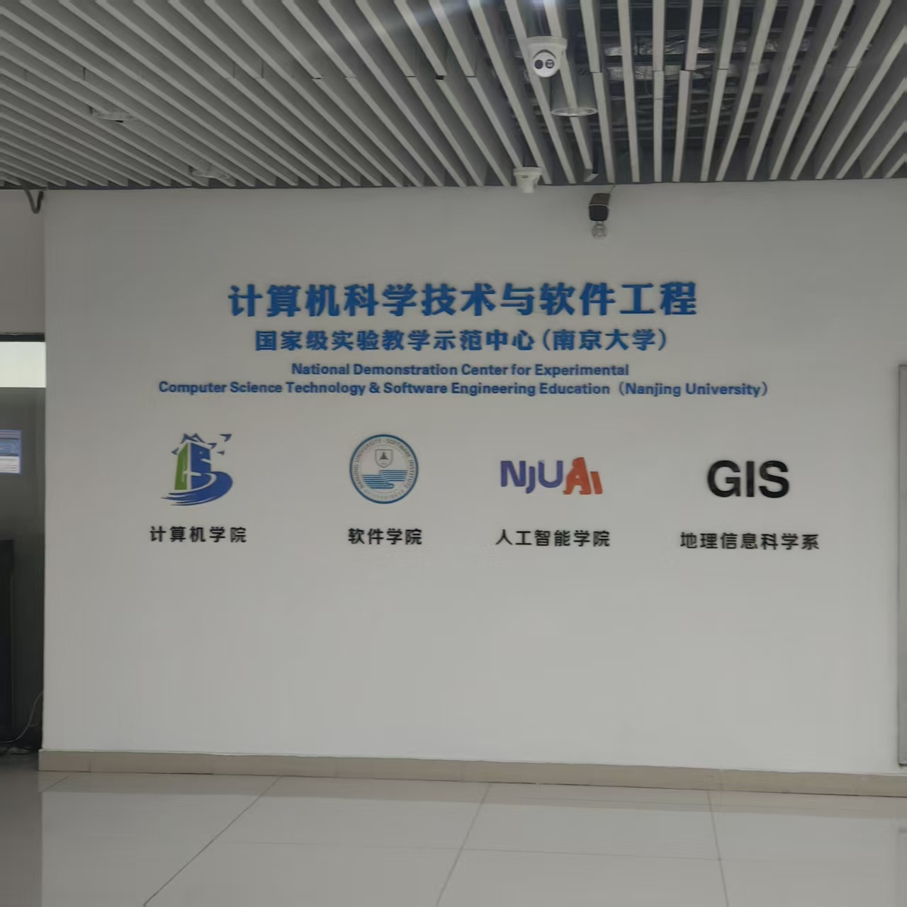

# 我的考研经验贴

## 1.基本背景

本科：苏州某南京985智能软件与工程专业

英语：六级540+

竞赛：大学生数学竞赛江苏赛区省一（考研顺便参加的），美赛H奖

其余：无

本科期间可以说平平无奇，绩点排名专业50%，考研的目标一方面是为了学历提升，另一方面也是对AI方向很感兴趣，想有更多的选择，对于未来就业也更好。

## 2.择校

一开始准备考南软22408，因为是本校且专业相关而且南软据说导师好且放实习，后面得知11408选择更多，在6月份改为选择11408，英语当时刚开始阅读影响不大，主要是数学补了一下重积分无穷级数和概率论，后来南软在8月份也改成11408了哈哈哈，而且南软改为3年制，本人综合考虑觉得性价比不高，再结合导师资源和研究方向等信息决定考南计，当时对于计院的老师和方向也大致了解了一下，最终选择考计专。至于其他的，比如科软，软微等等，这两个感觉竞争太大难度高，其他华五院校个人感觉差不多，对于本校还是比较青睐的，而且呢喃的计算机和AI方向还是很强的。

## 3.初试分数介绍

| 政治 | 英一 | 数一 | 408 | 总分 |
| ----- | ----- | ----- | ----- | ----- |
| 75 | 79 | 138 | 107 | 399 |

- 政治：选择是41分，单选错1道多选错4道；大题34分，大题主要是抄材料加肖四的背诵。

- 英语：客观扣了8.5分，客观难度不算太难，感觉比25年简单，但是本人新题型选反了两个，阅读错一个，完型五个；主观题感觉做得不错，翻译主题词对了，大小作文没跑题，后面主观有27.5分。

- 数学：选填都对，大题概率论第一问求导求错了导致失分，其他的地方感觉是证明题第一问有问题，其他大题对了答案没问题，最后的分数比预估的低一些。

- 408：今年的408对本人来说感觉有些难，选择有几题概念模糊，大题和语文阅读题一样，后面没时间了都是在抢分答题，在手写代码题上花时间太多了，大题丢了很多基础分，今年的题目比较新颖。

## 4.整体安排

笔者大概是从3月开始备考，每天是从8点起床吃饭学习，中午到11点半，然后玩手机睡午觉，下午一般两点多开始到五点半去吃饭，吃完饭可能会去健身，晚上6点多开始到10点半。平均每天10小时左右，考研期间我坚持去健身房锻炼，前期会按照计划一周四到五练，后面就两天一练了，有氧也不做了，关于健身锻炼我觉得考研期间还是可以保持的，不要太频繁一周七练就行，每周三练差不多，晚上也可以去跑跑步，对于身体和精神状态还是有益的。时间上分成4个阶段：

- 阶段一：3-7月。主要是基础阶段的学习，每天大概8小时左右学习，上课的话一般只有半天学习。数学完成了微积分、线性代数、概率论的学习。408按照数据结构、操作系统、计组、计网的顺序每个月一本书，做了王道书后面的选择题，因为中间有一些课程等等的事情所以到7月完成。英语一开始每天在扇贝上背单词，从5月份开始做阅读。

- 阶段二：8-9月。主要是强化阶段的学习，每天10小时起步。数学微积分和线代买了张宇的36讲，线代还看了杨威的，概率论找了方浩的资料但没看，无穷级数看了方浩的小猪佩奇，主要做了880。408我买了王道的网盘强化课，跟着学习了强化课大题的解法，这部分还是很有必要的，主要做了王道书后面的大题真题，后面想着二刷选择题的，但是没时间了。英语继续做真题，这段时间把阅读做完了，然后是新题型、完型、翻译，这三门我从b站上听了一些老师的课，翻译强推唐迟。政治我从暑假就开了，其实感觉到10月开也不迟，不过我暑假把政治的基础课听了一遍，跟的是肖秀荣系列的韩雪老师，对着书本勾勾画画就行了，也不用背诵，主要做做肖1000，买了苍盾的小程序刷题。

- 阶段三：10-11月。主要是真题，每天10小时起步。数学把05-25的真题做了两遍，选择李艳芳的真题集就完事了！然后数学可以针对错题和薄弱题型进行解决，b站上有丰富的up主资源，比如没咋了，你的葫芦等等，做完真题就可以开始模拟，我当时感觉真题的答案都记住了，真题平均也在140，直接开模拟了，如果真题遇到很多薄弱环节和问题的话，建议先解决这些问题再模拟，因为真题的重要性远大于模拟。408我只完全地做完了一遍真题，两天一张，一天计时做题，一天复盘，后面只把16-25的真题二刷了，本人感觉真题还是要刷两遍以上，而且复盘很重要，我当时复盘可能还不够，基础概念没有掌握好，408把真题吃透了包足够的，模拟我做了王道的模拟几张，感觉选择题是一些冷门考点，大题质量离真题差得远，选择题可以做做，其他的模拟卷没做过。英语的话开始作文，我会每天抄写一篇作文模板，大作文和小作文交叉，其实到考前我也没有正式写过一篇作文，全是背的作文模板和一些句型，然后客观题我二刷了一遍，每天一篇即可，保持手感，二刷的时候感觉对于一些文章的理解就清晰了。政治这时候我听了腿姐的马原史纲强化课，也打印了一些资料看，后面有肖秀荣的每日带背，我没有二刷肖1000，其实肖1000也只做了马原，主要是利用琐碎时间在小程序上反复刷题，上面也有模拟卷，政治不用做往年真题。

- 阶段四：12月。冲刺阶段，每天10小时起步。这个时候其实习题做得已经差不多了，主要是手感和熟练度，数学保持每天至少一套选填，两天一套大题。408真题二刷收尾，针对错题和薄弱的地方查缺补漏。英语两天一篇阅读保持题感。政治刷小程序，做肖八肖四选择，考前两周开始背英语作文模板和政治肖四，我是把肖四基本都背了下来（后面的提纲部分）。

## 5.数学

数学我一直是跟着张宇系列的，也有跟着武忠祥系列的，我的看法是无论是那位老师，主动权都在于自己，张宇的书很详细，方法也很完整，强化部分两者可以互为补充，其他的如杨威的线代，方浩的无穷级数和概率论，余炳森的概率论等也非常好，李林的概率论基础讲义据说也不错，总之是有时间就多结合各家进行补充。

### 阶段一

基础阶段我跟的张宇30讲，做了1000题微积分A组，然后做了660，660主要是选填，很多概念题，难度不大但是值得基础阶段一做，可以快速过一遍。微积分前几章的概念很重要，要能区分和判断，后面重积分和无穷级数算是两个难点。个人认为基础阶段理解和题目熟练度很重要，一定要把公式定理理解好，针对题型解决问题，而不是针对题目解决。

### 阶段二

强化阶段我仍然用的张宇的36讲，今年张宇的36讲变化较大，感觉更适合题型专项突破，方法总结得还是挺好的，对于一些常见考点一定要掌握，冷门的可以简单做一遍，后面忘了再看，到后期就是不断查缺补漏。线代部分强推杨威的每日一题以及一些题型的讲解，他在B站上有视频。概率论我用的是余炳森的，其实感觉市面上的概率论都大差不差，我本科学的概率论涉及到一些统计分析的内容，所以感觉考研的概率论其实就是微积分计算，而且题型很固定，掌握好离散型、连续型、混合型以及似然估计等等即可。强化阶段推荐做880，880也是考研数学必做的。

### 阶段三

真题阶段必做李艳芳的真题集，解析详尽，建议刷两遍保证真题每一题看到就知道怎么做，做真题的过程也是熟悉命题规律、掌握常考题型的过程。

### 阶段四

模拟阶段我做了张八、合工大超越、李六、张四、李四（按顺序），模拟卷做个20套即可，大概每天一张，后面会至少每天一套选填，超越卷的选填计算量太恶心了，大题目常规，不过题目确实出的很好，题目也新颖，值得一做，李林的卷子创新性也很好，适合提升，张四难度比真题简单，可以作为考前信心卷。我觉得模拟的主要目的是检查自己还有哪些地方有问题，查缺补漏，以及模拟考场上遇到未见题型的应变能力，不用在意具体的分数以及网上的模拟哥。

## 6.408

408主要就是王道系列的基础书加上真题和模拟题，配套B站上的视频，强化课和冲刺课在网盘上可以买到。

### 阶段一

在3-7月我按照数据结构与算法、操作系统、计组、计网的顺序每本书一个月完成了王道书的选择题和B站上的课程，也有人会把数据结构和算法与计网一起学习，把操作系统和计组一起学习，因为后两者强关联，四本书之间其实关联性一般，学习顺序因人而异，而计组相对来说难度最大，其次是操作系统，计网感觉更像是背诵加计算，数据结构则更加系统化，考点和题型固定。基础阶段一定要把重点考点全部理解一遍，对于一些冷门考点可以选择性不看，后面查缺补漏时看看。这里计网强推湖科大教书匠。

### 阶段二

这部分我在7月份到8月份大概一个月没看408，因为数学和408并行强化实在是有点难，时间分配上忙不过来，后来网盘上有王道的强化课，就买了强化课看，王道的强化课一定要看！这部分对于整个408每门每个部分的体系构建和做题方法非常重要，比如操作系统的PV操作、内存管理、地址的映射、文件管理、IO设备，计组的Cache计算、CPU数据通路、指令系统等等，计网部分则层次更加分明，物理层编码、数据链路层GBN/SR、网络层IPv4、传输层TCP/UDP、应用层DNS、SMTP、FTP等等。这一阶段要建立起整体的框架，把往年的真题按照章节分类完成，可以先听一遍讲解然后再自己做一遍，然后后面再二刷一遍，直到看到就直到怎么做为止。

### 阶段三

这一阶段重点就是真题套卷的完成，每两天完成一张，一天计时做题，一天认真复盘，复盘时不仅仅是错题，还有模糊的选项和蒙的题都要看看，一些边边角角的地方都不能放过，可以看王道书、参考书（比如袁春风的计组等等），或者是B站上的讲解，或者是问AI，比如deepseek、豆包等等。真题的分数也不重要，重要是复盘、查缺补漏、反复记忆。

### 阶段四

408的模拟卷质量良莠不齐，像王道的感觉大题很垃圾，选择题又太偏了，其他的模拟卷我没做过不做评价，真题的重要性永远远大于模拟卷，在真题吃透的情况下可以去看看资料书等等，湖科大的计网模拟卷可以一做。总之冲刺阶段重点是回归书本和常见考点，冷门考点留意即可，实在没有时间就all in常见考点。

## 7.英语

英语我个人的经验就是单词要背好，考研英语阅读对于细节题考的很多，一定要多背单词，然后多分析长难句，因为其实整张试卷都在考长难句。

英语题目我买的是张剑的黄皮书，至于单词书什么的可以不买纸质的，在扇贝或者墨墨等软件上背单词，其他的资料可以从网上打印。

阅读我会直接先看题目，了解文章相关词汇，因为出题顺序是按照文章顺序的，然后看第一段，后面看每段第一句，定下基调，要注意作者的情感词，很多时候会先抑后扬，但是切记不要带入自己的态度。

英语一的新题型有七选五、排序、段落标题选择三种题型，七选五考的最多，排序最难，今年的排序是我大意了，选反了两个，排序题要注意段落之间的衔接，重点看第一句和最后一句，也要注意语块的划分。

完型性价比比较低，一个才0.5分，而且难度不低，但是从16年后完型难度降低了，学有余力的同学可以看看具体的解题技巧。

翻译部分强推唐迟，翻译的原则是一定要翻译，不会的单词也要蒙，保证句子通畅，可以多翻译成小句子。

作文的话把小作文常见的建议信、感谢信等模板背背，大作文今年考了图表作文，以后大概率也是这种，图画和表格都要准备，推荐买一本王江涛的或者黄皮书的作文书。

## 8.政治

政治主要用的是肖秀荣系列，课本加1000题，还有腿姐网上的资料，打印出来看的。

政治个人的经验是多在小程序上刷题，以及多刷刷时政题，其实时政题刷熟练了就能掌握出题人的意图以及选项的规律，因为大家也都知道要选择合适立场的选项。基础阶段的课程可看可不看，马原和史纲建议看看，这两个逻辑性很强，马原的政治经济学部分可以少看点，当然今年的马原大题还就考了政治经济学，往年都是辩证法和唯物史观的。刷题推荐苍盾小程序，里面还有各方的模拟题很nice。

到11月就是肖秀荣的时间了，肖八选择题必须刷两三遍，保证每个题目每个选项都有印象，肖四选择题刷两遍和肖八同样的要求，当然今年肖四的题出的感觉偏偏难难的，当然模拟的分数不代表一切，到了12月就是背肖四了，今年肖四后面有一个提纲，也有十多页纸，还有B站上大牙、苏一等up主总结的背诵材料，都可以看看进行补充，每年肖四押题还是比较准的，我是把肖四都背下来了，考场上不会说抄材料抄不到以及没有话可说。

## 9.复试

复试由于保密协议暂时不做展开。

## 10.心态问题

考研期间心态非常重要，我相信大家在考研期间都会遇到各种各样的困难，在每个阶段也会产生不同的情绪波动。

- 考研一开始的时候感觉还行，毕竟学习压力没有那么大，但是这个时候可能还有一些课程等事情导致无法把时间完全投入到考研中，那么在学习的时候需要全身心地投入，对于课程什么的可以舍弃，保证学习的连贯性，也不用每天都高强度学习，每周留个一天放松是更好地调节方式，到后期也不能把自己当个机器一样学习，学累的时候就去玩玩喜欢的游戏、听听音乐、锻炼什么的。

- 心态最不稳的时候是八九月份，大概在保研出结果的时候，身边的同学们一个个尘埃落定，会让人十分焦虑，考研是一个人的战斗，主角是我们自己，无论别人再如何都与我们无关，可以关闭朋友圈，不断重复给自己打气，暗示自己会成功，少浏览一些加的考研信息群的消息，我是从不在那些群里发言，里面一些有用的资料和往年信息可以看看，但是我们自己要保持清醒，稳住心态。

- 到了后期，会发现自己怎么什么都忘了，知识点想不起来，做题没感觉，知识没体系，这些都是很正常的现象，我们要知道其实我们的知识没有忘，只不过大脑和内存一样，需要调页，需要置换，考研就是反复多次的学习，经过重复训练后就会拟合。当发现自己一直找不到做题的感觉时，可以刷刷别人的经验贴找感觉，看看B站放松大脑，吃顿好吃的休息休息，说不定再坐到座位上就茅塞顿开了。

- 初试那几天非常紧张，我初试前后瘦了好几斤，一是睡眠肯定是不够的，但是要保证有睡眠，中午一般就在考点旁找个位置休息，看看下午的科目，考场上保持适度的紧张感，可以给自己心理暗示稳住心态，看题做题要细心仔细，考完一门忘一门，不浏览社交软件的信息，考完即是胜利！

## 11.一些想说的话

- 考研的经历一定会在我们的人生中留下浓墨重彩的一笔，我觉得它让我又找回学习的准心和态度。

- 考研是一场信息战，重在各种院校信息、考研资料的搜寻，当然资料在精不在多，学习在于找对方向，付出努力，切忌三心二意。

- 考研是一场持久战，重在计划和实践，对自己的水平首先要有一定的把握，然后选择性价比以及未来发展较好的方向和院校，最后一定可以一研为定！

## 12.结语

感谢我的女朋友、家人、朋友的支持与陪伴，人生永远都是最好的选择，愿大家都成为最好的自己！

