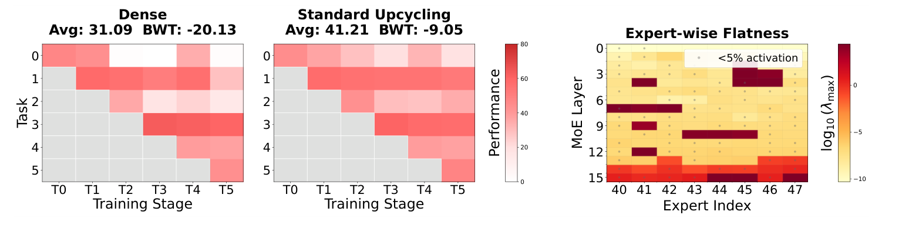
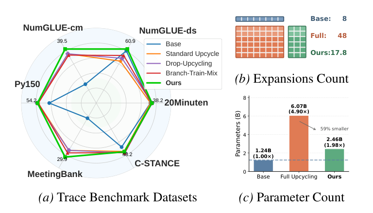
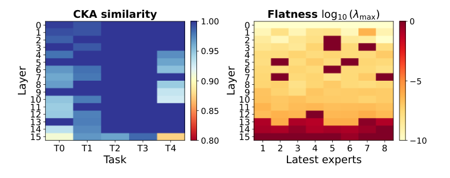
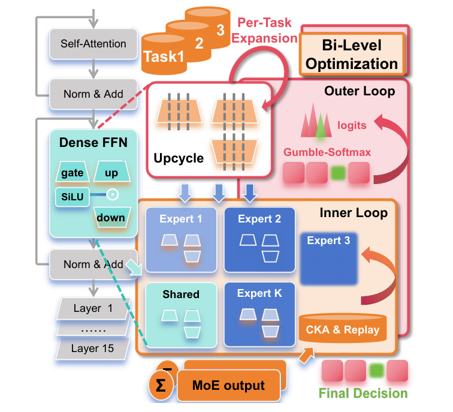
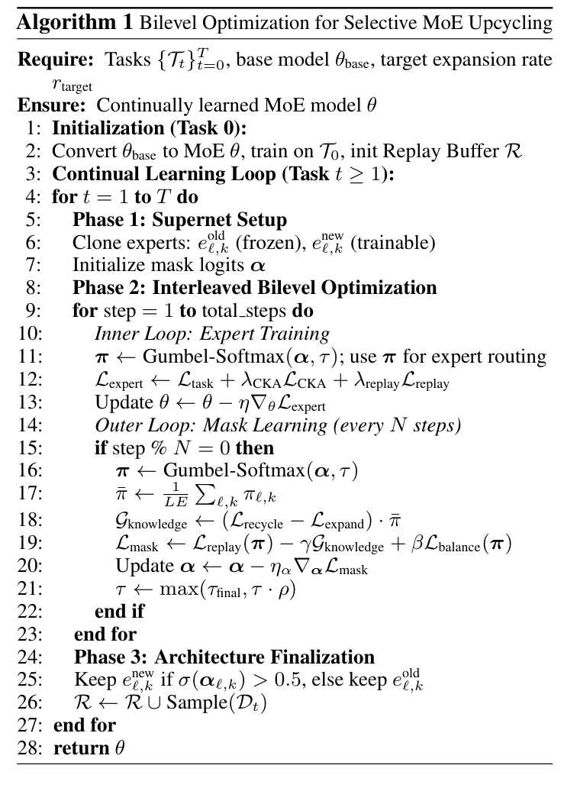
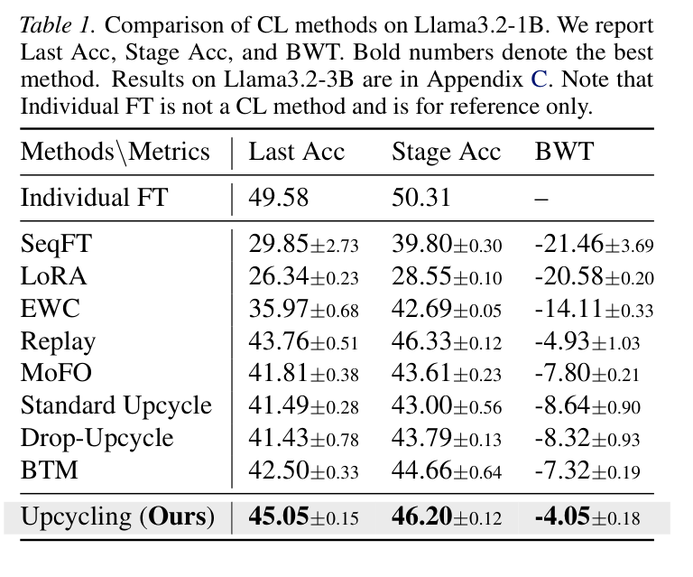
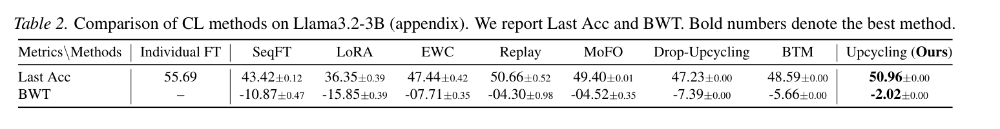
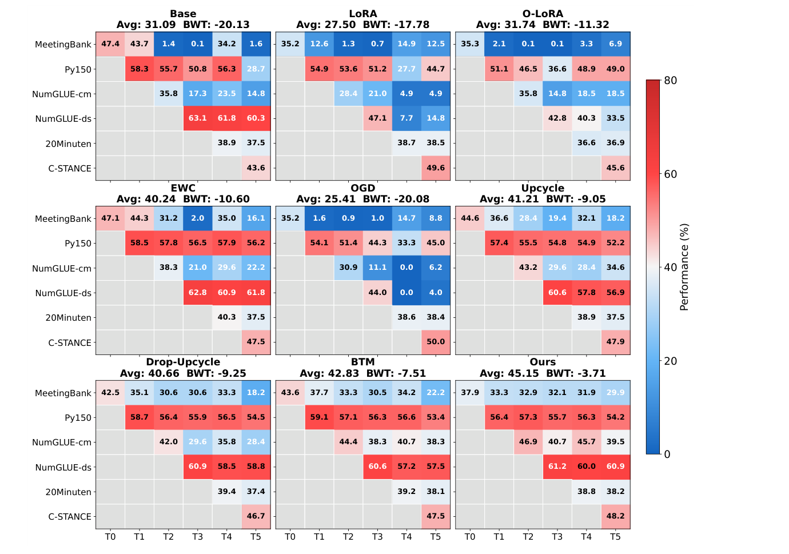
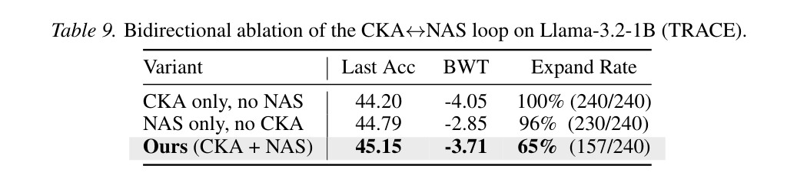

# Efficient Bilevel Optimization for CKA-Guided MoE Upcycling

> 作者：Zhiyuan Yu、Enneng Yang、Hao Jiang、Guojie Zhu、Feihong He、Peng Wang、Li Shen（中山大学、深圳河套学院、华为）

> 论文：ICML 2026。<https://icml.cc/virtual/2026/poster/64571>

> 代码：<https://github.com/fabfish/bilevel-moe-upcycle>

---

## 1. 背景与动机

### 1.1 持续学习

预训练结束以后，权重停在那一批数据上。新任务还是会来。按顺序接着训，新梯度会把旧任务的解盖掉，模型把已经会的事情忘掉。这件事叫灾难性遗忘（Catastrophic Forgetting）。

持续学习（Continual Learning），也叫终身学习或增量学习，要的是按顺序学习多个任务或数据分布，同时尽量保住已经学过的东西。

难处是稳定性—可塑性困境（Stability-Plasticity Dilemma）。旧知识要留得住，新知识也得有地方写进去。两边可以收成一项损失：

$$
L_{\mathrm{total}} = L_{\mathrm{new}} + \lambda \cdot L_{\mathrm{retain}}.
$$

前一项把模型推向当前任务，后一项把它拉回旧任务还能用的区域。\(\lambda\) 大了，新任务学不动；小了，旧任务掉得快。

### 1.2 几条现有路线

常见做法可以按动哪里来分。下表来自 [learnagent.wiki 的持续学习卡片](https://learnagent.wiki/agent/cards/continual-learning)。

| 策略 | 核心思路 | 代表方法 |
| --- | --- | --- |
| 回放（Replay） | 留下旧数据，和当前数据混在一起训 | Experience Replay、Generative Replay |
| 正则化（Regularization） | 限制重要参数不要挪太远 | EWC、LwF |
| 架构（Architecture） | 给新任务单独的参数 | Progressive Networks、LoRA |
| 优化（Optimization） | 改梯度方向，避开和旧任务冲突的更新 | OGD、Pareto Continual Learning |
| 蒸馏（Distillation） | 用旧模型当老师，教新模型记住旧输出 | Self-Distillation、SDFT |

架构这条路把任务知识隔进不同的参数子空间。渐进式网络是早期做法，来一个任务就加一列新网络。LoRA 更省，在冻结权重旁边加一块低秩增量。MoE Upcycling 也在这条路上：新专家是新容量，旧专家还留着。它的训练目标里同时有回放和 CKA 正则，后面会写到。

### 1.3 MoE Upcycling

Upcycling 把预训练稠密 FFN 的权重切分或复制成多个专家，用来扩大容量。新专家给新任务留出参数，旧专家继续承担已经学到的东西。推理时路由器只激活少量专家，计算量不跟专家总数一起涨。

论文里的标准切法沿中间维切片。LLaMA 式的 FFN 是

$$
\mathrm{FFN}(x) = W_{\mathrm{down}}\big(\sigma(W_{\mathrm{gate}} x) \odot W_{\mathrm{up}} x\big).
$$

\(W_{\mathrm{gate}}, W_{\mathrm{up}} \in \mathbb{R}^{H \times d}\)，\(W_{\mathrm{down}} \in \mathbb{R}^{d \times H}\)。目标专家数是 \(K\) 时，中间维 \(H\) 切成 \(K\) 段，每段宽度 \(h = H/K\)。第 \(i\) 个专家拿走 gate、up 的对应行，以及 down 的对应列：

$$
\begin{aligned}
W_{\mathrm{gate}}^{(i)} &= W_{\mathrm{gate}}[(i-1)h:ih,\ :], \\
W_{\mathrm{up}}^{(i)} &= W_{\mathrm{up}}[(i-1)h:ih,\ :], \\
W_{\mathrm{down}}^{(i)} &= W_{\mathrm{down}}[:,\ (i-1)h:ih].
\end{aligned}
$$

层输出是各专家的加权和，\(g(x)\) 是路由：

$$
\mathrm{MoE}(x) = \sum_{i=1}^{K} g(x)_i E_i(x).
$$

实验里每个新任务的切片都是 \(K = 8\)。

Sparse Upcycling、Branch-Train-MiX、Innovator、Drop-Upcycling、Lifelong-MoE 都在扩 MoE。常见做法是每层一起加专家，或者只看很粗的信号。这里要的选择更细：同一轮里同时看表示稳不稳、对新任务敏不敏感，并且细到某一个专家。

要回答的问题是：用什么指标判断这个 MoE 要不要扩、在哪一层扩、扩的时候留哪些专家。

### 1.4 统一扩展留下的空专家

Standard Upcycling 每来一个任务，所有 MoE 层都再切出 8 个新专家。TRACE 上六个任务走完，专家数从 8 涨到 48。

性能确实上去了。图 3 左边，稠密模型平均 31.09、BWT \(-20.13\)；Standard Upcycling 平均 41.21、BWT \(-9.05\)。BWT 是后向迁移，越负表示旧任务掉得越多。参数也上去了：1.24B 变成 6.07B，大约 4.90 倍。

图 3 右边是训完第 5 个任务之后，各层、各专家的平坦度，颜色用 \(\log_{10}(\lambda_{\max})\)。越浅越平。灰点是激活 token 不到 5% 的专家，浅层和中层里这种点很多。容量加上去了，路由几乎不用它们。

图 1 把这件事和后面的选择性扩展放在一起。(a) 是 TRACE 的六个数据集，选择性扩展的折线贴着几条 upcycling 基线。(b) 扩展次数从满扩展的 48 收到 17.8，基座是 8。(c) 参数是 2.46B，相对基座 1.98 倍；满扩展是 6.07B。图上标的是小了 59%。

---

## 2. 方法

### 2.1 用 CKA 和平坦度看该不该扩

CKA（Centered Kernel Alignment）量的是扩展前后，旧任务数据上的表示还像不像。两个中心化后的激活矩阵 \(X, Y \in \mathbb{R}^{n \times d}\)，线性 CKA 是

$$
\mathrm{CKA}(X, Y) = \frac{\|Y^{\top} X\|_{F}^{2}}{\|X^{\top} X\|_{F}\ \|Y^{\top} Y\|_{F}}.
$$

第 \(\ell\) 层的分数，用旧任务数据 \(\mathcal{D}_{\mathrm{old}}\) 上、扩展前的层输出 \(H_{\ell}\) 和扩展并训过之后的层输出 \(H_{\ell}^{\mathrm{up}}\) 来算：

$$
\mathrm{CKA}_{\ell} = \mathrm{CKA}\big(H_{\ell}(\mathcal{D}_{\mathrm{old}}),\ H_{\ell}^{\mathrm{up}}(\mathcal{D}_{\mathrm{old}})\big).
$$

实际只抽一小批旧任务激活。CKA 高，说明这一层在旧数据上的功能还在，现有容量够用，再扩是多余的。

平坦度（Flatness）量的是参数对新任务更新敏不敏感。训练里用梯度范数做代理，层参数是 \(\theta_{\ell}\)，损失是当前任务上的 \(\mathcal{L}\)：

$$
\mathrm{Flatness}_{\ell} = \frac{1}{|\theta_{\ell}|}\ \|\nabla_{\theta_{\ell}}\mathcal{L}\|_{2}^{2}.
$$

图上画的是 Hessian 最大特征值 \(\lambda_{\max}\)。论文比过梯度范数、随机方向上的景观锐度、Fisher 迹和 \(\lambda_{\max}\)，层与层的排序很接近，所以算法用更便宜的梯度范数，图用 \(\lambda_{\max}\)。数值越大，极小值越尖，对新任务越敏感。

图 4 是训完 \(\mathcal{T}_5\) 之后的结果。(a) 横轴是旧任务 \(\mathcal{T}_0\) 到 \(\mathcal{T}_4\)，纵轴是层。浅层和中层大多还停在高 CKA。第 15 层明显掉下去，旧数据上的表示漂了。(b) 是最新一组 8 个专家的 \(\log_{10}(\lambda_{\max})\)，深层整行更尖。

两张图的趋势是对齐的。浅层、中层在旧任务上漂得少，损失曲面也更平。这些层抗遗忘，新知识也不容易写进去，再加专家帮助不大，已有容量可以继续用。深层又漂又尖，适合加专家。同一层里专家也不一样，有的又平又很少被点到。扩展要细到每一层的每一个专家。

训练过程里有一个对应的数：第 15 层的专家扩展比例是 87.5%，第 12 层是 37.5%。

### 2.2 双层框架

外层决定扩哪些专家，内层决定这些专家的权重怎么更新。扩不扩写成可学习的架构决策，用可微神经架构搜索（NAS）来做，求解用一阶交替：专家的梯度步，和每隔若干步的一次掩码更新，轮流进行。

$$
\begin{cases}
\displaystyle \min_{\pi}\ \mathcal{L}_{\mathrm{mask}}(\theta^{*}, \pi), \\
\theta^{*} = \arg\min_{\theta}\ \mathcal{L}_{\mathrm{expert}}(\theta, \pi).
\end{cases}
$$

图 2 里，稠密 FFN 先切成专家。每个新任务到来时，外层从 logits 经 Gumbel-Softmax 得到掩码，决定这一层的这个专家是 Expand 还是 Recycle。内层在 CKA 和回放下更新被留下来训练的专家。任务结束，掩码收成一张离散决定。

### 2.3 内层：专家怎么更新

掩码先固定，只更新可训练的新专家。损失有三项：

$$
\mathcal{L}_{\mathrm{expert}} = \mathcal{L}_{\mathrm{task}} + \lambda_{\mathrm{CKA}} \cdot \mathcal{L}_{\mathrm{CKA}} + \lambda_{\mathrm{replay}} \cdot \mathcal{L}_{\mathrm{replay}}.
$$

\(\mathcal{L}_{\mathrm{task}}\) 是当前数据上的任务损失，负责把新知识写进去。

\(\mathcal{L}_{\mathrm{CKA}}\) 是较深几层上 \(1 - \mathrm{CKA}(\Phi_{\ell}, \Phi_{\ell}^{\mathrm{old}})\) 的平均。\(\Phi_{\ell}^{\mathrm{old}}\) 是扩展前的表示。这一项把深层表示拽在原来的流形附近，旧任务上的功能少漂一点。

\(\mathcal{L}_{\mathrm{replay}}\) 是回放缓冲区里一个小批量上的任务损失，用来维持已经见过的任务。

\(\lambda_{\mathrm{CKA}}\) 和 \(\lambda_{\mathrm{replay}}\) 在留出划分上调过，训练时当常数用。

### 2.4 外层：超网络和掩码

每个已有专家复制成两份：冻结的 \(e_{\ell,k}^{\mathrm{old}}\)，可训练的 \(e_{\ell,k}^{\mathrm{new}}\)。这一对的输出是凸组合：

$$
o_{\ell,k}(x) = \pi_{\ell,k}\, e_{\ell,k}^{\mathrm{new}}(x) + (1 - \pi_{\ell,k})\, e_{\ell,k}^{\mathrm{old}}(x).
$$

\(\pi_{\ell,k} = 1\) 时走新专家，也就是 Expand；等于 0 时走旧专家，也就是 Recycle。掩码来自 Gumbel-Softmax：

$$
\pi_{\ell,k} = \operatorname{Gumbel-Softmax}(\alpha_{\ell,k}, \tau)_{1}.
$$

\(\alpha \in \mathbb{R}^{L \times E \times 2}\) 是每层每个专家的二维 logits，\(\tau\) 是温度，下标 1 取扩展这一侧的概率。前向用接近离散的掩码，梯度经直通估计器回到 logits。

标准路由器仍然按输入选专家下标。掩码只改被选中的那个专家算的是新函数还是旧函数。负载均衡还作用在专家下标上，不必跟着掩码改。

### 2.5 外层损失、退火和定型

外层损失同时看回放、扩展带来的收益，以及扩展率离目标有多远：

$$
\mathcal{L}_{\mathrm{mask}} = \mathcal{L}_{\mathrm{replay}}(\pi) - \gamma \cdot G_{\mathrm{knowledge}}(\pi) + \beta \cdot \mathcal{L}_{\mathrm{balance}}(\pi).
$$

知识增益是

$$
G_{\mathrm{knowledge}} = \big(\mathcal{L}_{\mathrm{recycle}} - \mathcal{L}_{\mathrm{expand}}\big) \cdot \bar{\pi}.
$$

\(\mathcal{L}_{\mathrm{recycle}}\) 是把掩码强制成 0、只用旧专家时的损失，\(\mathcal{L}_{\mathrm{expand}}\) 是强制成 1 时的损失。\(\bar{\pi}\) 是所有层、所有专家上 \(\pi_{\ell,k}\) 的平均。新专家损失更低时，这一项为正；它在外层损失里带负号，梯度会把掩码往扩展一侧推。

均衡项不对称。低于目标扩展率 \(r_{\mathrm{target}}\) 时用线性惩罚，高于目标时用 sigmoid，涨得慢一些：

$$
\mathcal{L}_{\mathrm{balance}} =
\begin{cases}
2\beta\,(r_{\mathrm{target}} - \bar{\pi}), & \bar{\pi} < r_{\mathrm{target}}, \\
\sigma(\bar{\pi} - r_{\mathrm{target}}), & \text{otherwise}.
\end{cases}
$$

\(\sigma\) 是 sigmoid。这一项把平均扩展率拉向 \(r_{\mathrm{target}}\)。

Gumbel-Softmax 的温度按指数往下退火，决策从软的概率收成接近 0 或 1：

$$
\tau_t = \max\big(\tau_{\mathrm{final}},\ \tau_0 \cdot \rho^{t}\big), \quad \rho \in (0, 1).
$$

任务训完，按 logits 定架构：

$$
\mathrm{Decision}_{\ell,k} =
\begin{cases}
\mathrm{expand}, & \sigma(\alpha_{\ell,k}) > 0.5, \\
\mathrm{recycle}, & \text{otherwise}.
\end{cases}
$$

Expand 留下新训出来的专家，丢掉冻结副本。Recycle 留下原专家并解冻，丢掉新克隆。解冻是为了后面的任务还能再适配这份权重。

### 2.6 一个任务里的三步

任务 0 先把稠密模型切成 MoE，在 \(\mathcal{T}_0\) 上训练，并初始化回放缓冲区。从任务 1 起，每个任务走三步。

1. 克隆旧专家和新专家，搭起超网络，初始化掩码 logits \(\alpha\)。

2. 交替做专家梯度步和掩码更新。内层每步都走，掩码每 \(N\) 步更新一次，同时把温度乘上 \(\rho\)。

3. 用 0.5 的阈值删掉没被选中的那一份。

然后从当前任务抽样本放进回放缓冲区，进入下一个任务。

专家数量只在搜索期间暂时加倍。掩码定型之后，没被选中的副本释放掉，部署时只留下最终那一支。训练峰值显存和满扩展的搜索阶段接近，留下的模型比 Standard Upcycling 小。

---

## 3. 实验与分析

### 3.1 设置

基准是 TRACE，六个任务按顺序来，生成、代码、数值推理和分类混在一起。

| 任务 | 内容 | 指标 |
| --- | --- | --- |
| MeetingBank | 会议摘要 | ROUGE-L |
| Py150 | 代码补全 | 代码相似度 |
| NumGLUE-cm | 数值常识 | 准确率 |
| NumGLUE-ds | 数值推理 | 准确率 |
| 20Minuten | 文本简化 | SARI |
| C-STANCE | 立场检测 | 准确率 |

骨干是 Llama-3.2-1B-Instruct，FFN 切片成 8 专家的 MoE。Llama-3.2-3B 上做了补充。每个任务训 5 个 epoch。训练用 DeepSpeed ZeRO，4 张 A100 80GB。各方法共用同一份回放预算。

基线有 SeqFT、LoRA、O-LoRA、EWC、Replay、MoFO、Standard Upcycle、Drop-Upcycling、Branch-Train-MiX（BTM）。Individual FT 为每个任务单独微调一个模型，表里只作参照。

记 \(A_{b,j}\) 为训完任务 \(b\) 之后、模型在任务 \(j\) 上的分数，\(N\) 是任务数。汇报三个数：

$$
\begin{aligned}
A_{\mathrm{last}} &= \frac{1}{N}\sum_{j=1}^{N} A_{N,j}, \\
A_b &= \frac{1}{b}\sum_{j=1}^{b} A_{b,j}, \quad
\bar{A} = \frac{1}{N}\sum_{b=1}^{N} A_b, \\
\mathrm{BWT} &= \frac{1}{N-1}\sum_{j=1}^{N-1}\big(A_{N,j} - A_{j,j}\big).
\end{aligned}
$$

\(A_{\mathrm{last}}\) 是学完全部任务之后的平均表现，\(\bar{A}\) 是各阶段准确率的平均，BWT 用最后一轮和该任务刚学完时的差。BWT 越负，忘得越多。

### 3.2 TRACE 主结果

表 1 是多种子的均值。持续学习方法里，这套双层 Upcycling 的 Last Acc 是 45.05，BWT 是 \(-4.05\)，两项都是最好的。Stage Acc 是 46.20，Replay 是 46.33，略高一点。Individual FT 的 Last Acc 是 49.58，那是六个独立模型。

离得最近的是 Replay：Last Acc 43.76，BWT \(-4.93\)。Standard Upcycle 是 41.49 和 \(-8.64\)，SeqFT 是 29.85 和 \(-21.46\)。按热力图上的一次运行，Standard Upcycling 的 BWT 是 \(-9.05\)，这套方法是 \(-3.71\)，遗忘大约少了 60%。相对 SeqFT 的 \(-21.46\)，论文给出的降幅大约是 80%。

参数对应图 1：2.46B 对满扩展的 6.07B，大约少 60%；专家数是 17.8 对 48。论文写的有效扩展率大约是 38.7%。

Llama-3.2-3B 的补充结果在表 2。这套方法的 Last Acc 是 50.96，仍是持续学习方法里最高的，BWT 是 \(-2.02\)。BWT 最接近 0 的是 Replay，\(-0.30\)。规模换了，抗遗忘的名次和 1B 不完全一样。

### 3.3 任务序列上的热力图

图 5 是一次运行。每一格是训到该阶段之后、该任务上的分数，任务还没出现的位置空着。Ours 标的是 Avg 45.15、BWT \(-3.71\)，和表 1 的多种子均值不是同一个数。热力图里还有主表没列的 O-LoRA（31.74，\(-11.32\)）和 OGD（25.41，\(-20.08\)）。

看 MeetingBank 这一行。Standard Upcycling 从 44.6 掉到 18.2。这套方法从 37.9 落到 33.3 之后基本停住，最后是 29.9。Py150 最后仍有 54.2。NumGLUE-ds 从 61.2 到 60.9。早期任务在后续训练之后还在。

### 3.4 把 CKA 和 NAS 拆开

表 9 是同一次设定下的双向消融，模型仍是 Llama-3.2-1B。

只留 CKA、关掉 Gumbel-Softmax 掩码，等于强制 100% 扩展（240/240）。Last Acc 44.20，BWT \(-4.05\)。表示被正则拽住了，容量一点没省。

只留 NAS、把 \(\lambda_{\mathrm{CKA}}\) 设为 0，掩码随机初始化。扩展率仍有 96%（230/240），Last Acc 44.79，BWT \(-2.85\)。掩码分不出深层和浅层，结果接近全部扩展。

两项一起用，扩展率 65%（157/240），Last Acc 45.15，BWT \(-3.71\)。这里的 65% 是这一次运行里 Expand 决策占候选专家的比例。准确率最高，扩展也更稀疏。只开其中一项时，扩展率停在 96% 或 100%。

---

## 4. 总结

CKA 和平坦度用来区分该扩的层、该留的专家。浅层和中层往往又稳又平，深层在旧任务上漂得更厉害，同一层里的专家也不一样。

扩不扩被写成外层的 Gumbel-Softmax 掩码。内层在掩码给定时更新专家，损失里有当前任务、深层 CKA 和回放。搜索期每个专家暂时有一份冻结副本和一份可训练克隆，定型之后只留一支。

TRACE 上，Llama-3.2-1B 的 Last Acc 是 45.05，BWT 是 \(-4.05\)，都好于列出的持续学习基线。部署参数是 2.46B，相对满扩展的 6.07B 大约少 60%。

实现绑在 DeepSpeed 上。现在的实验从稠密 Llama 切专家，原生 MoE、多模态和 7B 以上还没有跑。在线数据流，以及和 LoRA 接在一起，论文放在后面的方向里。专家合并可以把训完的新专家融回旧专家，部署时连剩下的那部分额外参数也可以拿掉。

---

## 5. 参考文献

1. Yu et al. [*Efficient Bilevel Optimization for CKA-Guided MoE Upcycling*](https://icml.cc/virtual/2026/poster/64571). ICML 2026.

2. Wang et al. [*TRACE: A Comprehensive Benchmark for Continual Learning in Large Language Models*](https://arxiv.org/abs/2310.06762). arXiv:2310.06762, 2023.

3. Kornblith et al. [*Similarity of Neural Network Representations Revisited*](https://arxiv.org/abs/1905.00414). ICML 2019.

4. Komatsuzaki et al. [*Sparse Upcycling: Training Mixture-of-Experts from Dense Checkpoints*](https://arxiv.org/abs/2212.05055). arXiv:2212.05055, 2022.

5. Sukhbaatar et al. [*Branch-Train-MiX: Mixing Expert LLMs into a Mixture-of-Experts LLM*](https://arxiv.org/abs/2403.07816). arXiv:2403.07816, 2024.

6. Liao et al. [*Innovator: Scientific Continued Pretraining with Fine-grained MoE Upcycling*](https://arxiv.org/abs/2507.18671). arXiv:2507.18671, 2025.

7. Nakamura et al. [*Drop-Upcycling: Training Sparse Mixture of Experts with Partial Re-initialization*](https://arxiv.org/abs/2502.19261). arXiv:2502.19261, 2025.

8. Chen et al. Lifelong Language Pretraining with Distribution-Specialized Experts. ICML 2023.

9. Kirkpatrick et al. [*Overcoming Catastrophic Forgetting in Neural Networks*](https://arxiv.org/abs/1612.00796). PNAS 2017.

10. Li and Hoiem. [*Learning without Forgetting*](https://arxiv.org/abs/1606.09282). IEEE TPAMI 2017.

11. Hu et al. [*LoRA: Low-Rank Adaptation of Large Language Models*](https://arxiv.org/abs/2106.09685). ICLR 2022.

12. Wang et al. [*Orthogonal Subspace Learning for Language Model Continual Learning*](https://arxiv.org/abs/2310.14152). Findings of EMNLP 2023.

13. Jang et al. [*Categorical Reparameterization with Gumbel-Softmax*](https://arxiv.org/abs/1611.01144). arXiv:1611.01144, 2016.

14. Chen et al. [*MoFO: Momentum-Filtered Optimizer for Mitigating Forgetting in LLM Fine-Tuning*](https://arxiv.org/abs/2407.20999). arXiv:2407.20999, 2024.

15. Franceschi et al. [*Bilevel Programming for Hyperparameter Optimization and Meta-Learning*](https://arxiv.org/abs/1806.04910). ICML 2018.

16. McCloskey and Cohen. Catastrophic Interference in Connectionist Networks: The Sequential Learning Problem. Psychology of Learning and Motivation, 1989.

17. Rusu et al. [*Progressive Neural Networks*](https://arxiv.org/abs/1606.04671). arXiv:1606.04671, 2016.
