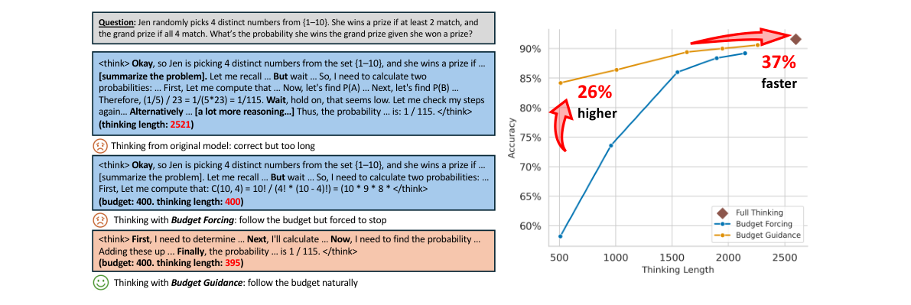
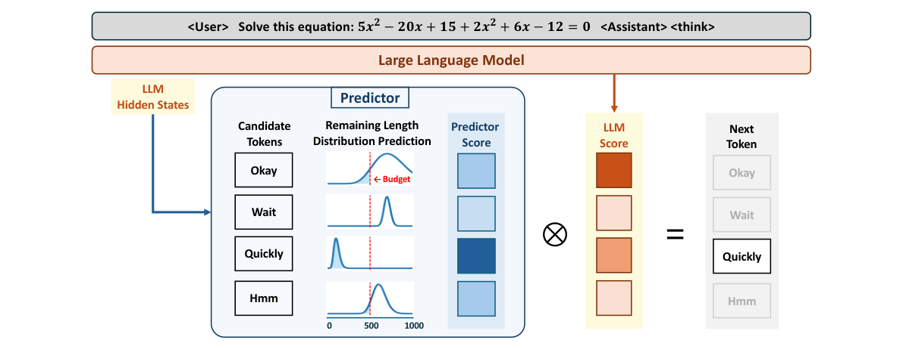
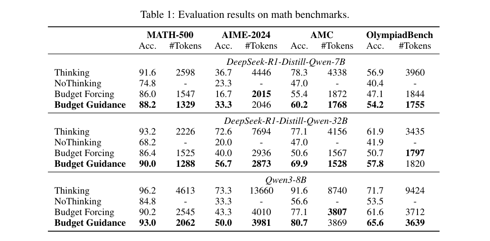
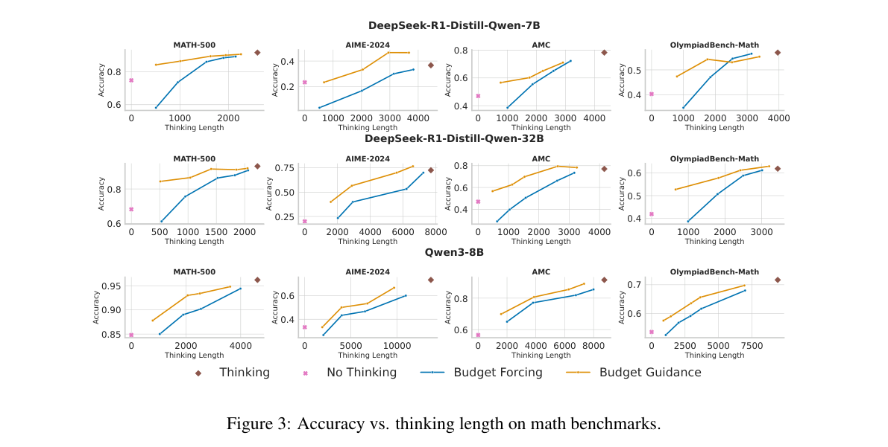
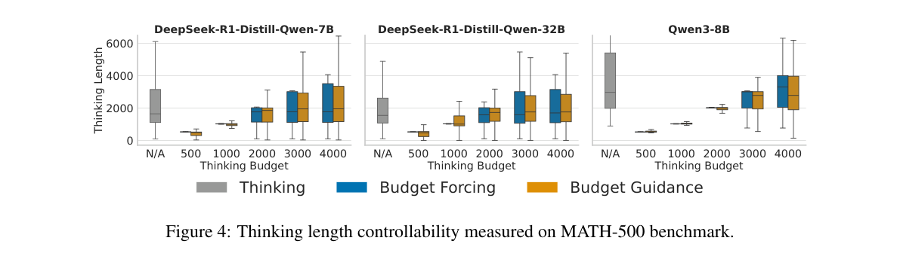
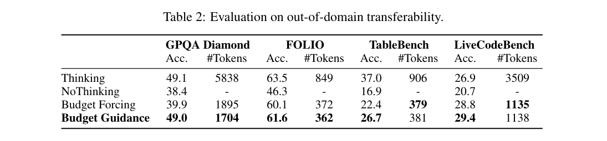
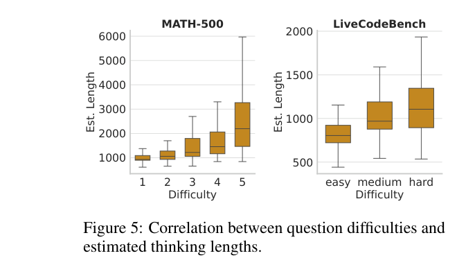
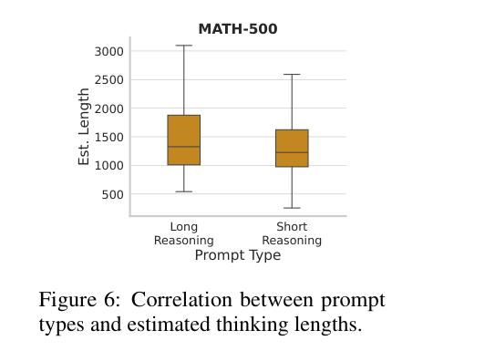
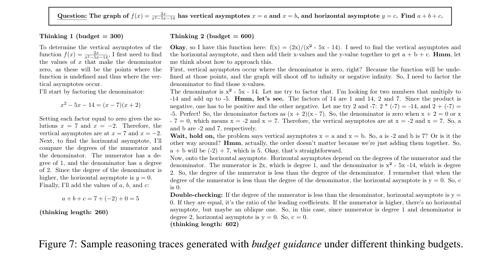
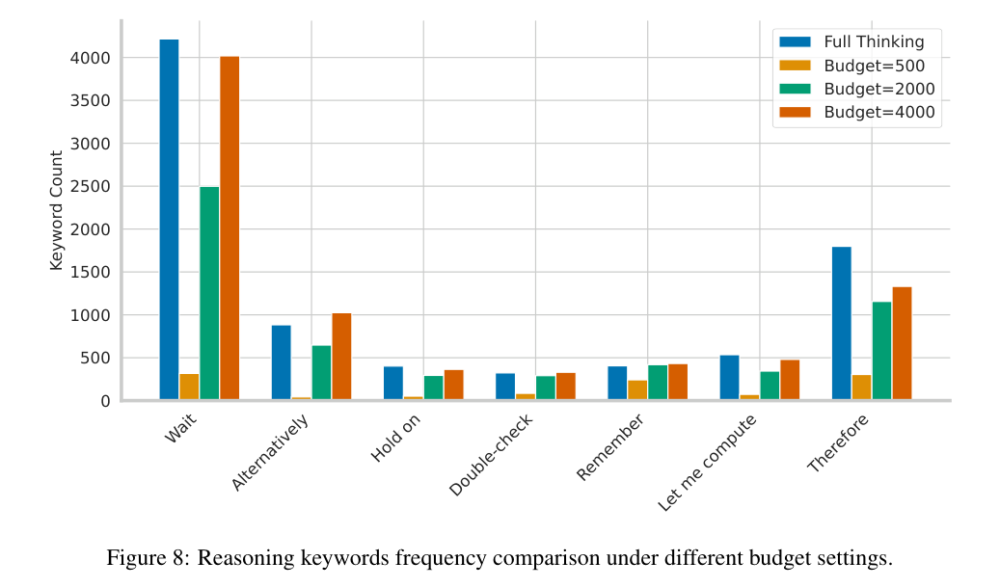

# BudgetGuidance: Steering LLM Thinking with Budget Guidance

> 作者：Junyan Li、Wenshuo Zhao、Yang Zhang、Chuang Gan（UMass Amherst、浙江大学、MIT-IBM Watson AI Lab）

> 论文：<https://arxiv.org/abs/2506.13752>

> 代码：<https://github.com/UMass-Embodied-AGI/BudgetGuidance>

---

## 1. 背景与动机

### 1.1 长思维链的开销

OpenAI o1、DeepSeek-R1、Qwen3 用很长的思维链换推理表现。答案可以是对的，过程却经常远长于题目需要的篇幅。推理 token 变多以后，延迟和算力一起涨，准确率并没有按同样的比例涨。面向用户的对话里，这段等待会直接变成响应变慢。

图 1 左边是同一道抽奖概率题。原始模型想了 2521 个 token，答案正确。Budget Forcing 把预算卡在 400，思考写到 400 就被截断，组合数的式子没有收完。Budget Guidance 在同一预算下写到 395 个 token，自己把概率收成 1/115。

图 1 右侧是 MATH-500 上准确率随思考长度的变化。紧预算一端，Budget Guidance 比 Budget Forcing 大约高 26 个百分点。靠近完整思考的那一端，思考长度大约是完整思考的 63%，图上标成快了 37%，准确率仍贴着完整思考。

### 1.2 两条现有路线

微调在专门构造的数据上改模型，或用带预算意识的奖励做强化学习。ThinkPrune 属于这一类。模型可以按预算重组推理，长度和准确率都能保住。微调本身贵，也有机会把原来的行为改掉，例如安全对齐。

推理时方法不动参数。Budget Forcing 数到预算就插上思考结束符，必要时再补一句 “Final Answer:”，逼模型立刻交卷。token 数卡得很死，没写完的那一步也会被砍掉，模型只好拿一个没完成的猜测当答案。NoThinking 更直接：插入固定句子 `Okay, I think I have finished thinking.`，把思考阶段跳过去。

### 1.3 要问的问题

微调能改写推理轨迹，代价是一次训练。推理时方法省掉这次训练，常见的干预是截断或跳过。缺的是一种测试时的办法：LLM 权重保持原样，推理轨迹仍能在预算里重新组织。

问题可以写成：有限的推理计算下，模型怎样动态调整自己的推理轨迹，尽量在预算内把任务做完。

Budget Guidance 借用扩散模型里 classifier guidance 的做法。扩散采样用一个辅助预测器把生成往目标条件上推。这里的条件换成思考预算。一个轻量预测器在生成过程中改下一个 token 的概率，LLM 参数不更新。

---

## 2. 方法

### 2.1 预算条件生成

记问题为 \(X\)，已经写出的思考为 \(Y_{<t}\)，下一步 token 为 \(Y_t\)。没有预算时，模型从无条件分布里采样：

$$
p(Y_t \mid X, Y_{<t}).
$$

设 \(L_t\) 是从当前 token 起还要再写多少个思考 token。若思考在第 \(l\) 个 token 结束，则 \(L_t = l - t\)。预算上限记为 \(\bar{l}\)，希望采的是

$$
p(Y_t \mid X, Y_{<t}, L_t \le \bar{l} - t).
$$

贝叶斯把条件分布拆成两项的乘积：

$$
p(Y_t \mid X, Y_{<t}, L_t \le \bar{l}-t)
\propto
p(Y_t \mid X, Y_{<t})
\cdot
\Pr(L_t \le \bar{l}-t \mid X, Y_{<t}, Y_t).
$$

左边是预算条件分布。右边第一项是 LLM 本来的下一个 token 分布，第二项是“如果选了这个 token，剩余思考长度还会落在预算里”的概率。测试时要算的就是第二项。

### 2.2 一次解码里的三步

图 2 里，预测器读 LLM 的隐状态，给每个候选 token 一条剩余长度的分布。预算画成一条竖线，落在竖线左边的概率就是这个 token 的调制分数。分数和 LLM 的输出分数相乘，再归一化，得到下一个 token。

每一步做三件事：

1. 对 LLM 做一次前向，得到无条件分布。
   
2. 预测器给出剩余长度分布，用 CDF 算每个候选 token 落在预算内的概率。
   
3. 两项相乘，重新归一化，按这个分布取下一个 token。

词表大小是 \(n\)。LLM 的输出写成向量 \(\boldsymbol{u}_t\)，预测器给出同维的 \(\boldsymbol{a}_t\)，预算条件分布是

$$
\boldsymbol{c}_t = \mathrm{normalize}(\boldsymbol{u}_t \circ \boldsymbol{a}_t).
$$

图 2 的例子里，候选有 Okay、Wait、Quickly、Hmm。Quickly 对应的剩余长度分布几乎整个落在预算左边，调制分数最高，下一步选中它。Wait、Hmm 的分布中心在预算右边，分数被压下去。

### 2.3 预测器

若逐步枚举，每一步要对词表里每个 token 都回答：假如下一步是它，剩下的思考会有多长，再对这条分布算到 \(\bar{l}-t\) 的累积概率。词表有多长，就要做多少次完整的密度估计。

论文把每条分布收成 \(\log(L_t)\) 上的 Gamma。对词表中的 \(v_i\)，

$$
p(L_t \mid X, Y_{<t}, Y_t = v_i)
= \mathrm{Gamma}\bigl(\log(L_t);\ \lambda_t(v_i),\ \alpha_t(v_i)\bigr).
$$

\(\lambda\) 是形状，\(\alpha\) 是速率。对长度取对数，是为了盖住思考长度从几十到上万的范围。Gamma 的 CDF 有闭式，所以预测器不用输出整条密度，只输出两组向量 \(\boldsymbol{\lambda}_t\) 和 \(\boldsymbol{\alpha}_t\)，\(\boldsymbol{a}_t\) 由 CDF 算出来。

结构用 BERT-base。输入是 LLM 最后一个已生成 token 的跨层隐状态，线性层把隐层维投到预测器的输入维，用一个 `[CLS]` 把这些隐状态收成一个向量。再一层线性得到 \(M \in \mathbb{R}^{n \times 2}\)，每一行是一个 token 的 \((\lambda, \alpha)\)。softplus 保证两个参数非负。

LLM 在整个过程里冻结。多出来的计算是这个 BERT 量级的前向，而且调制还会被限制在段落开头。论文在 7B 上测得，这样只让总延迟增加 0.6%。

### 2.4 训练，以及跳过大部分步

训练数据要的是目标模型风格的推理链，形式是 \((x, y_{1:l}, l)\)。论文用 OpenR1-Math-220k：约 22 万道数学题，轨迹由 DeepSeek-R1 生成。评测集和这个训练集不是同一批题。

一条轨迹会在不同位置截断。预测器看到截断后的前缀，要预测的剩余长度是 \(l - t\)。只更新预测器，目标是这些剩余长度的对数似然：

$$
\max_{\boldsymbol{\theta}}\ \mathbb{E}_{(x, y_{1:l}, l)}
\sum_{t=1}^{l-1}
\log p_{\boldsymbol{\theta}}(L_t = l - t \mid X = x,\ Y_{<t} = y_{<t},\ Y_t = y_t).
$$

数据增强把样本量翻倍。原始样本是一段思考再接一段答案，预测器训练时只用思考段。增强样本把答案再包进一对 think 标签，变成第二条轨迹，答案段也就进了训练。

理想情况下每一步都调制。段落内部 token 的选择通常已经被开头定下来了，不确定性集中在换行之后的新段落。所以调制只打在推理段落的起始位置，其余步直接用 \(\boldsymbol{u}_t\)。

---

## 3. 实验与分析

### 3.1 设置

模型是 DeepSeek-R1-Distill-Qwen-7B、32B，以及 Qwen3-8B。预测器训练 1 个 epoch，batch size 8，warmup 之后学习率恒定 \(1 \times 10^{-4}\)。7B 和 8B 大约 15 小时，32B 大约 35 小时，8 张 H100。评测在同一套机器上。

数学评测用 MATH-500、AIME-2024、AMC12（2022 与 2023，共 83 题）、OlympiadBench 的数学子集（675 题）。域外用 GPQA Diamond、FOLIO、TableBench 的数值推理子集、LiveCodeBench（2024-08 到 2025-01）。全部零样本，解码用贪心。

基线是 Budget Forcing 和 NoThinking，另外报完整思考。主表里的预算大约是该模型完整思考长度的一半，并让 Budget Guidance 和 Budget Forcing 的平均思考长度处在同一档，再比准确率。

### 3.2 数学基准

表 1 里，三个模型、四个数据集，平均长度可比时 Budget Guidance 的准确率都高于 Budget Forcing。和 NoThinking 的差距更大。拿掉思考之后准确率掉一截，这些推理轨迹对做对题有贡献。

看 DS-7B 的 MATH-500。完整思考 91.6%，2598 token。Budget Guidance 88.2%，1329 token。Budget Forcing 86.0%，1547 token。长度更短，准确率仍高 2.2 个百分点。AIME-2024 上差距被拉开：完整思考 36.7%，Budget Forcing 掉到 16.7%，Budget Guidance 留在 33.3%，长度都在 2000 左右。

32B 上 AIME 从 40.0% 到 56.7%，AMC 从 50.6% 到 69.9%。Qwen3-8B 的预测器是用 DeepSeek-R1 的轨迹训的，MATH-500 上仍是 93.0% / 2062 token，Budget Forcing 是 90.2% / 2545 token。推理风格接近的模型可以共用这一类轨迹。Qwen3 里同样会出现 wait、alternatively 这类组织思考的词。

### 3.3 准确率和思考长度

图 3 把预算从紧扫到松。横轴是实际平均思考长度，纵轴是准确率。棕点是完整思考，粉点是 NoThinking，蓝线是 Budget Forcing，橙线是 Budget Guidance。

多数格子里橙线在蓝线上面。预算越紧，两条线分得越开，MATH-500 这种难度从易到难都有的集合上更明显。紧预算时模型需要把题收成一条短但写完的轨迹，简单题本来也不需要展开很多轮自我否定。Budget Forcing 在 DS-7B 和 DS-32B 的 MATH-500 紧预算端会掉到 NoThinking 下面：思考被截断，模型提前猜。Budget Guidance 这条线一直在 NoThinking 上面。

### 3.4 长度能不能对准预算

图 4 是 MATH-500 上、预算从 500 取到 4000 时，每条样本实际思考长度的分布。灰箱是完整思考，蓝箱是 Budget Forcing，橙箱是 Budget Guidance。三个模型上，两种方法的中位数都贴着所设预算，每种设置里至少 75% 的样本落在预算以内。

Budget Forcing 靠硬截断拿到这个对齐。Budget Guidance 没有截断，分布仍然收在预算附近。预算给到 4000、接近该模型完整思考的中位长度时，箱子会重新张开，和灰色的完整思考靠近。

### 3.5 只在数学上训练，换到别的任务

表 2 只用 DS-7B，预测器仍是数学轨迹上训出来的那个。GPQA Diamond 上，完整思考 49.1%、5838 token，Budget Forcing 39.9%、1895 token，Budget Guidance 49.0%、1704 token。准确率回到完整思考，token 大约是原来的三成。FOLIO 上 61.6% 对 60.1%，TableBench 上 26.7% 对 22.4%，LiveCodeBench 上 29.4% 对 28.8%。四个集合都高于 Budget Forcing。

域外的差距小于数学题上的差距。TableBench 上 26.7% 离完整思考的 37.0% 还有一截。预测器没见过表格和代码的轨迹，调制信号是从数学推理里迁移过去的。LiveCodeBench 上 Budget Guidance 是 29.4%，高于完整思考的 26.9%。

### 3.6 预测器在估计什么

分析取的是第一个思考 token 处的长度估计，模型是 DS-7B。这个数可以看成预测器认为这道题还要写多少 token。

图 5 左边是 MATH-500，难度 1 到 5，估计长度的中位数从大约 1000 升到 2000 以上，难度 5 的上须拉到 6000。右边是 LiveCodeBench，easy、medium、hard 的箱子依次上移。域外的代码题上也有这层难度排序。

图 6 在 MATH-500 上换系统提示。长推理提示是 “Think step by step and provide thorough reasoning before reaching a conclusion.”，短推理提示是 “Think quickly and provide a concise reasoning with minimal steps.”。长提示的估计长度整体更高，\(t\) 检验 \(p = 0.0028\)。预测器会跟着题目难度和指令一起改估计，预算调制用的就是这个估计。

### 3.7 一条轨迹，以及关键词

图 7 是同一道题的两条轨迹。函数 \(f(x) = \dfrac{2x}{x^2 - 5x - 14}\)，垂直渐近线 \(x = a\)、\(x = b\)，水平渐近线 \(y = c\)，求 \(a + b + c\)。

预算 300 时实际写了 260 个 token。分母分解成 \((x - 7)(x + 2)\)，垂直渐近线 \(x = 7\) 和 \(x = -2\)，分子次数低于分母，水平渐近线 \(y = 0\)，加起来是 5。中间没有 Wait。

预算 600 时实际写了 602 个 token。同样的因式分解，中间插入 Wait、Hmm、Double-checking，把“次数相等时看首项系数、分子更高时可能是斜渐近线”也核对了一遍，答案仍是 5。两条都在预算附近自己结束，反思句的多少跟着预算走。

图 8 把这件事放到整份 MATH-500 上，模型仍是 DS-7B，预算取 500、2000、4000，对照完整思考。Wait、Alternatively、Hold on、Double-check、Therefore 都随预算变少而变少。完整思考里 Wait 超过 4000 次，预算 4000 时几乎一样高，预算 500 时只剩很低的一截。预算够用时，模型还会做原来的那套检查。

---

## 4. 总结

Budget Guidance 是一种测试时的长度控制。LLM 参数不动。BERT-base 预测器把剩余思考长度建成 Gamma 分布，用 CDF 去乘下一个 token 的概率，让整条轨迹靠向给定预算。调制放在段落开头，7B 上额外延迟大约 0.6%。

半预算设置下，7B、32B 和 Qwen3-8B 的四个数学基准上都高于 Budget Forcing。紧预算时优势更大，轨迹是写完再停。预测器能跟着难度和提示改长度估计。只在数学轨迹上训练，GPQA、FOLIO、TableBench、LiveCodeBench 上仍然高于 Budget Forcing。

论文自己标出的不足也直接。预测器只有数学数据，域外的提升小于域内，TableBench 离完整思考还有距离；把更多领域的推理轨迹放进训练，有机会再补上这一截。解码时仍然要逐 token 看要不要调制，更大模型和更长序列上的延迟还没有测。安全对齐会不会被这套分布调制带偏，论文没有做实验。

---

## 5. 参考文献

1. Li et al. [*Steering LLM Thinking with Budget Guidance*](https://arxiv.org/abs/2506.13752). arXiv:2506.13752, 2025.

2. Jaech et al. [*OpenAI o1 System Card*](https://arxiv.org/abs/2412.16720). 2024.

3. Guo et al. [*DeepSeek-R1: Incentivizing Reasoning Capability in LLMs via Reinforcement Learning*](https://arxiv.org/abs/2501.12948). 2025.

4. Yang et al. [*Qwen3 Technical Report*](https://arxiv.org/abs/2505.09388). 2025.

5. Hou et al. [*ThinkPrune: Pruning Long Chain-of-Thought of LLMs via Reinforcement Learning*](https://arxiv.org/abs/2504.01296). 2025.

6. Muennighoff et al. [*s1: Simple Test-Time Scaling*](https://arxiv.org/abs/2501.19393). 2025.

7. Ma et al. [*Reasoning Models Can Be Effective Without Thinking*](https://arxiv.org/abs/2504.09858). 2025.

8. Dhariwal and Nichol. [*Diffusion Models Beat GANs on Image Synthesis*](https://arxiv.org/abs/2105.05233). NeurIPS 2021.

9. Devlin et al. [*BERT: Pre-training of Deep Bidirectional Transformers for Language Understanding*](https://arxiv.org/abs/1810.04805). NAACL 2019.

10. Hugging Face. [*Open R1: A Fully Open Reproduction of DeepSeek-R1*](https://github.com/huggingface/open-r1). 2025.

11. Hendrycks et al. [*Measuring Mathematical Problem Solving With the MATH Dataset*](https://arxiv.org/abs/2103.03874). 2021.

12. Rein et al. [*GPQA: A Graduate-Level Google-Proof Q&A Benchmark*](https://arxiv.org/abs/2311.12022). COLM 2024.

13. Jain et al. [*LiveCodeBench: Holistic and Contamination Free Evaluation of Large Language Models for Code*](https://arxiv.org/abs/2403.07974). 2024.

14. Qi et al. [*Fine-tuning Aligned Language Models Compromises Safety, Even When Users Do Not Intend To!*](https://arxiv.org/abs/2310.03693). 2023.
