# Dynamic Expert Sharing: Decoupling Memory from Parallelism in Mixture-of-Experts Diffusion LLMs

> 作者：Hao (Mark) Chen¹, Zhiwen Mo¹, Royson Lee², Qianzhou Wang¹, Da Li², Shell Xu Hu², Wayne Luk¹, Timothy Hospedales², Hongxiang Fan¹
>
> ¹伦敦帝国理工学院，伦敦，英国  
> ²三星AI中心，剑桥，英国
>
> 论文链接：<https://arxiv.org/abs/2602.00879> 

---

## 1. 背景与动机

### 1.1 扩散大语言模型与并行解码

在各种并行解码范式中，扩散大语言模型（dLLMs）作为一种在生成质量和吞吐量之间取得平衡的有前景的方案应运而生。最先进的dLLMs通常利用基于块的并行解码，通过并发token生成实现与传统自回归（AR）模型相当的性能。

为了有效扩展这些架构，dLLMs越来越多地将混合专家（MoE）作为核心架构组件集成。MoE的主要优势在于它能够将模式的整体知识容量与每个token的计算成本解耦。通过为每个输入只激活稀疏的专家子集，MoE允许dLLMs扩展到海量参数规模，在不按比例增加FLOPs的情况下显著增强表示能力。

### 1.2 "专家爆炸"问题

然而，将MoE集成到dLLMs中引入了一个效率悖论。虽然从AR过渡到并行dLLM会增加运算强度，但MoE dLLMs的稀疏激活使其比密集模型更加内存受限。

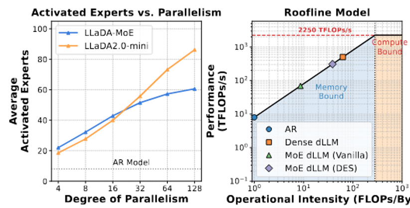

在这些内存受限场景中——这在多GPU和CPU卸载环境中很典型——延迟主要由从高带宽内存（HBM）到静态RAM（SRAM）加载唯一专家权重所需的流量决定。这种瓶颈因并行生成固有的"专家爆炸"而加剧：

- AR解码每步处理单个token。
  
- dLLMs同时处理N个token。
  
- 如果专家被独立选择，唯一专家负载几乎随块大小N线性扩展。

随着并行块的扩展，将不同专家从HBM传输到片上内存的开销可能会抵消MoE的计算节省，可能使这些模型比其较小的密集等价物更慢。

### 1.3 现有方法的局限

现有的MoE动态效率优化方法，如专家跳过（expert skipping），主要是为AR模型设计的，且严格以token为中心。虽然这些方法在减少每个token的计算FLOPs方面有效，但它们优先考虑局部稀疏性而非跨token的专家冗余。因此，它们无法缓解全局HBM流量瓶颈，因为每层加载的唯一专家权重没有在序列级别进行优化。

---

## 2. 核心方法

### 2.1 延迟模型分析

通过单个专家处理c个token的时间为：\(f(c) = ac + b\)（当c > 0时），其中b表示从HBM到SRAM的权重获取成本，a是边际计算成本。

N个并行token序列的MoE块总延迟为：

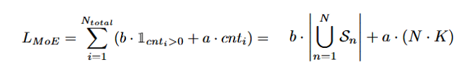

这里\(b\cdot \bigcup_{n=1}^N \mathcal{S}_n\)主导延迟，需最小化特殊专家负载。

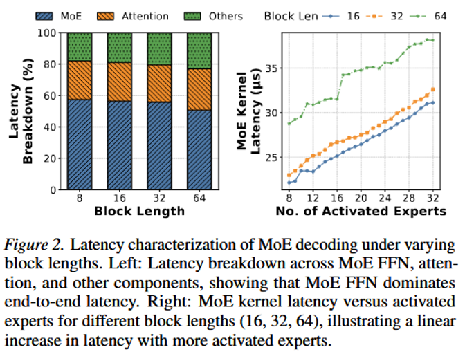

### 2.2 DES框架

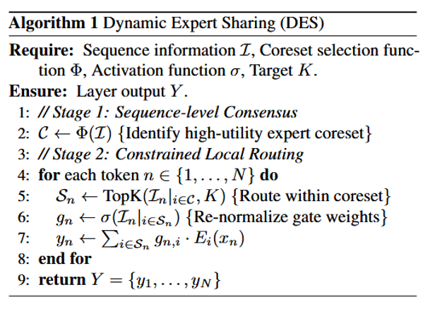

动态专家共享（DES）是一种旨在通过在并行token之间形成共识来最小化专家占用的新方法。该方法将优化目标从每token剪枝转向序列级共享。

与标准AR批处理中token通常属于不同任务不同，dLLMs中的并行解码涉及语义耦合的token，它们在专家需求方面表现出显著的重叠。为利用这一点，DES引入了核心集选择：在运行时动态识别出一个最小、高价值的专家集来服务于整个并行块。

通过将专家选择限制在共享核心集，显著减少了HBM到SRAM的流量，有效缓解了并行MoE解码的内存流量开销而不损害生成质量。

核心集选择函数：\(\Phi : \mathcal{I} \rightarrow \mathcal{C}\)，\(\mathcal{I}\)是路由器的logits或者隐藏状态，\(\mathcal{C}\)是专家集合。

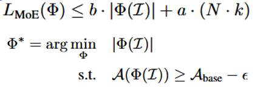

那么如何设计核心集选择函数呢？

### 2.3 序列内共享（DES-Seq）

形成较小核心集的一种直接方法是从每个token选择固定数量的最显著专家。对于块中的每个token n，选择其top-k专家。核心集\(\mathcal{C}\)是这些本地选择的并集：

\[\mathcal{C}_{DES-Seq} = \bigcup_{n=1}^N \text{TopK}(\mathcal{I}_n, k)\]

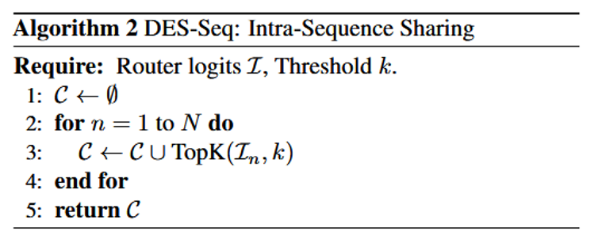

优点：简单，易于实现，可向量化。

局限：（1）只是减少本地预算而不寻求全局共识；（2）对所有token使用固定的选择阈值k，忽略了专家重要性在序列中差异显著（例如，token A的第2位排名专家可能比token B的第2位排名专家更关键）。

### 2.4 显著性感知投票（DES-Vote）

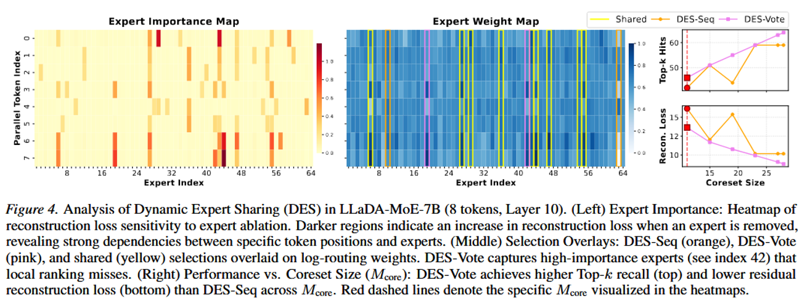

重要发现：路由权重与专家重要性高度相关，让token“投票”选出最重要的专家。

DES-Vote流程：

- 筛选：每个token只考虑自己的top-K专家 (屏蔽其他专家，过滤噪声)。

- 投票：将这些专家的路由权重作为“选票”，跨token累加。

- 选举：选择总得票数最高的\(M_{core}\)个专家作为核心集。

\[V_i = \sum_{n=1}^N \text{Masked}(\mathcal{I}_{n,i}), \mathcal{C}_{DES-Vote} = \text{TopK}(V, M_{core})\]

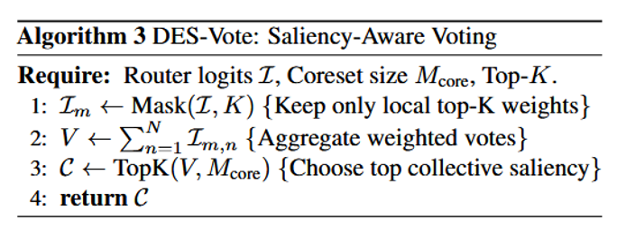

优点：自动考虑专家在整个序列中的集体重要性；灵活性高，通过调整\(M_{core}\)控制核心集大小。

### 2.5 Vanilla vs Expert Skipping vs DES

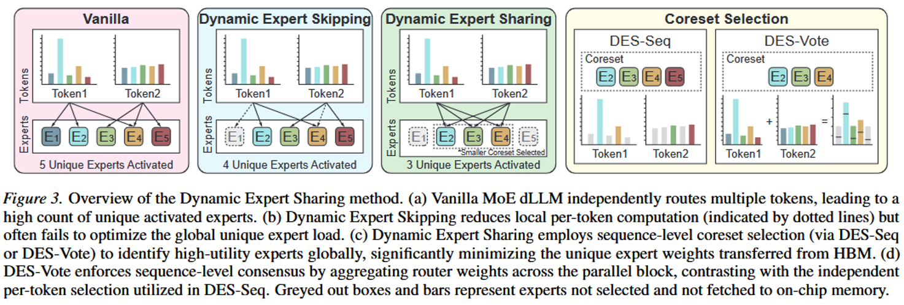

---

## 3. 实验与结果

### 3.1 实验设置

框架：使用dInfer框架，采用Fast-dLLM作为KV缓存方法，采用0.9置信度采样阈值和默认超参数配置。

超参数：使用预算因子β参数化DES-Vote使得核心集大小\(M_{core}\) = β × M（M是总专家池大小），而DES-Seq由本地选择计数k控制，改变β和k来调整核心集大小。

模型：LLaDA2.0-Mini(16B MoE dLLM)，LLaDA-MoE-7B(7B MoE dLLM)。

四个长形式生成解码和多样化推理基准数据集：HumanEval，MBPP，GSM8K，MATH500。

基线：Vanilla(原始模型)，Top-K(直接减少K)，NAEE(自适应专家跳过)，MC-MoE(保留重要token的专家)。

硬件：NVIDIA B200 GPU。

评估指标：准确率、特殊专家激活数、内存占用、MoE层延迟、端到端延迟等。

### 3.2 主要结果

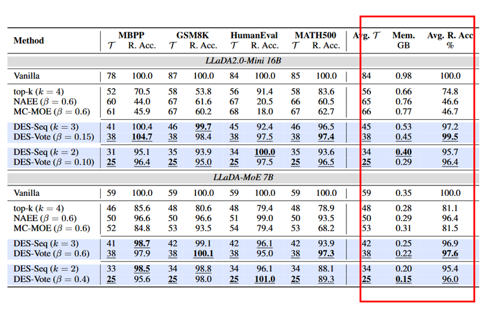

现有专家跳过方法失败：NAEE和MC-MoE在dLLMs上仅保留约46%的准确度，源于在具有不同门控分布的并行token上应用静态跳过阈值的次优性。

DES-Vote表现最优：在将唯一专家负载减少55%的同时保持99.5%的相对准确度。

专家共享的有效性：结合本地显著性（MC-MoE）相对于NAEE仅产生可忽略的改进，表明以token为中心的指标不足以解决并行解码固有的集体冗余。

### 3.3 效率分析

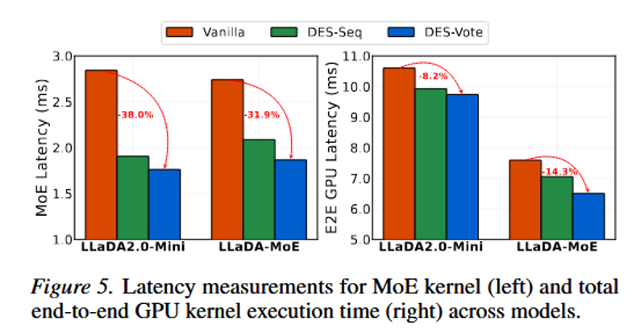

DES-Vote将LLaDA2.0-Mini的MoE层延迟降低高达38.0%。

LLaDA-MoE-7B降低31.9%。

总端到端GPU内核时间提高8.2-14.3%。

---

## 4. 消融实验

### 4.1 核心集大小的影响

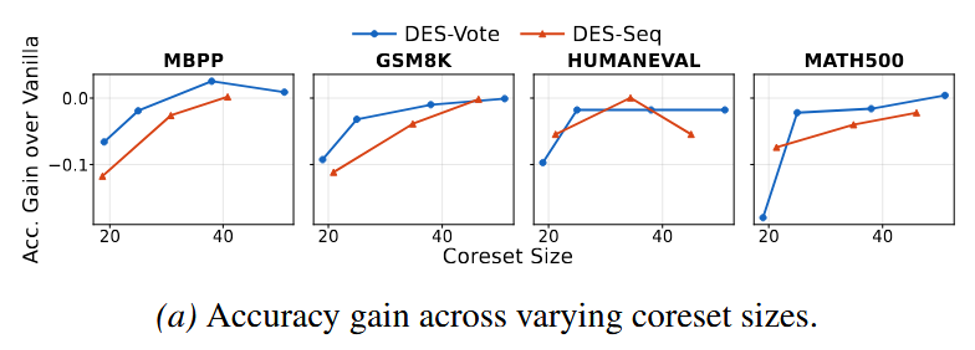

模型性能与核心集大小正相关，随核心集变小逐渐下降。

DES-Vote在相同核心集大小下始终保持更高准确度。

DES-Vote通过连续β参数实现更细粒度的核心集大小调节。

某些情况下准确度提升，可能归因于剪掉可能引入噪声的低价值专家。

### 4.2 对块大小的鲁棒性

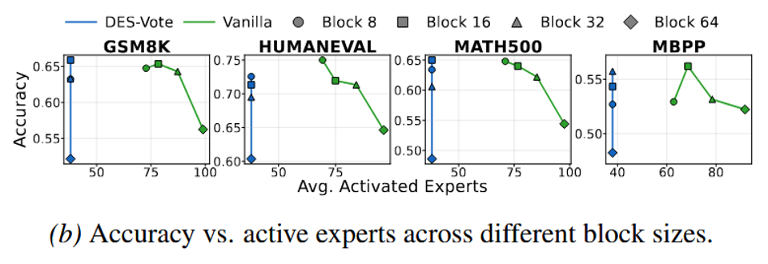

准确度下降始终较小，核心集有效泛化到更大并行度。

DES-Vote保持恒定且低的激活专家数量，与块大小无关。

从业者可以纯粹基于效率与准确度权衡优化块大小，不受传统内存带宽限制的约束。

### 4.3 活跃专家数量的影响

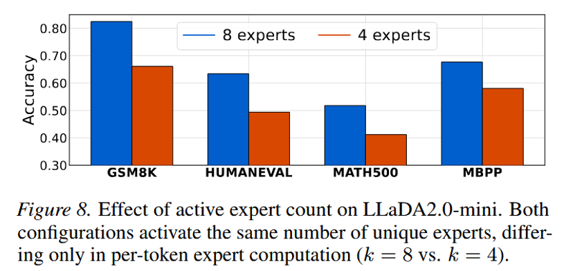

即使激活相同总数的唯一专家，将每token计算从8个专家减少到4个专家也会导致一致且显著的准确度下降，这证实了：即使这些专家与原始模型选择的top-8不同，从核心集重新激活专家也能保持性能。

### 4.4 专家利用可视化

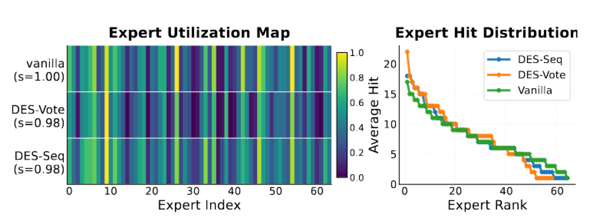

路由保真度：DES-Seq和DES-Vote与原始专家命中率向量余弦相似度≥0.98。

表示保真度：限制专家池在核心集内不会扭曲模型的基本路由模式。

集中效应：DES-Vote的激活曲线比DES-Seq和原基线更尖锐，集中在少数核心专家上；DES-Vote成功地聚焦于最重要的专家，缓解了长尾效应，从而减少了内存流量。

---

## 5. 总结

主要工作和贡献：

- 识别并量化了并行MoE解码中的专家爆炸瓶颈。

- 提出动态专家共享，将MoE优化从token级转向序列级，利用新颖的显著性感知投票机制来最大化专家重用。

- 通过DES-Seq和DES-Vote显著减少延迟同时保持高准确度，有效地将内存流量与并行度解耦。

局限：

- 核心集选择本身有计算开销。

- 主要验证在代码/数学任务，在更广泛的语言任务上需要进一步验证。

- 对极度稀疏或非均匀路由的MoE架构的适用性？
