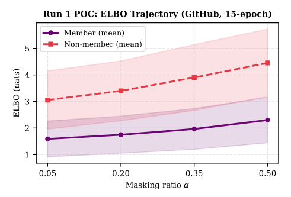
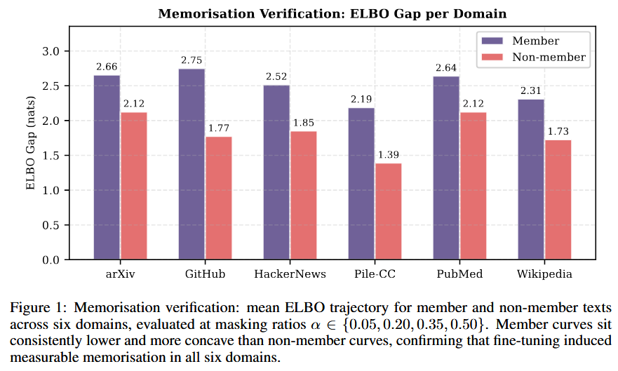
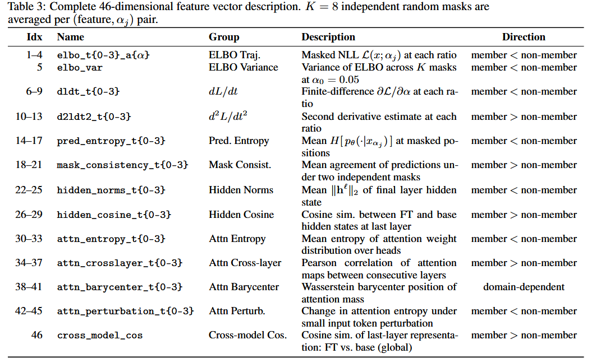
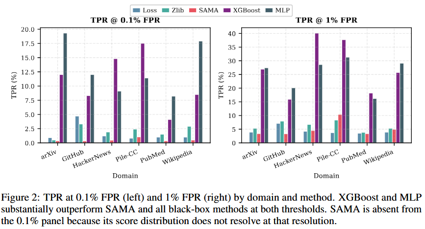
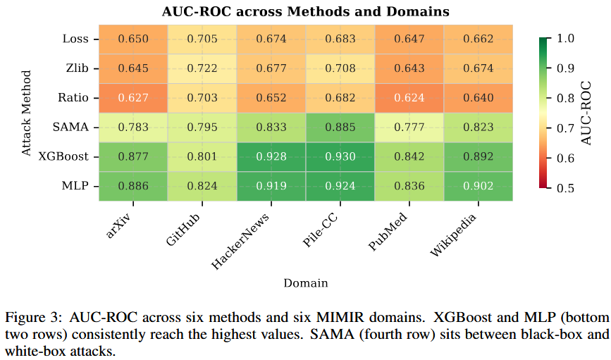
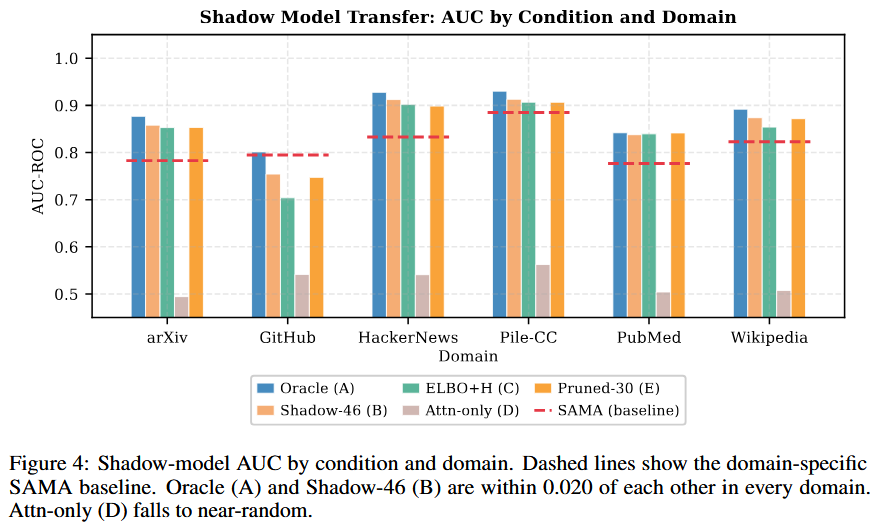
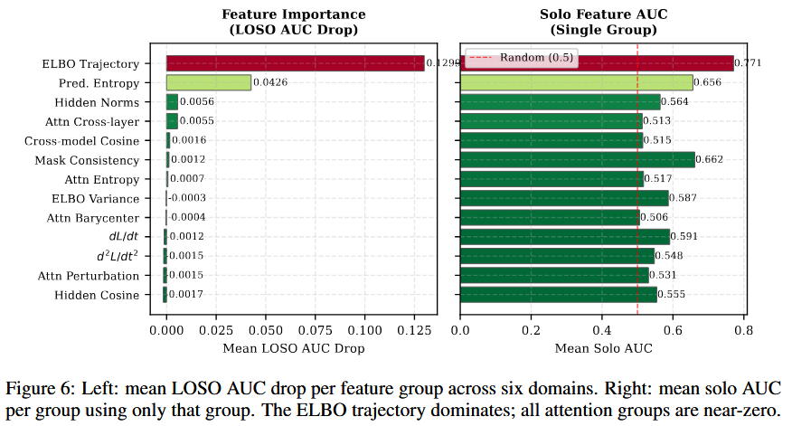

# Membership Inference Attacks on Discrete Diffusion Language Models

> 作者：Shailesh K，印度理工学院马德拉斯分校（Indian Institute of Technology Madras）

> 论文链接：<https://arxiv.org/abs/2605.16445>

---

## 1. 背景与动机

### 1.1 成员推理攻击与 MDLM 隐私

成员推理攻击（Membership Inference Attack, MIA）是隐私泄露的标准经验化检验：给定一段文本与对模型的某种访问权限，攻击者能否判断该文本是否出现在训练集中？对微调后的大语言模型而言，这类攻击在医疗记录、法律文档、私有代码库等敏感语料场景下具有实际意义。

按访问级别，MIA 可粗分为三类：

- **黑盒**：Loss、Zlib、Ratio 等，仅使用标量 NLL 输出；
  
- **灰盒**：SAMA 等，可使用任意掩码输入的 NLL，但不使用内部状态；
  
- **白盒**：可访问权重、隐状态、注意力图与梯度，本文攻击即属此类。

### 1.2 MDLM 与现有基线

掩码扩散语言模型（Masked Diffusion Language Models, MDLMs）以迭代去掩码替代自回归生成。前向过程以概率 \(t\) 独立掩码每个 token，其中 \(t \sim U(\varepsilon, 1)\)：

\[
q(x_t \mid x_0) = \prod_{i=1}^{L} \left[ t \cdot \mathbf{1}[x_t^{(i)} = [\text{M}]] + (1-t) \cdot \mathbf{1}[x_t^{(i)} = x_0^{(i)}] \right]
\]

模型 \(p_\theta\) 学习填充被掩码位置，通过最小化掩码重构损失（ELBO）训练：

\[
\mathcal{L}_\theta(x_0) = \mathbb{E}_{t,\, x_t \sim q(\cdot \mid x_0)} \left[ -\log p_\theta(x_0 \mid x_t)_{\text{masked}} \right]
\]

与自回归模型不同，MDLM 不存在可直接读取的单一无条件似然——损失取决于哪些 token 被掩码以及掩码比例，这种依赖关系携带了基于标量攻击所遗漏的成员信息。

现有灰盒基线 SAMA 在 \(T\) 步渐进累积掩码上，对随机 token 子集的 NLL 差异做符号聚合，再用调和权重汇总。本文实验使用 \(T=4\)、\(N=128\) 子集、每子集 \(M=10\) 个 token 的 SAMA 配置作为对比。

研究空白：自回归 MIA 已有大量研究，但尚无工作将白盒 ELBO 轨迹提取应用于离散扩散语言模型。本文表明 MDLM 的实际脆弱性显著高于 SAMA 等灰盒基线所暗示的水平。

### 1.3 核心洞察

已记忆某段文本的模型在任何掩码水平下都能以较低代价重构，产生比未见文本更低、更凹的 ELBO 曲线。单点标量 NLL 会遗漏这条轨迹形状中的成员信息。

---

## 2. 方法

### 2.1 威胁模型

本文考虑两种攻击设置：

- **完全白盒**：攻击者拥有微调模型权重，可运行任意掩码模式的前向传播，读取隐状态、注意力图与梯度张量；对应权重公开发布或泄露的场景。
  
- **影子模型迁移**：攻击者没有目标域成员标签，但知道架构与微调配方，可在无关数据上训练代理 MDLM，用 shadow 数据训练分类器后直接迁移至目标域。

### 2.2 记忆验证

运行攻击前，论文检验微调是否诱导了记忆。定义 ELBO 差距：

\[
\Delta_{\text{mem}}(x) = \mathcal{L}_{\text{base}}(x) - \mathcal{L}_{\text{FT}}(x)
\]

正差距表示微调降低了该文本的重构代价。在六个 MIMIR 域中，成员差距为 2.19–2.75 nats，非成员为 1.39–2.12 nats，分布有明显分离，确认记忆存在且可测量。

### 2.3 扩散轨迹特征提取

每条挑战文本 \(x\) 在掩码比例 \(\alpha = \{0.05, 0.20, 0.35, 0.50\}\)（\(T=4\) 个水平）下评估，每个水平 \(K=8\) 次独立随机掩码以降低方差。在每个水平计算 11–12 个标量信号，拼接后得到 46 维特征向量 \(\phi(x)\)：

| 信号组 | 维度 | 说明 |
|--------|------|------|
| ELBO 轨迹 | 4 | 各比例下的掩码 NLL，成员值更低 |
| ELBO 导数 | 8 | \(dL/dt\) 与 \(d^2L/dt^2\) 的有限差分估计 |
| 预测熵 | 4 | 掩码位置上预测分布的平均熵 |
| 掩码一致性 | 4 | 同一比例下两次独立掩码的预测一致度 |
| 隐状态统计 | 8 | FT 与 base 隐状态的 \(\ell_2\) 范数及余弦相似度 |
| 注意力信号 | 16 | 注意力熵、跨层相关、传输重心、扰动响应 |
| 跨模型余弦 + ELBO 方差 | 2 | 全局跨模型表示相似度与 ELBO 方差 |

### 2.4 攻击分类器

在 \(\phi(x)\) 上训练三种分类器，均使用 5 折分层交叉验证，折外概率用于 AUC 计算：

- **XGBoost**：200 棵树，深度 4，学习率 0.05，子采样 0.8；
  
- **LightGBM**：相同设置；
  
- **MLP**：隐藏层 \((256, 128, 64)\)，dropout 0.3，20% 验证集早停。

### 2.5 影子模型迁移

在 \(K_s=3\) 个 shadow MDLM 上（于 ngram\_13\_0.2 MIMIR 划分的代理数据微调，跨六域池化约 5,695 条成员序列）提取相同 46 维特征，训练单个 XGBoost 分类器后直接应用于目标域，无需重训练、无目标域标签。

评估五种条件：

| 条件 | 说明 |
|------|------|
| A（Oracle） | 使用目标成员标签的 5 折 CV，白盒上界 |
| B（Shadow-46） | 完整 46 维 shadow 迁移 |
| C（ELBO+H） | 8 维子集，仅 ELBO 与熵特征 |
| D（Attn-only） | 仅 16 维注意力特征（负对照） |
| E（Pruned-30） | 46 维去掉 16 维注意力 |

---

## 3. 实验与结果

### 3.1 实验设置

- **模型**：dllm-hub/Qwen3-0.6B-diffusion-mdlm-v0.1，按域分别微调 5 epoch（AdamW，\(\eta=10^{-4}\)，batch 8，bfloat16）；
  
- **数据集**：MIMIR 基准 ngram\_13\_0.8 划分，六域（arXiv、GitHub、HackerNews、Pile-CC、PubMed Central、Wikipedia）；每域 300 成员 + 300 非成员作评估，1,000 成员用于微调；
  
- **基线**：黑盒 Loss、Zlib、Ratio；灰盒 SAMA（\(T=4\)，\(N=128\)，\(M=10\)）；
  
- **指标**：AUC-ROC（95% bootstrap CI，1000 次重采样），以及 TPR@\{0.1%, 1%, 10%\} FPR。

### 3.2 低 FPR 下的 TPR

在 1% FPR 下，XGBoost 依域恢复 15–40% 成员，SAMA 仅 3–10%；Pile-CC 上 XGBoost 识别 37.7% 成员，HackerNews 达 40.1%，相对 SAMA 改进 4–8 倍。

在 0.1% FPR 下，XGBoost 仍恢复 4–18% 成员（每测试 1,000 个非成员仅一个误报）。SAMA 在 \(N=128\) 子集时无法在此分辨率可靠运行，而轨迹分类器无性能退化即可工作。

### 3.3 AUC-ROC 总览

XGBoost 平均 AUC 0.878（±0.046），MLP 0.882，均远高于 SAMA 灰盒基线 0.816（±0.037）。相对 SAMA 的 +0.062 差距来自捕获完整 ELBO 曲线形状，而非每子集标量 NLL 比较。黑盒攻击（Loss、Zlib、Ratio）集中在 0.625–0.722，未从扩散结构获益。

域差异：Pile-CC（AUC 0.930）与 HackerNews（0.928）最脆弱；GitHub（0.801）最难，源码结构规律使成员与非成员产生相似 ELBO。

### 3.4 影子模型迁移

Oracle 平均 AUC 0.878；Shadow-46（条件 B）平均 0.858，差距仅 0.020。在 1% FPR 下，无目标域标签的影子攻击平均恢复 19.5% 成员，Oracle 为 27.4%。

- **条件 C（ELBO+熵，8 维）**：AUC 0.843，仅损失 0.015 AUC，提取约快 6 倍；
  
- **条件 D（仅注意力）**：AUC 崩塌至 0.525，TPR@1%FPR 1.6%，接近随机——注意力模式域特定，无可迁移成员信号；

结论：基于 ELBO 的信号可跨域迁移；注意力信号不可。

---

## 4. 消融实验

留一信号（LOSO）分析将 ELBO 轨迹隔离为主要信号：

| 信号组 | LOSO AUC 下降 | Solo AUC |
|--------|---------------|----------|
| ELBO 轨迹 | 0.130 | 0.774 |
| 预测熵 | 0.043 | 0.655 |
| 掩码一致性 | — | 0.666 |
| 注意力各组 | <0.006 | 0.47–0.53（接近随机） |

移除 ELBO 轨迹组使平均 AUC 下降 0.130，超过 XGBoost 与 SAMA 之间的完整差距（0.062）。四个注意力组各自贡献均小于 0.006；在 shadow 设置中 Attn-only 亦失败（AUC 0.525），证实注意力特征域特定。

最小有效攻击：ELBO 轨迹 + 预测熵（8 维）在 shadow 迁移中平均 AUC 0.843，仍高于 SAMA 0.816，且提取成本约为完整 46 维的 1/6。

---

## 5. 总结

本文首次将白盒 ELBO 轨迹提取应用于微调 MDLM 的成员推断，表明其脆弱性显著高于灰盒基线所暗示：

- **白盒 MIA**：46 维扩散轨迹特征 + XGBoost/MLP 分类器，六域平均 AUC 0.878，峰值 0.930，比 SAMA 高 0.062；
  
- **影子模型迁移**：\(K=3\) 个代理 MDLM，无目标域标签达 0.858 AUC，与 Oracle 差距仅 0.020；
- **特征消融**：ELBO 轨迹驱动大部分性能，注意力特征几乎无贡。

**局限**：实验基于单一模型族（Qwen3-0.6B MDLM），每域训练集较小（300–1,000 样本）；白盒威胁模型偏乐观，限制内部访问的部署将把攻击限制在影子模型路径。

**未来方向**：防御侧可考虑差分隐私微调与 ELBO 轨迹正则化；攻击侧可扩展至 LLaDA 等 MDLM 变体，以及从生成时输出估计 ELBO 轨迹以实现完全黑盒设置。
