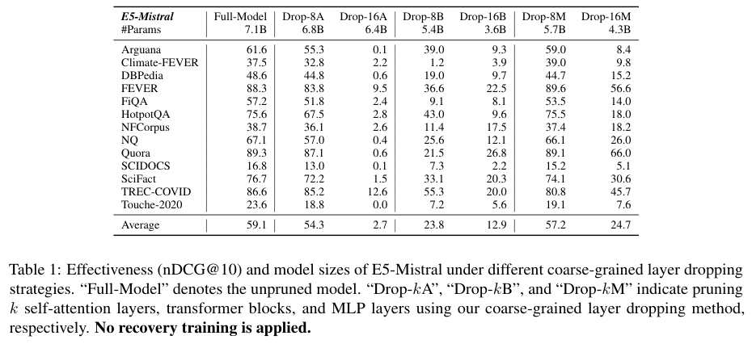
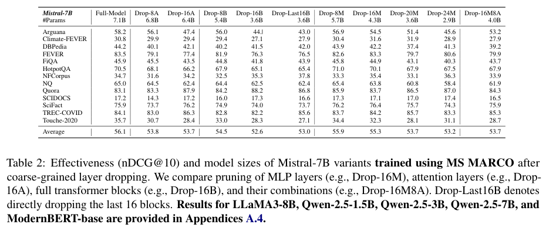
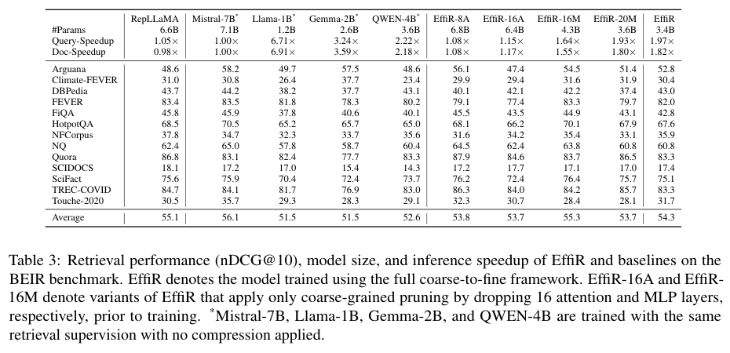
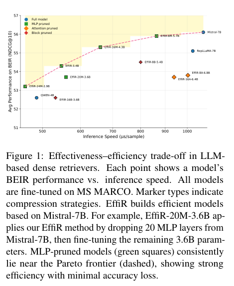
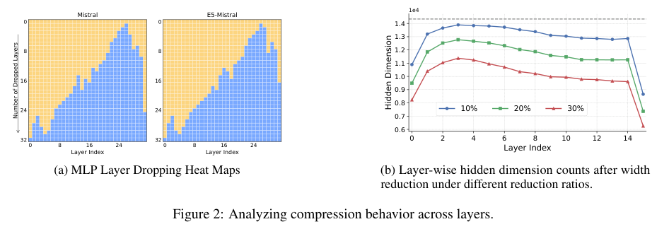
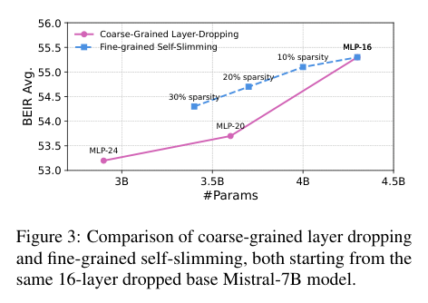
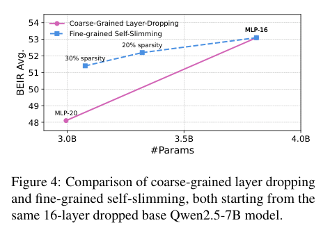
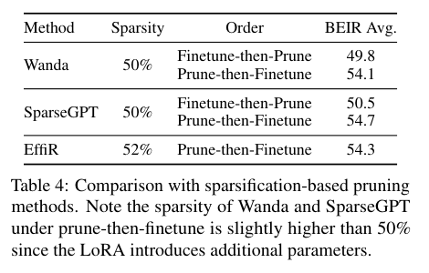
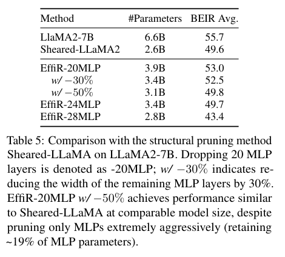
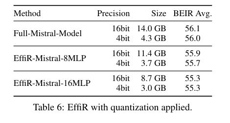

# EffiR: Making Large Language Models Efficient Dense Retrievers

> 作者：Yibin Lei、Shwai He、Ang Li、Andrew Yates（阿姆斯特丹大学、马里兰大学学院公园分校、约翰霍普金斯大学 HLTCOE）

> 论文：ACL 2026。<https://arxiv.org/abs/2512.20612>

> 代码：<https://github.com/Yibin-Lei/EffiR>

---

## 1. 背景与动机

### 1.1 稠密检索

稠密检索把 query 和 document 编码进同一向量空间，用相似度做语义匹配。相对 BM25 这类稀疏方法，匹配更依赖语义，而不是词面重叠。

训练时，相关的 query–document 拉近，不相关样本推远。目标是 InfoNCE：

$$
\mathcal{L}=-\log\frac{\exp(\mathrm{sim}(q,d^{+})/\tau)}{\exp(\mathrm{sim}(q,d^{+})/\tau)+\sum_{j=1}^{N}\exp(\mathrm{sim}(q,d_{j}^{-})/\tau)}
$$

早期做法是把 BERT 这类预训练语言模型微调到检索任务上。

### 1.2 LLM 检索

E5-Mistral、RepLLaMA 把 LLM 微调成检索骨架。嵌入质量、泛化、多语言能力和数据效率都更好，模型也到了数十亿参数。编码的计算和显存开销很大，实时检索和大规模部署都困难。

已有提效工作主要做了这几件事：

- 降低嵌入维度，或用 Matryoshka Representation Learning 训练可以截断的表示；
  
- 用近似最近邻（ANNS）加速相似度搜索；

- DRAMA：三阶段数据增强，再剪注意力和 MLP 等全部组件。

前两条动的是向量或索引，编码网络仍是完整 LLM。DRAMA 会剪模型，但要先合成超过 5000 万条训练样本。EffiR 只压 MLP，并用标准 MS MARCO 做单阶段微调。

### 1.3 生成任务和检索任务

生成是 token 级的。模型靠局部上下文预测下一个 token。Attention 跨 token 聚合信息，MLP 做 token 内部变换。生成模型上的层剪枝结论是注意力更可剪，Mistral 上可以丢掉不少注意力层。

检索是序列级的。一次前向把整段输入编成定长表示，需要全局语义聚合。没有自回归解码，也没有 KV cache。参数又大多堆在 MLP 里：Mistral-7B 的 MLP 中间维是 14336，隐层是 4096，MLP 约占全模型参数的 77.8%。

论文要回答的是三件事：

- 基座模型的架构拿到检索任务上，是否同样存在层冗余？
  
- 若存在，这种冗余和生成任务里的冗余有何不同？
  
- 怎样利用这种冗余，做出更高效的检索模型？

---

## 2. 方法

### 2.1 层重要性

分析沿用 He et al.（2024）的 layer dropping。子层带残差，\(x_{l+1}=x_l+F_l(x_l)\)。输入和输出越接近，这一层的增量越小。重要性取

$$
S_l=1-\mathrm{Cosine}(x_l,x_{l+1})
$$

分数在 C4 的 256 条样本上估计，与检索数据无关。注意力和 MLP 分开打分，各自保留 top-\(k\)。实验剪三类模块：注意力层、MLP 层、整个 Transformer block。

两种设定：直接剪现成检索器；先剪基座模型，再做对比微调。剪完后在 13 个 BEIR 数据集上报 nDCG@10。

### 2.2 直接剪 E5-Mistral

表 1 是现成的 E5-Mistral，剪完不做恢复训练。完整模型平均 59.1（7.1B）。丢掉 16 层注意力后平均掉到 2.7，多个数据集接近 0。丢掉 8 个 MLP 仍有 57.2（5.7B），丢掉 16 个 MLP 还有 24.7（4.3B）。Drop-16M 的参数比 Drop-8B（5.4B，23.8）更少，分数还略高；整块丢掉 16 层（Drop-16B，3.6B）则掉到 12.9。

注意力把上下文收成一个表示，剪掉之后嵌入几乎不可用。MLP 掉得慢，适合作为压缩轴。

### 2.3 先剪再微调

表 2 先剪 Mistral-7B，再用 MS MARCO 做对比微调。MLP 仍然最冗余。EffiR-16M 从 7.1B 收到 4.3B，去掉超过 35% 的参数，平均 nDCG@10 从 56.1 到 55.3。再往下丢，EffiR-20M 是 53.7（3.6B），EffiR-24M 是 53.2（2.9B）。只做深度压缩，过了这个点就会明显掉分。

剪注意力省不下多少参数。EffiR-16A 还剩 6.4B，平均已经到 53.7。整块剪枝（EffiR-8B，5.4B，54.5）落在中间。LLaMA3-8B、Qwen2.5-1.5B / 3B / 7B 上是同一趋势。

所以后面的压缩分两截：MLP 作为主压缩维度；深度剪到收益变差之后，改做宽度上的自适应瘦身。

### 2.4 EffiR：由粗到细

EffiR 是面向检索的两阶段压缩，再加一次微调。

1. 粗粒度深度削减（layer dropping）。按重要性丢掉 \(N\) 个最不重要的 MLP 层。主实验取 \(N=16\)。
   
2. 细粒度宽度削减（self-slimming）。给剩下的 MLP 学神经元重要性向量 \(\mathbf{z}\)，用 \(\ell_0\) 稀疏正则剪掉低价值的中间维。主实验再减 30% 宽度。
   
3. 检索微调。在 MS MARCO 上用 InfoNCE，并蒸馏排序模型的分数。文本末尾追加 `<eos>`，用最后一个 token 的隐状态作为表示。

参数量统计不含语言模型头，编码用不到它。

### 2.5 Self-slimming

Mistral 的 MLP 写成

$$
\mathrm{MLP}(x)=W_{\mathrm{down}}\bigl(\mathrm{Act}(W_{\mathrm{gate}}x)\odot W_{\mathrm{up}}x\bigr)+x
$$

中间维 \(n\) 远大于隐层 \(d\)，参数主要在这里。Self-slimming 给每个中间神经元一个可训练标量，\(\mathbf{z}\in\mathbb{R}^{n}\) 初始化为全 1：

$$
\mathrm{MLP}(x)=W_{\mathrm{down}}\bigl(\mathrm{ReLU}(\mathbf{z})\cdot\mathrm{Act}(W_{\mathrm{gate}}x)\odot (W_{\mathrm{up}}x)\bigr)+x
$$

\(\mathrm{ReLU}(\mathbf{z})\) 保证分数非负，同时充当软掩码。\(\mathrm{ReLU}(z_i)\approx 0\) 的神经元几乎不进入输出，就是剪枝候选。

训练目标是检索损失加上稀疏项：

$$
\mathcal{L}=\mathcal{L}_{\mathrm{InfoNCE}}+\lambda\mathcal{L}_{\mathrm{norm}}
$$

\(\mathcal{L}_{\mathrm{norm}}\) 是 \(\mathrm{ReLU}(\mathbf{z})\) 上的 \(\ell_0\)。\(\ell_0\) 不可导，论文用基于 sigmoid 的松弛代替（附录 A.1，\(\beta=5\)）。这一阶段只更新 \(\mathbf{z}\)。少量步数之后，活跃神经元就明显减少。

然后在全部 MLP 层上对缩放因子做一次全局排序：最不重要的值冻成 0，其余设为 1，得到二值门控。接下来用 InfoNCE 训练这个稀疏模型。训练结束，缩放为 0 的中间维永久删除。

附录中的训练配置：LoRA 作用于 q/k/v/o 以及 gate/up/down，秩 32，\(\alpha=64\)，学习率 \(1\times 10^{-4}\)，训 1 个 epoch。每条样本 1 个正例、7 个负例，另加 batch 内负例，并用 KL 蒸馏 BGE-reranker。Self-slimming 阶段全参数更新缩放因子 500 步，\(\lambda=1\times 10^{-8}\)，再按全局排序剪掉 30% 中间维。温度取 0.02。

---

## 3. 实验与分析

### 3.1 设置

- 模型：Mistral-7B。丢掉 16 个 MLP 层，再把剩余 MLP 宽度减少 30%，得到 3.4B 的 EffiR。
  
- 数据：MS MARCO。
  
- 评测：13 个 BEIR 数据集，零样本，指标 nDCG@10。
  
- 效率：相对完整 Mistral-7B 的参数量，以及 query、document 编码加速比。加速在单张 H100 上测量，从 NQ 抽 1000 条，使用 HuggingFace Transformers 和 `torch.compile`。
  
- 基线：RepLLaMA；同配置训练的 LLaMA-3.2-1B、Gemma-2-2B、Qwen1.5-4B；Wanda、SparseGPT、Sheared-LLaMA。

### 3.2 主要结果

EffiR 的平均 nDCG@10 是 54.3，完整 Mistral-7B 是 56.1。参数大约剩 48%（3.4B / 7.1B），查询编码 1.97×，文档编码 1.80×。

同一种检索监督下，LLaMA-3.2-1B 和 Gemma-2-2B 都是 51.5，Qwen1.5-4B 是 52.6。RepLLaMA 是 6.6B、55.1。EffiR 约 3.4B，平均分仍高于这三个小模型。

只做深度削减的 EffiR-20M 是 3.6B、53.7。加上宽度削减的 EffiR-3.4B 更小，分数是 54.3。深度和宽度两段一起用，比继续丢层更好。

图 1 把 BEIR 平均分和推理速度放在一起。绿色方块是 MLP 剪枝模型，靠近虚线标出的帕累托前沿。剪注意力（橙色）和整块剪枝（红色）都落在前沿下面。EffiR-3.4B 在前沿附近，比只丢 20 层 MLP 的 EffiR-20M-3.6B 更小，分数也更高。

### 3.3 哪些层更冗余

图 2(a) 是 MLP 的丢弃顺序。蓝格表示在丢掉前 \(k\) 层时这一层已经被剪，橙格表示仍保留。越靠后的层越早被剪，冗余集中在模型顶部。Mistral-7B 和检索微调后的 E5-Mistral 图案接近，微调没有把这套顺序重排掉。

图 2(b) 是不同削减比例下，各层还剩多少中间维。10%、20%、30% 三条曲线形状一致：靠后的层留得更少。和层丢弃是同一现象的两种粒度，深层更可剪。

### 3.4 宽度削减和继续丢层

两条曲线从同一个点出发：已经丢掉 16 个 MLP 的模型。粉色继续丢层，蓝色对剩下的 MLP 做不同比例的 self-slimming。

Mistral 上，从 MLP-16（4.3B，55.3）再丢到 MLP-20、MLP-24，分数掉得更陡。30% 自瘦身用更少参数超过 EffiR-20M。Qwen2.5-7B（图 4）是同一形状：继续丢层的曲线更陡，相近参数量下自瘦身更高。先去掉整层冗余，再收剩余层的宽度。

### 3.5 和其他剪枝方法比

Wanda 和 SparseGPT 在“先剪再微调”下可以接近 EffiR。约 50% 稀疏时，二者的 BEIR 平均分别是 54.1 和 54.7；EffiR 在约 52% 稀疏下是 54.3。“先微调再剪”则掉到 50 左右。

它们的加速依赖 2:4 稀疏内核。Wanda 原文里，LLaMA-7B 上 50% 稀疏大约只有 1.24×，权重仍然全部载入，显存并不下降。EffiR 是硬剪枝：整层删掉，隐藏维也缩小，计算和显存一起少，不需要专用稀疏库。

和 Sheared-LLaMA 的对比放在 LLaMA2-7B 上。Sheared-LLaMA 剪全部参数，得到 2.6B、BEIR 49.6。EffiR 只动 MLP：丢掉 20 层，再把剩余宽度砍 50%，得到 3.1B、49.8，MLP 参数大约只留 19%。剪枝数据也少约 10 倍（Sheared-LLaMA 约 4 亿 token，EffiR 约 0.3 亿）。只剪 MLP，分数仍能接到同一档。再只做深度、丢到 28 个 MLP（2.8B）时，平均掉到 43.4，和前面“只丢层会碰到天花板”一致。

### 3.6 和量化叠加

bitsandbytes 的 NF4 加双重量化，打在完整 Mistral 和 EffiR 上的掉点接近。完整模型从 16-bit 的 14.0 GB、56.1，收到 4-bit 的 4.3 GB、56.0。EffiR-Mistral-16MLP 从 8.7 GB、55.3 收到 3.0 GB，分数仍是 55.3。结构化剪枝不妨碍再量化，体积可以再收一截。

---

## 4. 总结

生成模型里更可剪的是注意力。检索模型反过来：注意力把序列收成一个向量，MLP 里则有大量中间维用不上。EffiR 按这个观察做两段压缩。先用余弦重要性丢掉整层 MLP，再给剩余 MLP 学缩放向量，全局排序后删除中间维，最后在 MS MARCO 上用 InfoNCE 微调。

Mistral-7B 上，丢掉 16 个 MLP 再减 30% 宽度，BEIR 平均从 56.1 到 54.3，参数约剩 48%，查询编码接近 2 倍。同一套流程在 LLaMA2-7B 和 Qwen2.5 上也成立，并且可以再叠 NF4。硬剪枝带来的是真实的计算和显存下降，不依赖稀疏内核。

论文给出的边界也直接：评测以英文检索基准为主，多语言和低资源设定还没有验证；压完之后的模型仍然慢于 BERT-base 这一档小编码器。

---

## 5. 参考文献

1. Karpukhin et al. [*Dense Passage Retrieval for Open-Domain Question Answering*](https://aclanthology.org/2020.emnlp-main.550/). EMNLP 2020.

2. Robertson et al. *Okapi at TREC-3*. NIST, 1995.

3. Thakur et al. [*BEIR: A Heterogeneous Benchmark for Zero-shot Evaluation of Information Retrieval Models*](https://arxiv.org/abs/2104.08663). NeurIPS 2021.

4. Wang et al. [*Improving Text Embeddings with Large Language Models*](https://arxiv.org/abs/2401.00368). ACL 2024.

5. Ma et al. [*Fine-Tuning LLaMA for Multi-Stage Text Retrieval*](https://arxiv.org/abs/2310.08319). SIGIR 2024.

6. He et al. [*What Matters in Transformers? Not All Attention is Needed*](https://arxiv.org/abs/2406.15786). 2024.

7. Gromov et al. [*The Unreasonable Ineffectiveness of the Deeper Layers*](https://arxiv.org/abs/2403.17887). 2024.

8. Kusupati et al. [*Matryoshka Representation Learning*](https://arxiv.org/abs/2205.13147). NeurIPS 2022.

9. Ma et al. [*DRAMA: Diverse Augmentation from Large Language Models to Smaller Dense Retrievers*](https://arxiv.org/abs/2502.18460). ACL 2025.

10. Sun et al. [*A Simple and Effective Pruning Approach for Large Language Models*](https://arxiv.org/abs/2306.11695). ICLR 2024.

11. Frantar and Alistarh. [*SparseGPT: Massive Language Models Can Be Accurately Pruned in One-Shot*](https://arxiv.org/abs/2301.00774). ICML 2023.

12. Xia et al. [*Sheared LLaMA: Accelerating Language Model Pre-training via Structured Pruning*](https://arxiv.org/abs/2310.06694). ICLR 2024.

13. Dettmers et al. [*QLoRA: Efficient Finetuning of Quantized LLMs*](https://arxiv.org/abs/2305.14314). NeurIPS 2023.

14. Jiang et al. [*Mistral 7B*](https://arxiv.org/abs/2310.06825). 2023.

15. Bajaj et al. [*MS MARCO: A Human Generated MAchine Reading COmprehension Dataset*](https://arxiv.org/abs/1611.09268). 2018.
