# Olica: Efficient Structured Pruning of Large Language Models without Retraining

> 作者：Jiujun He、Huazhen Lin ，西南财经大学统计与数据科学学院
  
> 论文链接： <https://arxiv.org/abs/2506.08436>

> 开源代码：<https://github.com/BetterTMrR/LLM-Olica>

---

## 1. 背景与动机

### 1.1 LLM 的发展与挑战

随着 Transformer 架构的普及，自然语言处理经历了从 BERT 到 GPT 系列的重要演进。遵循缩放定律（scaling laws），模型参数从数亿扩展到数千亿级，并展现出上下文学习、指令遵循等涌现能力。

与此同时，规模增长带来三方面压力：

- **参数规模**：常见大模型参数量在数百亿到千亿量级。  
- **部署困难**：在边缘设备上部署与推理难度陡增。  
- **资源需求**：训练与推理对算力、显存要求高。

现有模型压缩手段包括网络剪枝、知识蒸馏、量化等。Olica 聚焦网络剪枝，目标是在去除冗余参数的同时尽量保持模型能力。

### 1.2 结构化与非结构化剪枝

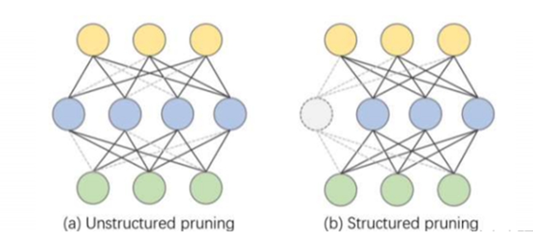

面向 LLM 的剪枝可粗分为两类：

- **结构化剪枝**：移除结构化单元（如整组通道或卷积核等），更易映射到硬件与高效内核，有利于实际加速。  
- **非结构化剪枝**：移除单个权重，稀疏模式不规则，往往依赖专用库或硬件才能充分体现加速收益。

### 1.3 现有结构化剪枝的局限

结构化剪枝常见两条技术路线：

- **基于梯度（gradient-based）**：借助损失函数的泰勒展开等估计参数重要性（如 OBD、OBS）。但对 LLM 全体参数求梯度代价极高。  
- **基于正则化（regularization-based）**：对参数施加 L1/L2 等促使稀疏。LLM 预训练本身已极耗资源，实践中往往避免再叠加强结构化正则。

此外，许多 LLM 结构化剪枝工作还存在：

- **重硬件与多卡**：例如 DISP-LLM 剪枝 13B LLaMA 需要多张 A100 80GB。  
- **依赖大量数据与重训练**：如 LLM-Pruner、LoRAP、SlimGPT 等往往需要数万条标注指令数据做恢复训练。  
- **剪枝后关联被破坏**：通常需要昂贵的重训练来重建层间依赖与性能。

Olica 的动机正是在上述约束下，探索尽量少数据、少算力、无需完整重训练的结构化剪枝路径。

---

## 2. 剪枝方法

### 2.1 核心观察与总体思路

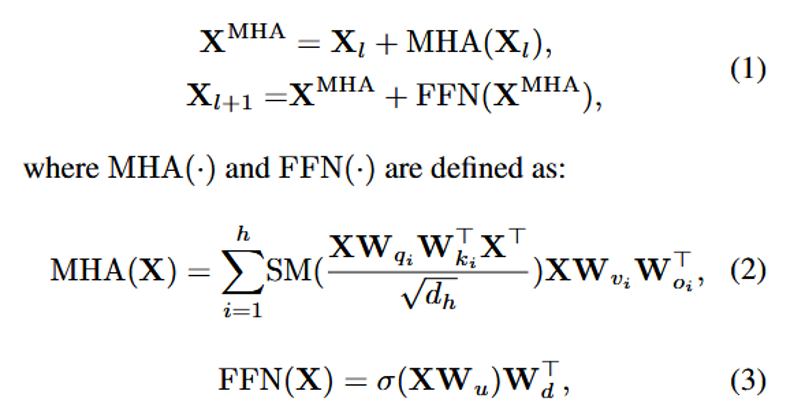

Transformer 中 **多头注意力层（MHA）** 涉及两组矩阵乘积：\(W_q W_k^\top\) 与 \(W_v W_o^\top\)。Olica 的关键是将这类矩阵乘积视作统一对象，对其施加主成分分析（PCA），用低维子空间保留主要信息，从而在不破坏整体模块形状、不依赖大规模重训练的前提下压缩 MHA。

### 2.2 MHA：正交神经元分解（OND）

**正交神经元分解（Orthogonal Neuron Decomposition, OND）** 将 MHA 中的 \(W_v\) 与 \(W_o\) 视为一体，通过 SVD 提取主结构。设 \(W_{vo} = U \Sigma V^\top\)，可定义 \(\hat{W}_v \leftarrow U\Sigma\)、\(\hat{W}_o \leftarrow V\) 等形式（并保持与 \(W_v\) 相关的恒等/等价关系，具体实现见论文），使得分解后 **\(U\)、\(V\) 列正交**，输出方向上的信息更“去相关”，便于在固定维度内保留尽可能多的有效信息。

**剪枝策略**：对每个神经元（或等价特征方向）定义重要性评分，优先剪掉重要性最低的部分。

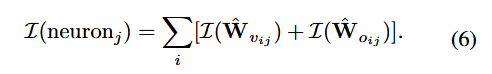

### 2.3 Fast-OND：降低分解复杂度

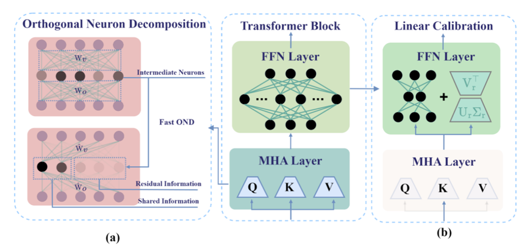

朴素 OND 若对 **\(h\) 个注意力头分别做 SVD，复杂度约为 \(O(h d^3)\)**，对 7B 级模型可能达到约一小时。

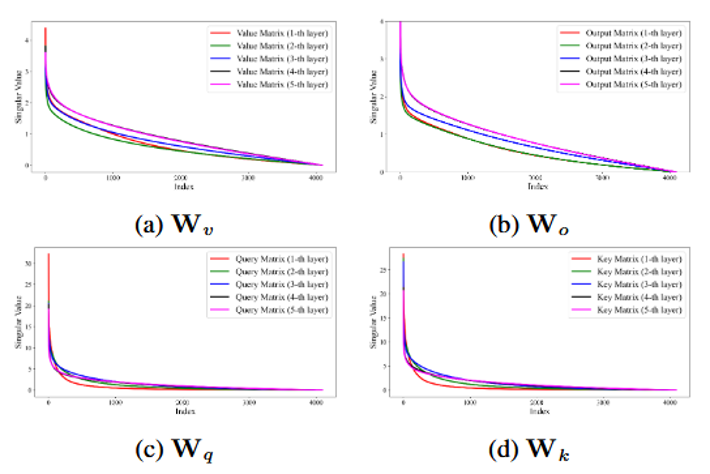

Olica 利用一个经验观察：**\(W_q\) 与 \(W_k\)（以及 \(W_v\) 与 \(W_o\)）的奇异值分布高度相似**，在相同“能量保留比例”下所需奇异值个数也接近。据此提出 **Fast-OND**：**仅对 \(W_v\) 做 SVD**，令 \(W_v = U \Sigma V^\top\)，再据此更新 \(\hat{W}_v \leftarrow U\)、\(\hat{W}_o \leftarrow W_o V \Sigma^\top\)，将复杂度降至约 **\(O(d^3 / h)\)**。对 LLaMA-7B（如 \(h=32\)）可在数分钟级完成剪枝。

### 2.4 FFN 层剪枝

对前馈（FFN）层，剪枝目标是中间神经元。用重要性评分对中间神经元排序，按目标稀疏率 \(s\) 剪掉低分神经元，使权重形状由 \(\mathbb{R}^{d \times 4d}\) 变为 \(\mathbb{R}^{d \times d'}\)（\(d'\) 由稀疏率决定）。

**问题**：层输出发生变化后，误差会在深度网络中逐层累积，需要额外校准。

### 2.5 线性校准（无需重训练）

为重建剪枝 FFN 引入的残差误差并避免完整重训练，Olica 使用岭回归拟合误差项 \(E\)，对校准矩阵 \(\hat{W}\) 求闭式解，并相应修改前向传播形式。

### 2.6 层选择与低秩近似

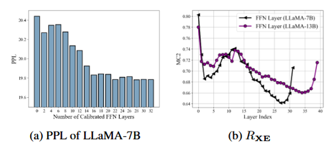

**层选择**：随着参与校准的 FFN 层数增加，困惑度（PPL）通常先降后趋于平稳；校准层并非越多越好，过多会引入额外参数与过拟合风险。论文使用 多重相关系数 \(MC2\) 衡量线性可恢复程度：\(R_{XE}\) 越大，残差越适合用线性方式补偿；实验上较浅层 FFN 的残差往往更易校准。

**低秩近似**：若直接引入完整 \(\hat{W}\)，参数量约 **\(d^2\)**，约占单层 FFN 的 1/8。可将 \(\hat{W}\) 低秩分解，只保留前 \(r\) 个最大奇异值对应的方向，将新增参数降到约 **\(2dr\)**（\(r \ll d\)）。

---

## 3. 实验与结果

### 3.1 设置

- **模型**：LLaMA-1、LLaMA-2、Vicuna 系列。  

- **语言建模数据**：WikiText2，序列长度 128 tokens。  

- **下游任务**：BoolQ、PIQA、HellaSwag、WinoGrande、ARC-e、ARC-c、OpenbookQA 等。

- **评估**：`lm-eval-harness`。  

- **校准数据**：从 BookCorpus 与 Alpaca 随机抽 **256** 条样本，截断长度 **128**；在 FFN 层数取 **6 / 12 / 16** 等设置下，选取约 **3%** 最大特征值对应方向等配置。  

- **基线**：LLM-Pruner、LoRAPrune、Compresso、FLAP、SliceGPT、LLM-Surgeon、LoRAP、DISP-LLM、SlimGPT 等结构化剪枝方法。

### 3.2 资源与性能

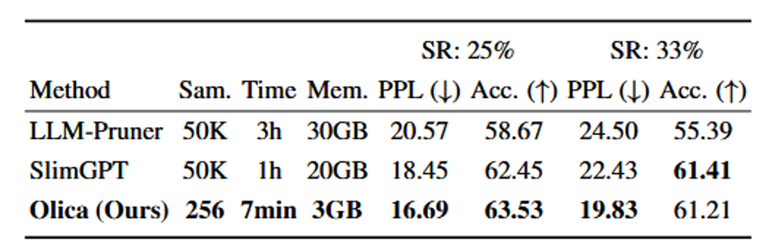

在 33% 稀疏率下，Olica 在报告设置中达到 PPL = 19.83、平均准确率 61.21%。相对依赖大量数据与多卡重训练的路线，Olica 在数据与 GPU 资源上更省。

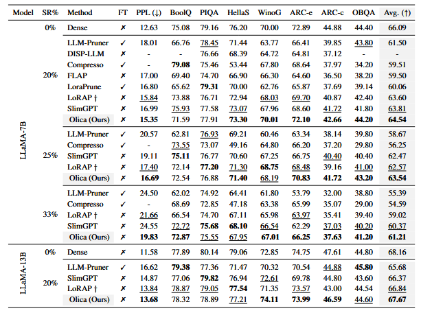

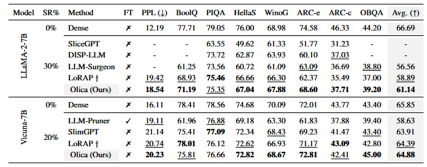

**LLaMA-7B，25% 稀疏率**：PPL **16.69**，平均准确率 **63.54%**，优于所对比基线。

**更高稀疏率（33%）**：PPL **19.83**、准确率 **61.21%**，明显优于 LLM-Pruner（PPL 24.50）与 SlimGPT（PPL 24.55）。

**跨规模与系列**：在 LLaMA-13B、LLaMA-2-7B、Vicuna 等模型上，Olica 多为最优或次优，体现一定通用性和可扩展性。

**无 LoRA 微调**：PPT 强调上述结果均在不做 LoRA 微调的情况下取得。

### 3.3 推理效率

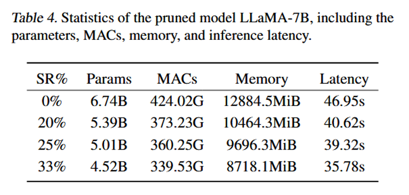

在较高稀疏度下，可降低资源占用并提升推理吞吐，使剪枝模型更适合资源受限场景；报告表明在稀疏度提升的同时性能损失可控。

---

## 4. 消融实验

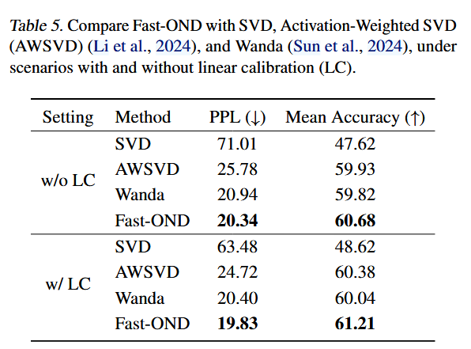

- **模块有效性**：**Fast-OND** 相对基线分解更高效；线性校准可与其它剪枝流程结合并带来增益。  

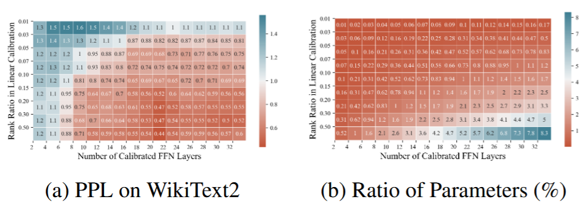
  
- **校准层数**：PPL 随校准层数增加先降后稳，超过约 20 层后边际收益减小。
    
- **低秩比例**：随低秩近似比例增大 PPL 逐步下降，超过约 0.15 后收益有限。  
  
- **推荐折中**：校准 **20 层 FFN** 且低秩比例 **0.15** 时，**额外参数约占全模型 1%**。  

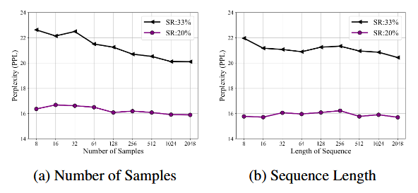
  
- **样本效率**：校准样本数与序列长度在 **8～2048** 范围变化时，PPL 波动不超过约 **2.4**；即便仅 8 个样本仍较稳定。  
  
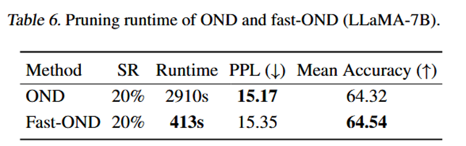

- **运行时间**：Fast-OND 约 **413 s**，对比标准 OND 约 **2910 s**，约 **7×** 加速且精度相当。

---

## 5. 总结

Olica 将 MHA 中矩阵乘积的 PCA/SVD 式压缩与 FFN 剪枝后的线性校准结合，并辅以 Fast-OND 降低分解复杂度、加权 SVD 与层选择控制额外参数。整体在数据量、显存与运行时间上较省，并在多个基准上达到优于或接近主流结构化剪枝基线的表现，同时保持无需完整重训练这一实践上的吸引力。

---

## 6. 参考文献

1. Vaswani et al. [*Attention Is All You Need*](https://arxiv.org/abs/1706.03762). NeurIPS 2017.

2. Kaplan et al. [*Scaling Laws for Neural Language Models*](https://arxiv.org/abs/2001.08361). 2020.

3. Gao et al. [*DISP-LLM: Dimension-independent structural pruning for large language models*](https://arxiv.org/abs/2410.11988). NeurIPS 2024.

4. Ma et al. [*LLM-Pruner: On the Structural Pruning of Large Language Models*](https://arxiv.org/abs/2305.11627). NeurIPS 2023.

5. Li et al. [*LoRAP: Transformer Sub-layers Deserve Differentiated Structured Compression*](https://arxiv.org/abs/2404.09695). ICML 2024.

6. Ling et al. [*SlimGPT: Layer-wise Structured Pruning for LLMs*](https://arxiv.org/abs/2412.18110). NeurIPS 2024.

7. Zhang et al. [*LoRAPrune: Structured pruning meets low-rank parameter-efficient fine-tuning*](https://arxiv.org/abs/2305.18403). ACL 2024.

8. Guo et al. [*Compresso: Structured pruning with collaborative prompting learns compact large language models*](https://arxiv.org/abs/2310.05015). 2023.

9. An et al. [*Fluctuation-based adaptive structured pruning for large language models*](https://arxiv.org/abs/2312.11983). AAAI 2024.

10. Ashkboos et al. [*SliceGPT: Compress LLMs by Deleting Rows and Columns*](https://arxiv.org/abs/2401.15024). ICLR 2024.

11. van der Ouderaa et al. [*The LLM Surgeon*](https://arxiv.org/abs/2312.17244). ICLR 2024.

12. Frantar & Alistarh. [*SparseGPT: Massive Language Models Can Be Accurately Pruned in One-shot*](https://arxiv.org/abs/2301.00774). ICML 2023.

