# POP: Online Structural Pruning Enables Efficient Inference of Large Foundation Models

> 作者：Yi Chen、Wonjin Shin、Shuhong Liu、Tho Mai、Jeongmo Lee、Chuanbo Hua、Kun Wang、Jun Liu、Joo-Young Kim（韩国科学技术院 KAIST、东京大学、东京工业大学等）
  
> 论文链接： <https://arxiv.org/abs/2602.06822>

---

## 1. 背景

### 1.1 大规模基础模型与推理挑战

大规模基础模型（Large Foundation Models, LFMs）通过持续扩大规模显著提升能力，但推理阶段计算开销巨大。常见压缩路径包括：

- **量化**：降低数值精度；  
  
- **低秩分解**：近似权重矩阵；  
  
- **剪枝**：移除冗余参数。

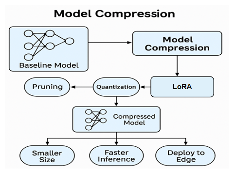

其中，结构化剪枝移除整块通道或子结构，在通用 GPU 上更易获得稳定加速，与实际部署结合更紧。

### 1.2 静态掩码的局限性

传统结构化剪枝常依赖离线校准或预训练预测器，得到静态剪枝掩码，并在整条推理链路中复用。其缺点包括：

- **对输入不敏感**：难以捕捉不同上下文与任务所触发的多样稀疏模式。  
  
- **在长生成中崩溃**：静态框架 Týr 在约 20% 剪枝比例下，Llama2-7B 在 ARC-C 短格式 QA 上仍能保持约 98% 准确率，但在 MBPP 等长格式生成基准上仅约 35%。  

**原因**：自回归解码中，每一步只有当前步的 token 信息可用，有效上下文从整段 prompt塌缩为单 token，通道重要性会随解码步动态变化；固定掩码无法对齐这种变化。

### 1.3 上下文稀疏性

**定义**：在给定输入上下文下，模型内部只有一部分神经元会被显著激活，且这一“有用子集”随输入变化。

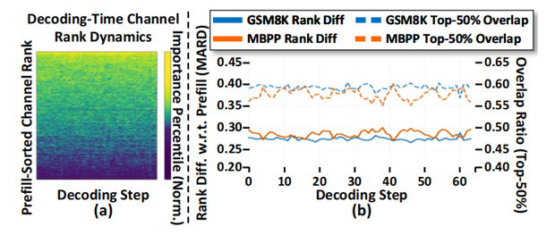

**关键观察**：

- **细粒度**：通道重要性的排序在不同解码步之间会变化（例如平均排序差异不为零）。  
  
- **粗粒度**：Top-50% 高重要性通道在解码过程中又具有相当的稳定性（通道集合重合度约 0.6–0.65）。

由此得到设计张力：既不能在预填充（prefill）阶段一次性固定整张掩码，也不宜在每一步对全体通道重新评估（开销过大）。这自然引向在线、分阶段的剪枝策略。

### 1.4 现有在线剪枝方法

为缓解静态剪枝问题，文献中已有在线剪枝思路：在解码过程中动态更新剪枝决策。但仍有局限：

- **Probe Pruning**：依赖多 token 聚合后的激活估计重要性，与自回归解码每步仅可见单 token的设定不完全兼容。  
  
- **Instruction-Following Pruning**：需要训练预测器，引入额外数据与训练开销。

Q：能否在推理阶段，以最小额外开销，让剪枝决策随生成上下文条件化，并适用于多种任务与架构？

---

## 2.动机与方法

### 2.1 POP 方法概述

POP（Partition-guided Online Pruning）建立在两点观察上：

1. 全局重要性结构在解码过程中大体稳定；  
   
2. 中间仍存在局部波动（上下文稀疏性），需要在解码阶段做小范围自适应。

设计思路：

- **Prefill 阶段**：利用全序列激活做一次粗粒度划分，得到相对稳定的计算骨架。  
  
- **Decode 阶段**：仅在少数候选通道内做细粒度、逐 token的动态选择，控制额外开销。

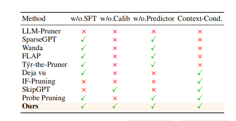

特点：

- 强调自回归解码场景下在线剪枝的必要性；  
  
- 提出三态通道划分 + 两阶段在线剪框架；  
  
- 无需离线校准、无需再训练，即插即用。

### 2.2 激活感知的重要性度量

记线性层权重 \(W \in \mathbb{R}^{C_{\mathrm{out}} \times C_{\mathrm{in}}}\)，输入激活 \(X \in \mathbb{R}^{B \times L \times C_{\mathrm{in}}}\)（\(B\) 为 batch，\(L\) 为序列长度）。自回归解码第 \(t\) 步的激活记为 \(X_t \in \mathbb{R}^{B \times 1 \times C_{\mathrm{in}}}\)。用 \(i\) 索引输出通道、\(k\) 索引输入通道。输出通道重要性记为 \(I_i\)，解码步上的对应量为 \(I_i(t)\)。目标剪枝率为 \(r\)。

POP沿用Wanda一类激活感知思路：重要性 = 权重幅度 × 激活强度，且随当前输入变化。直观上，通道若在输入上被强烈激活且权重大，则更不宜剪除。

逐元素重要性：

\[
I_{i,k} = \lvert W_{i,k} \rvert \cdot \lVert X_k \rVert_2 \tag{1}
\]

其中 \(\lVert X_k \rVert_2\) 表示第 \(k\) 个输入通道在样本与 token 上聚合后的 \(\ell_2\) 范数。

结构化剪枝以通道为单位，需将 \(\{I_{i,k}\}\) 聚合为输出通道标量：

\[
I^{\mathrm{out}}_i = \mathcal{A}\bigl(\{ I_{i,k} \}_{k=1}^{C_{\mathrm{in}}}\bigr),\quad i = 1,\ldots,C_{\mathrm{out}} \tag{2}
\]

\(\mathcal{A}(\cdot)\) 为聚合算子（如求和、取最大等）。

### 2.3 两阶段架构与三态通道划分

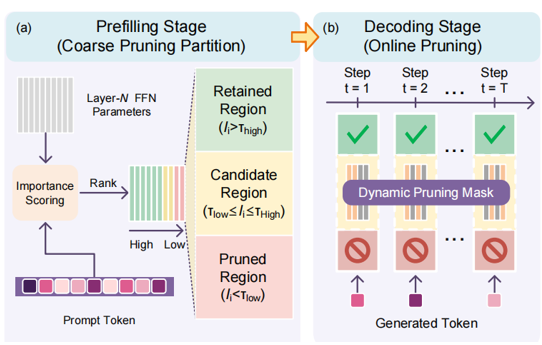

Prefill（粗划分）：处理完整 prompt，得到全序列激活 \(X\)，计算各通道重要性并排序。将每个 FFN 的通道划分为三个区域：

| 区域 | 含义 |
|------|------|
| 保留区 R（Retained） | 重要性持续偏高，始终保留，作为整条生成过程的稳定骨架。 |
| 剪除区 P（Pruned） | 贡献很小，提前移除，在给定 prompt 下提升效率。 |
| 候选区 C（Candidate） | 重要性处于中间，随上下文波动明显，作为 decode 阶段有界的在线搜索空间。 |

分位数与超参：给定目标剪枝率 \(r\) 与划分相关宽度参数（记为 \(\delta\) 或 \(\gamma\)），可对重要性分数集合\(\{I^{\mathrm{out}}_i\}_{i=1}^{C_{\mathrm{out}}}\) 使用分位数阈值 \(Q_\alpha(\mathcal{I})\)（\(\alpha\) 分位数），据此划定 R / P / C 的边界。论文与实验中 \(\gamma\) 控制候选区相对大小（默认 0.1，见后文消融）。

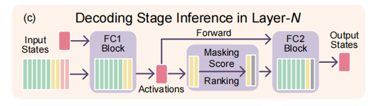

Decode（细选择与低开销前向）：每一步解码 \(t\)：

1. **前向**：仅对 \(R \cup C\) 参与计算，得到中间激活（P 区不参与）。  
   
2. **打分**：仅对候选区 \(C\) 内的通道，用当前步 token 对应的激活重算重要性分数。  
   
3. **选择**：从 \(C\) 中选取子集，使激活通道总数满足全局预算（与目标剪枝率 \(r\) 一致）。  
   
4. **最终 FFN 计算**：仅使用 R + 被选中的 C 中通道 完成输出。

这样，大部分通道在 prefill 已定论，decode 只维护 C 的内部排序与子集选择，将额外开销限制在候选区。

---

## 3. 实验与结果

### 3.1 实验设置

- **模型**：稠密 LLM（Llama2/3、Qwen3）；MoE（Qwen1.5/2/3-MoE）；视觉语言模型 VLM（Qwen2-VL、Qwen2.5-VL）。  
  
- **基准**：问答（BoolQ、ARC、HellaSwag 等）；长生成（CoQA、MBPP、HumanEval、GSM8K、NQ-Open 等）；VQA（POPE、OK-VQA、GQA、ScienceQA、MME 等）。  
  
- **基线**：Wanda-sp、FLAP、Týr（离线）；Probe Pruning（在线）等。  
  
- **评测**：LM-Eval-Harness、LMMs-Eval；硬件如 RTX A6000；LLM batch=10，VLM batch=1；\(\gamma=0.1\)。  
  
- **公平性说明**：剪枝比例取 20%、40%；POP 仅剪 FFN、不剪注意力，并在 MLP 内调节稀疏度以匹配目标整体剪枝率。

### 3.2 稠密 LLM

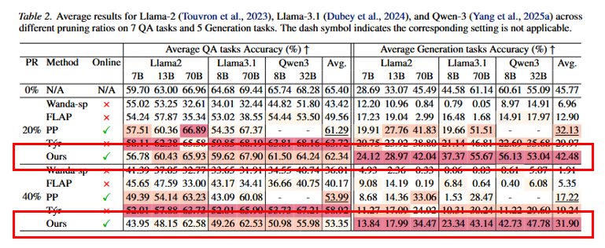

POP 在多数模型上 QA 表现强劲。部分设置下次于 Týr，与 Týr 依赖带校准数据的离线进化搜索有关。在生成类任务上，POP 相对基线的平均提升更明显，强调了在自回归解码过程中进行随上下文条件化剪枝的必要性。

### 3.3 MoE

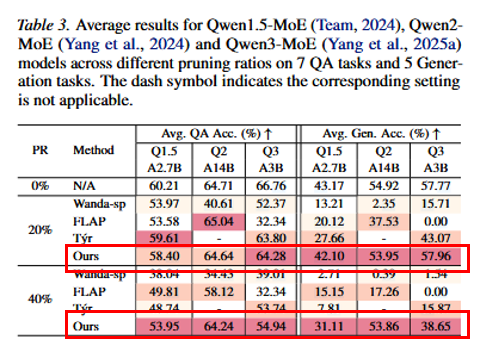

动态路由使 prefill 与 decode 的差异更大，在线剪枝对 MoE 尤其有益；在 40% 剪枝等设置下，基线退化更重，而 POP 更稳。

### 3.4 VLM

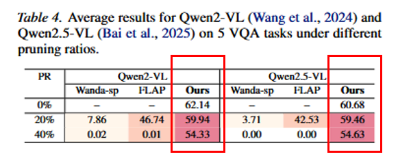

多模态下部分基线可接近崩溃；POP 在 Qwen2-VL / Qwen2.5-VL 上仍能保持较强的 VQA 表现，说明能推广到多模态架构，跨领域更鲁棒。

### 3.5 推理效率

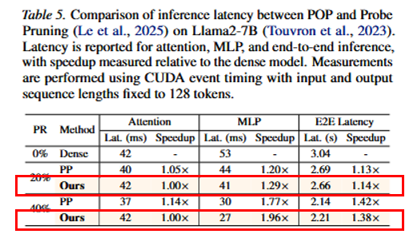

POP 不剪注意力，注意力延迟基本不变；端到端可达约 1.14×–1.38× 加速，同时维持较好准确率。

---

## 4. 消融实验

### 4.1 剪枝策略对比

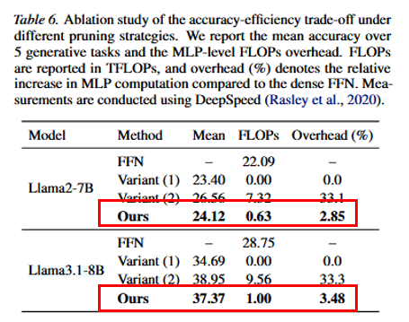

- 变体1（固定 prefill 掩码）：省算但精度降； 
   
- 变体2（每步全通道重评估）：精度高但开销大；  
  
- POP：仅在 C 内在线更新，\(\gamma=0.1\) 时额外 FFN 成本 低于约 4%，在精度与效率间更均衡。  

### 4.2 划分比例

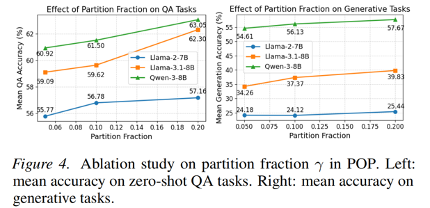

候选区扩大（\(\gamma\) 增大）通常准确率更好，decode 开销也增加；默认 0.1。  

### 4.3 离线准备成本

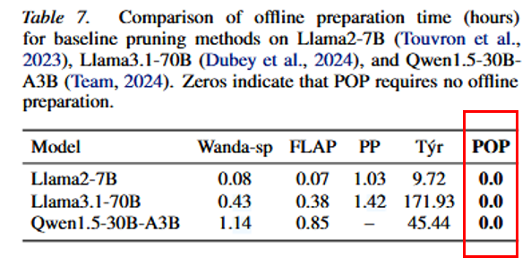

Wanda/FLAP 等校准相对小；Probe、Týr 等离线成本高；POP 完全在线，零离线准备。

---

## 5. 总结与展望

**总结**：

- 自回归生成中，仅 prefill 固定掩码会在新 token 上产生系统性偏差，在线剪枝有必要。
  
- POP 通过 三态划分 + decode 阶段仅在候选区内更新，在精度与开销之间取得平衡。

- POP 在 LLM / MoE / VLM 上多设置优于或稳健于同类剪枝，突出 decode 动态决策的价值。

**局限与展望**：Top 通道在解码中较稳定多为经验观察；若阈值外的通道也强依赖上下文，固定 R / P 可能限制极端场景下的自适应。未来可探索：自动选择候选区宽度、自适应 \(\gamma\)、以及能否以低开销将类似思想扩展到注意力头等。

??? note "局限性"
    这篇论文采用划分区域然后保留R，剪去P，对C进行再计算候选，感觉参数规模仍然很大，因为候选区还要计算中间激活，FFN层参数量仍占大头，这种划区域思想挺好，但有待改进，划分宽度这里有待优化，中间步骤感觉可以探索一些方法再优化效率。

---

## 6. 参考文献

1. Li et al. [*Týr-the-Pruner: Structural Pruning LLMs via Global Sparsity Distribution Optimization*](https://arxiv.org/abs/2503.09657). NeurIPS 2025.

2. Le et al. [*Probe Pruning: Accelerating LLMs through Dynamic Pruning via Model-Probing*](https://arxiv.org/abs/2502.15618). ICLR 2025.

3. Hou et al. [*Instruction-Following Pruning for LLMs*](https://arxiv.org/abs/2501.02086). ICML 2025.

4. Sun et al. [*Wanda: A Simple and Effective Pruning Approach for LLMs*](https://arxiv.org/abs/2306.11695). ICLR 2024.

5. An et al. [*FLAP: Fluctuation-based Adaptive Structured Pruning for LLMs*](https://arxiv.org/abs/2312.11983). AAAI 2024.

6. Gao et al. [*The Language Model Evaluation Harness*](https://arxiv.org/abs/2405.14782). 2024.

7. Zhang et al. [*LMMs-Eval: Reality Check on the Evaluation of Large Multimodal Models*](https://arxiv.org/abs/2407.12772). 2024.

