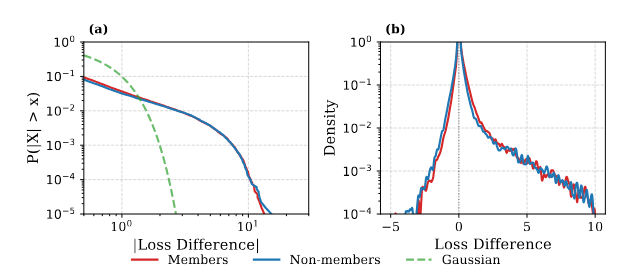
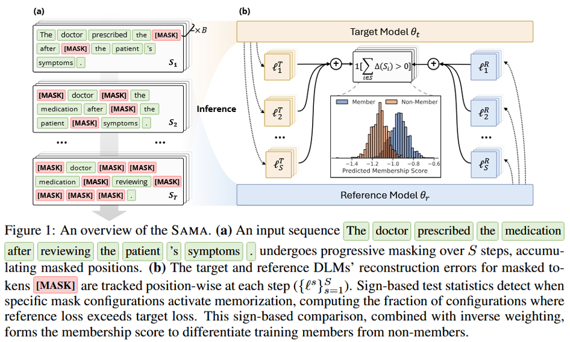
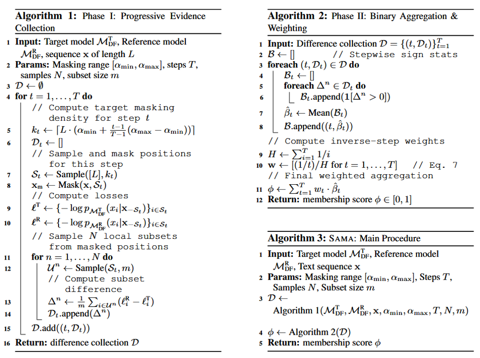
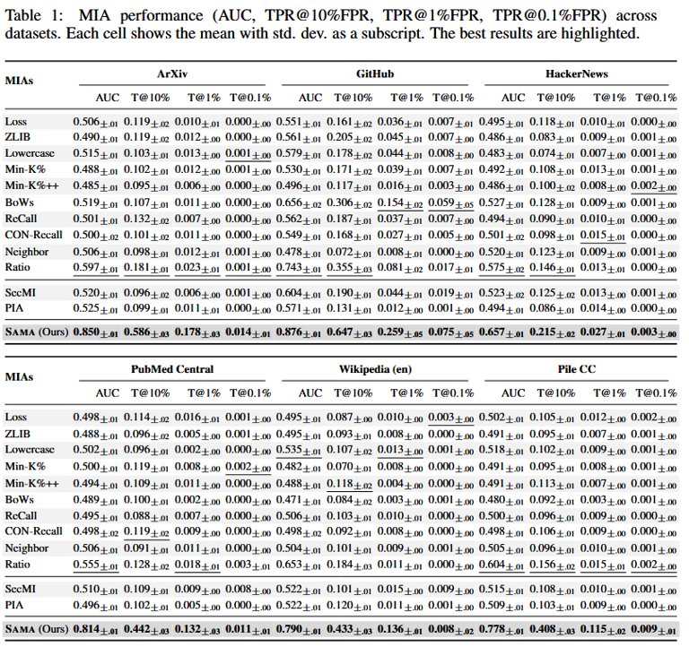
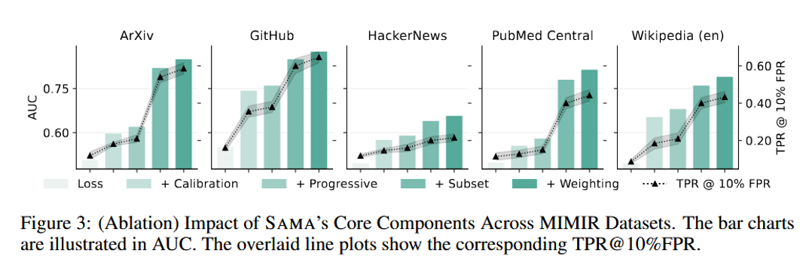
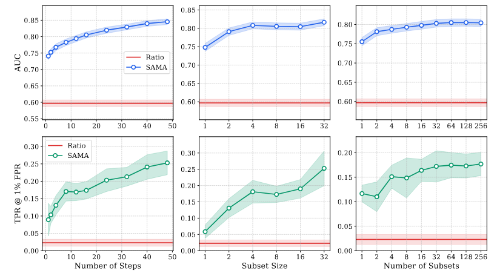
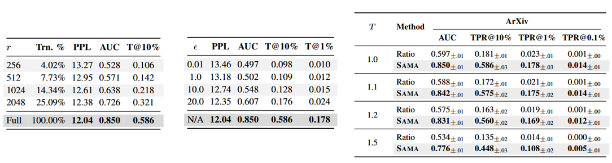
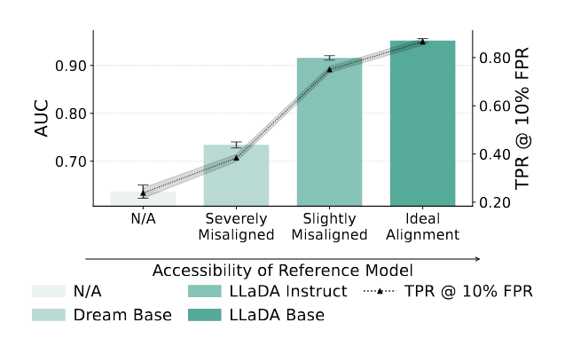

# SAMA: Membership Inference Attacks Against Fine-tuned Diffusion Language Models

> 作者：Yuetian Chen、Kaiyuan Zhang、Yuntao Du、Edoardo Stoppa，Charles Fleming、Ashish Kundu，Bruno Ribeiro、Ninghui Li

> 论文链接：<https://arxiv.org/abs/2601.20125>

> 开源代码：<https://github.com/Stry233/SAMA>

---

## 1. 背景与动机

### 1.1 成员推理攻击与 LLM 隐私

成员推理攻击（Membership Inference Attack, MIA）旨在判断某条文本是否出现在目标模型的训练集中。对微调后的大语言模型而言，这类攻击是量化隐私泄露风险的主要基准之一。

常见评估指标包括 AUC、TPR@低 FPR（如 10%、1%、0.1%）等。其中低 FPR 下的 TPR 更贴近实际部署场景：攻击者希望在几乎不误判的前提下，尽可能多地识别出训练成员。

### 1.2 自回归模型与扩散语言模型

当前 LLM 仍以自回归模型（ARM）为主：按从左到右的顺序逐 token 预测。近年来扩散语言模型（DLM）快速兴起，代表工作包括 LLaDA、Dream，以及 Google 的 Gemini Diffusion 等。

DLM 采用掩码-预测（Mask-and-Predict）范式：随机遮盖部分 token，再借助双向上下文重建被掩码位置。相比 ARM，DLM 在生成速度、可控性以及缓解逆转诅咒等方面具有潜在优势。

### 1.3 研究空白

ARM 上的 MIA 已有大量研究（Loss、LiRA、Min-K%、ReCall 等），但DLM 的隐私脆弱性几乎未被系统探索。二者架构差异显著：

| 维度 | ARM | DLM |
|------|-----|-----|
| 预测方向 | 单向（左→右） | 双向 |
| 上下文配置 | 每个 token 仅一种 | 掩码子集 \(S \subseteq [L]\) 可指数级组合 |
| 成员信号 | 固定、单一 | 依赖掩码配置，稀疏且高方差 |

核心问题：DLM 的多掩码配置是否引入了可被 MIA 利用的新漏洞？本文聚焦微调场景——此处记忆化与隐私风险通常被放大。

---

## 2. SAMA 方法

### 2.1 威胁模型

采用灰盒、基于参考模型的设置：

- 攻击者可向目标模型 \(\mathcal{M}^T_{DF}\) 提交任意部分掩码序列，并获得指定位置的 logits / 概率；
  
- 同时拥有与目标模型同族的预训练参考模型\(\mathcal{M}^R_{DF}\)，用于隔离微调引入的记忆化；
  
- 无法访问模型参数、梯度或内部激活。

### 2.2 ARM 与 DLM 中的成员信号

对文本序列 \(x\)，成员信号定义为参考模型与微调目标模型之间的损失差异。

ARM 中信号由自回归分解唯一确定：

\[
\Delta_{AR}(x) = \ell_{AR}(x; \mathcal{M}^R_{AR}) - \ell_{AR}(x; \mathcal{M}^T_{AR}) = \frac{1}{L} \sum_{i=1}^{L} [\ell^R_i(x) - \ell^T_i(x)]
\]

其中 \(\ell_i = -\log p(x_i \mid x_{<i})\)。每个 token 位置只有一种上下文，无法探测双向关系。

DLM 中信号取决于掩码配置 \(\mathcal{S}\)：

\[
\Delta_{DF}(x; \mathcal{S}) = \ell_{DF}(x; \mathcal{S}, \mathcal{M}^R_{DF}) - \ell_{DF}(x; \mathcal{S}, \mathcal{M}^T_{DF})
\]

其中 \(\ell_i(x, \mathcal{S}) = -\log p(x_i \mid x_{-\mathcal{S}})\)。

机遇：可收集 \(\{\Delta_{DF}(x; \mathcal{S}_1), \Delta_{DF}(x; \mathcal{S}_2), \ldots\}\) 等多组独立探测；双向上下文还能检验 ARM 中不可见的 token 关系（如逆转诅咒相关模式）。

挑战：成员信号稀疏且配置相关——只有掩码恰好隐藏可记忆 token 时才显著；单一随机掩码大概率落入噪声区。

在 ArXiv 数据集上，对每个样本评估 100 种随机掩码配置后发现：

- 非成员信号以零为中心，成员信号整体右移；
- 仅因改变掩码配置引起的样本内方差（\(\sigma \approx 0.10\)）已超过成员与非成员的平均边际（\(\delta \approx 0.06\)）。

因此需要多配置探测 + 稳健聚合，而非单次估计。

### 2.3 SAMA 总体框架

SAMA（Subset-Aggregated Membership Attack，子集聚合成员攻击）将稀疏记忆化检测转化为稳健的投票机制，包含三个组件：

1. 渐进掩码：在 \(T\) 步上从 \(\alpha_{\min}=5\%\) 到 \(\alpha_{\max}=50\%\) 逐步增加掩码密度，在多尺度上收集证据；
   
2. 稳健子集聚合：每步从掩码位置采样 \(N\) 个大小为 \(m\) 的 token 子集，对局部损失差异做符号聚合（只保留正负方向，丢弃幅度）；
   
3. 自适应加权：以逆步权重 \(w_t = (1/t) / H\) 优先稀疏掩码的清晰信号。

最终成员分数：

\[
\text{SAMA}(x) = \sum_{t=1}^{T} w_t \cdot \frac{1}{N} \sum_{n=1}^{N} \mathbf{1}[\Delta^n_{DF}(x; \mathcal{S}_t) > 0]
\]

算法整体架构：

### 2.4 为何采用符号聚合

传统 MIA 对掩码配置做蒙特卡洛平均：

\[
\Delta^{avg}_{DF}(x) = \mathbb{E}_{\mathcal{S} \sim P(\mathcal{S})}[\Delta_{DF}(x; \mathcal{S})]
\]

这在 DLM 上效果有限，原因有二：

- 配置内：并非所有被掩码 token 都携带实例级记忆化信号，领域适应效应（如高频领域词）会产生极端损失值，淹没真实信号；
  
- 配置间：稀疏掩码信噪比高但聚合点少，密集掩码反之；简单平均无法兼顾。

符号聚合 \(\mathbf{1}[\Delta > 0]\) 对重尾噪声具有稳健性：非成员时该指示器以 0.5 概率为 1；成员在命中有效配置时一致推向 1。即使噪声方差未定义，该性质仍成立（Hodges-Lehmann 类结论）。

---

## 3. 实验与结果

### 3.1 实验设置

- 模型：LLaDA-8B-Base、Dream-v0-7B-Base；预训练版本作参考模型；
  
- 数据集：MIMIR 六个领域（ArXiv、GitHub、HackerNews、PubMed Central、Wikipedia、Pile CC），以及 WikiText-103、AG News、XSum；
  
- SAMA 超参：\(T=16\) 步，\(\alpha \in [5\%, 50\%]\)，每步 \(N=128\) 个子集，子集大小 \(m=10\)；
  
- 基线（12 个）：Loss、ZLIB、Lowercase、Neighbor、Min-K%、Min-K%++、ReCall、CON-ReCall、BoWs、Ratio（自回归 MIA）；SecMI、PIA（图像扩散 MIA 改编）；
  
- 指标：AUC，TPR@10%/1%/0.1% FPR；所有方法统一 \(T=16\) 查询预算。

微调后模型在测试集困惑度与 LLM-as-a-Judge 评分上均保持可用性，排除仅过拟合、无泛化的伪阳性。

### 3.2 主要结果

SAMA 在全部数据集与指标上一致显著优于基线：

- 平均 AUC 0.81，最佳基线 Ratio 为 0.62，相对提升约 30%；
  
- TPR@1%FPR：SAMA 平均 0.16，最佳基线仅 0.04，约 4 倍；部分设置下可达 8 倍；
  
- GitHub（记忆化最强）：AUC 0.88，TPR@10%FPR 0.65；Ratio 分别为 0.74 与 0.36。

关键发现：面向 ARM 的传统 MIA 在 DLM 上 AUC 接近随机（≈0.50）；图像扩散改编方法 SecMI、PIA 亦几乎无效（AUC ≈0.52）。这说明 DLM 需要专门考虑稀疏、配置相关信号的攻击设计。

### 3.3 消融实验

从基线 Loss 攻击（AUC ≈0.5）逐步叠加组件：

| 组件 | AUC 增益 |
|------|----------|
| + 参考模型校准 | +0.09 ~ +0.19 |
| + 渐进掩码 | +2 ~ 3% |
| + 稳健子集聚合（符号投票） | +20 ~ 30% |
| + 自适应加权 | +3 ~ 5% |

符号聚合是最大贡献项；校准与渐进掩码提供必要但较小的补充。

### 3.4 超参数敏感性

- 步数 \(T\)：从 1 增至 16，AUC 从 0.741 升至 0.805；\(T=48\) 可进一步到 0.845，默认取 16 平衡效果与查询成本；
  
- 子集大小 \(m\)：\(m=10\) 为稳健默认；更大子集（如 32）在长上下文域上可再提升；
  
- 子集数 \(N\)：\(N \ge 32\) 后收益趋于饱和，默认 128 保证稳健性。

---

## 4. 防御与其他分析

### 4.1 隐私保护微调

- LoRA：秩 \(r=256\) 时 AUC 从 0.850 降至 0.528，但困惑度上升；需在隐私与效用间权衡；
  
- DP-LoRA（\(\epsilon=0.01\)）：AUC 接近 0.50，攻击近乎失效，代价是 PPL 升高；
  
- 温度缩放：\(T=1.5\) 时 SAMA AUC 降至 0.776，但生成质量严重受损；SAMA 相对 Ratio 的鲁棒性反而更强；
  
- SOFT 数据混淆：改写约 15% 高影响样本后，SAMA AUC 降至 0.499，接近随机，且保持模型效用。

### 4.2 参考模型未对齐

当理想参考（同架构预训练基础模型）不可用时，SAMA 性能随未对齐程度平滑下降，但即使使用架构不同的 Dream-v0-7B-Base 作参考，仍优于未校准基线。

---

## 5. 总结

SAMA 是首个针对微调 DLM 的系统化 MIA 框架。论文揭示：DLM 的双向、多掩码机制创造了 ARM 中不存在的可利用记忆化模式；通过渐进掩码、符号投票与逆步加权，SAMA 将稀疏信号检测转化为稳健聚合问题，在九个数据集上大幅超越现有基线。

局限：方法针对掩码-预测式 DLM；依赖兼容的参考模型与分词器；符号聚合丢弃幅度信息，可能损失部分区分度。

启示：随着 LLaDA、Dream 等 DLM 走向应用，隐私防御不能简单移植 ARM 方案，需要面向配置相关、重尾噪声特授性的专门设计（如 DP-LoRA、SOFT 等方向）。

---

## 6. 参考文献

1. Chen et al. [*Membership Inference Attacks Against Fine-tuned Diffusion Language Models*](https://arxiv.org/abs/2601.20125). ICLR 2026.

2. Shokri et al. [*Membership Inference Attacks Against Machine Learning Models*](https://arxiv.org/abs/1610.05820). IEEE S&P 2017.

3. Carlini et al. [*Membership Inference Attacks From First Principles*](https://arxiv.org/abs/2112.03570). IEEE S&P 2022.

4. Nie et al. [*Large Language Diffusion Models*](https://arxiv.org/abs/2502.09992). 2025.

5. Ye et al. [*Dream 7B: Diffusion Large Language Models*](https://arxiv.org/abs/2508.15487). 2025.

6. Duan et al. [*Do Membership Inference Attacks Work on Large Language Models?*](https://arxiv.org/abs/2402.07841). ACL 2024.

7. Fu et al. [*Practical Membership Inference Attacks Against Fine-tuned Large Language Models via Self-prompt Calibration*](https://arxiv.org/abs/2406.04832). USENIX Security 2024.

8. Watson et al. [*On the Importance of Difficulty Calibration for Membership Inference Attacks*](https://arxiv.org/abs/2111.08440). ICLR 2022.

9. Duan et al. [*Are Diffusion Models Vulnerable to Membership Inference Attacks?*](https://arxiv.org/abs/2302.01316). ICML 2023.

10. Kong et al. [*An Efficient Membership Inference Attack for the Diffusion Model by Proximal Initialization*](https://arxiv.org/abs/2302.10181). ICCV 2023.

11. Hu et al. [*LoRA: Low-Rank Adaptation of Large Language Models*](https://arxiv.org/abs/2106.09685). ICLR 2022.

12. Liu et al. [*Differentially Private Low-Rank Adaptation of Large Language Model Using Federated Learning*](https://arxiv.org/abs/2401.00363). 2024.

13. Zhang et al. [*SOFT: Selective Data Obfuscation for Protecting LLM Fine-tuning Against Membership Inference Attacks*](https://arxiv.org/abs/2506.10424). USENIX Security 2025.

