# Compact 3D Gaussian Splatting for Static and Dynamic Radiance Fields

> 作者：Joo Chan Lee、Daniel Rho、Xiangyu Sun、Jong Hwan Ko、Eunbyung Park（成均馆大学）

> 论文链接：<https://arxiv.org/abs/2408.03822>（CVPR 2024 Highlight；期刊版扩展至动态场景）

> 论文代码：<https://github.com/maincold2/Compact-3DGS>

> 项目主页：<https://maincold2.github.io/c3dgs/>

---

## 1. 背景与动机

### 1.1 从 NeRF 到 3DGS

神经辐射场（NeRF）用 MLP 表示体密度与颜色，通过逐射线体渲染实现高质量新视角合成，但训练与推理代价高，难以在普通 GPU 上实时运行。Instant NGP 等网格/哈希方法加快了训练，却仍受限于体采样，内存占用大，实时渲染仍是瓶颈。

3D Gaussian Splatting（3DGS） 改用显式三维高斯点云 + 可微光栅化，在保持高质量的同时实现实时渲染。后续工作（如 STG）进一步将 3DGS 扩展到动态场景，用时空高斯特征溅射建模多视角视频。

### 1.2 3DGS 的存储瓶颈

高质量 3DGS 表示一个真实静态场景往往需要 >1GB 存储，原因主要有两点：

- **高斯数量多**：致密化（克隆/分裂）为保留细节会不断增点，其中存在大量冗余。  
  
- **每点属性大**：位置、尺度、旋转、不透明度、视角相关颜色（3 阶 SH 共 48 维）等，单点约 59 个参数；动态场景还需额外时间属性。

现有压缩路线（LightGaussian、Compressed 3DGS、EAGLES 等）多采用训练后剪枝、量化或熵编码，仅 EAGLES 与本方法支持端到端训练；EAGLES 主要通过调整致密化调度控点，缩减效果次优。本方法是唯一在训练期间通过可学习掩码去除无效高斯的工作。

### 1.3 核心目标

在不牺牲渲染质量的前提下，从两个维度压缩：

1. 减少高斯数量——可学习体积掩码，训练期剔除对渲染贡献极小的高斯。  
   
2. 压缩每点属性——哈希网格 + MLP 表示视角相关颜色；R-VQ 码本表示尺度/旋转及动态时间属性。

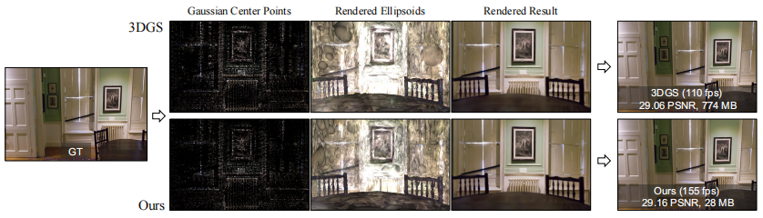

典型对比：3DGS 为 110 fps / 29.06 PSNR / 774 MB；本方法为 155 fps / 29.16 PSNR / 28 MB。

---

## 2. 方法与框架

### 2.1 整体流程

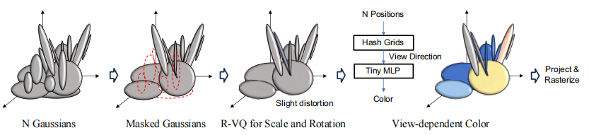

对 \(N\) 个高斯依次做：

1. 可学习掩码筛选有效高斯；  
   
2. R-VQ 码本压缩尺度 \(s\) 与旋转 \(r\)；  
   
3. 哈希网格 + Tiny MLP 查询视角相关颜色，替代每点 SH；  
   
4. 投影与光栅化渲染。

总损失：

\[
L = L_{\text{ren}} + \lambda_m L_m + L_r + L_s
\]

其中 \(L_{\text{ren}}\) 为 L1 + SSIM 渲染损失，\(L_m\) 为掩码稀疏正则，\(L_r\)、\(L_s\) 为旋转与尺度的 R-VQ 损失。

### 2.2 可学习体积掩码（Gaussian Volume Mask）

**观察**：小体积或低不透明度高斯对最终像素贡献极小，却占大量存储与计算；仅按不透明度剪枝无法充分去除冗余。

**做法**：引入可学习标量 \(m_n\)，经 Sigmoid 与直通估计器（STE）得到二值掩码 \(M_n\)，同时作用于尺度与不透明度：

\[
\hat{\Sigma}_n = R(r_n)\, S(M_n s_n)\, S(M_n s_n)^\top R(r_n)^\top
\]

\[
\hat{\alpha}_n(x) = M_n\, o_n \exp\!\left(-\tfrac{1}{2}(x-p'_n)^\top \hat{\Sigma}'^{-1}_n (x-p'_n)\right)
\]

掩码损失 \(L_m = \frac{1}{N}\sum_n \sigma(m_n)\) 鼓励稀疏；与 3DGS 在中期停止致密化不同，本方法全程持续掩蔽，训练期即可降低 GPU 内存。

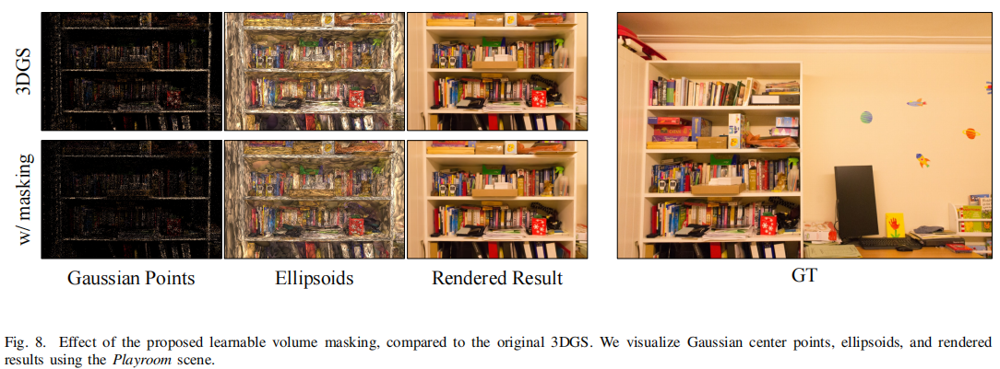

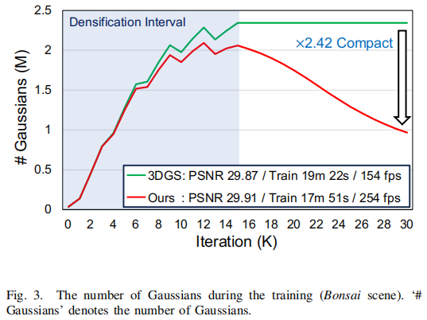

### 2.3 几何码本（R-VQ）

**观察**：场景中大量小高斯几何相似，尺度/旋转变化有限，适合用共享码本 + 索引表示。

采用残差向量量化（R-VQ）：\(L\) 阶段码本，每阶段存储 \(C\) 个码字索引，逐层量化残差。朴素 VQ 计算与显存开销大，R-VQ 在保持表达能力的同时更可控。

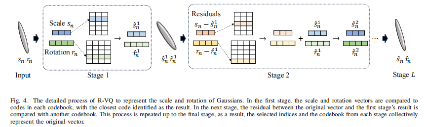

- **静态**：\(C=64\)，\(L=6\)；  
  
- **动态**：\(C=256\)，几何/时间属性阶段数分别为 (4,3) 或 (5,4)。

训练策略：码本用 K-means 初始化，仅在最后 1K 迭代启用 R-VQ，其余阶段 \(L_r + L_s = 0\)，避免早期不稳定。

### 2.4 紧凑视角相关颜色

3DGS 每点用 48 维 SH 建模视角相关颜色，参数低效。本方法借鉴 Mip-NeRF 360 的 contract 将有界位置映射到 \([-1,1]^3\)，再用 Instant NGP 式多分辨率哈希网格（16 级分辨率 16–4096，2 通道）+ 2 层 64 通道 MLP 输出颜色：

\[
c_n(d) = f(\text{contract}(p_n),\, d;\, \theta)
\]

SH 0 阶分量单独表示并转 RGB，性能略优于直接预测 RGB。相对逐点 SH，颜色存储可压缩 3× 以上。

### 2.5 动态场景扩展

以 STG 为基线：每个高斯用多项式系数描述时变位置/旋转，时间 RBF 控制可见性，9 维特征经溅射 + MLP 得最终 RGB。

本方法在此基础上：

- **时空掩码**：将 \(M_n\) 同时作用于时变协方差与时间不透明度 \(\hat{o}_n(t) = M_n o_n \exp(-\xi_n |t-\mu_n|^2)\)，在所有时间戳上联合学习重要性，避免训练后逐帧评估的困难。  
  
- **R-VQ**：对时间不变几何（\(s_n, sr_n\)）及旋转系数、时间颜色特征做码本压缩；位置系数 \(u_{n,k}\) 已有多项式紧凑表示，不再额外量化。  
  
- **神经场颜色**：规范位置 \(sp_n\) 的空间/视角颜色由共享哈希场查询，时间分量仍用 R-VQ 后的 \(\hat{sc}_n\)。

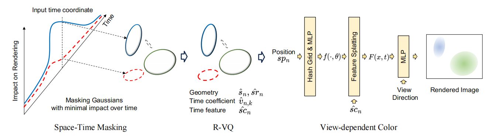

### 2.6 后处理（Ours + PP）

端到端模型记为 Ours；进一步施加：

- 位置/标量属性 FP16 存储；  
  
- 哈希网格与标量 8-bit min-max 量化； 
   
- 剪枝绝对值 < 0.1 的哈希参数；  
  
- Morton 顺序排序高斯；  
  
- 量化值与 R-VQ 索引做 Huffman + DEFLATE 压缩。

变体记为 Ours + PP，静态 Mip-NeRF 360 上可达相对 3DGS >28× 压缩。

---

## 3. 实验与结果

### 3.1 设置

| 类型 | 数据集 | 训练 |
|------|--------|------|
| 静态 | Mip-NeRF 360、Tanks&Temples、Deep Blending、NeRF-Synthetic | 30K iter，保留 3DGS 超参 |
| 动态 | DyNeRF、Technicolor | 25K iter，保留 STG 超参 |

评估指标：PSNR、SSIM、LPIPS、训练时间、FPS、Storage (MB)。

### 3.2 静态场景

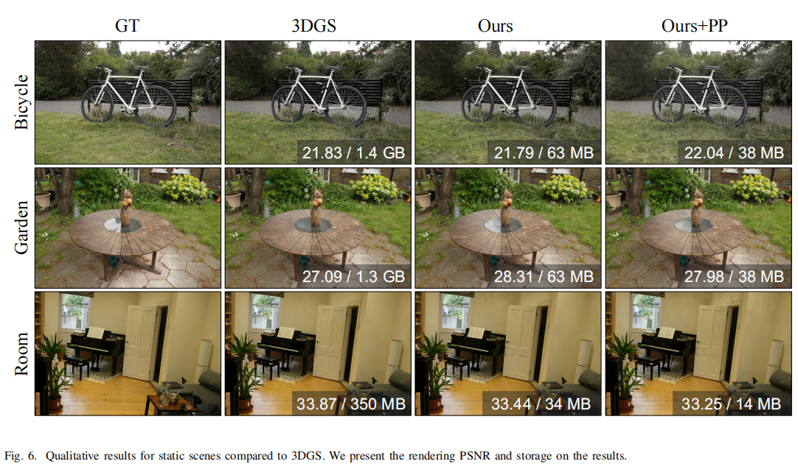

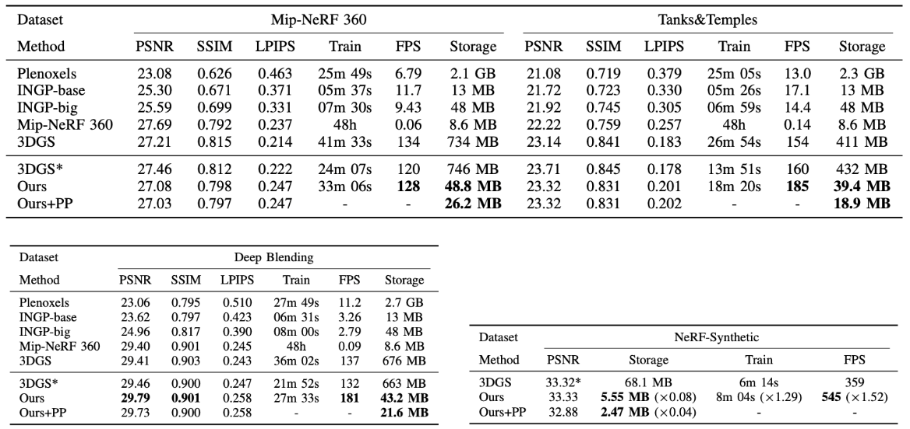

**Mip-NeRF 360**：Ours 48.8 MB vs 3DGS\* 746 MB（约 15×），PSNR 相当，FPS 更高。

**Deep Blending**：Ours PSNR 29.79 略优于 3DGS，FPS 181，存储 43.2 MB（约 40% 更快、>15× 更紧凑）。

**NeRF-Synthetic**：5.55 MB（约 0.08× 存储），FPS 545（约 1.52×），PSNR 33.33。

**Ours + PP**：26.2 MB，相对 3DGS >28× 压缩，质量保持。

### 3.3 动态场景

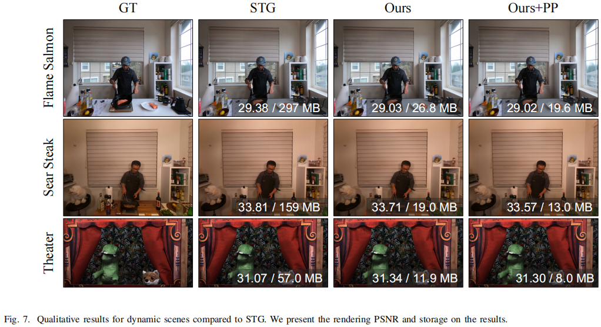

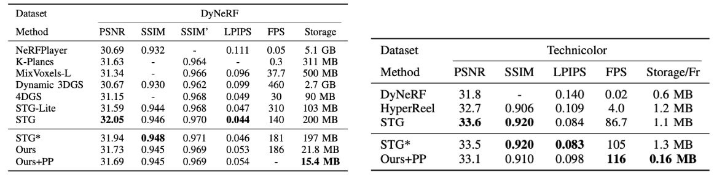

**DyNeRF**：Ours 21.8 MB vs STG\* 197 MB（约 9×），PSNR 31.73，FPS 186。

**Technicolor（Ours + PP）**：0.16 MB/帧，PSNR 33.1，FPS 116。

相对 STG，端到端训练约 >10× 参数效率；加后处理可达 >12× 压缩，渲染质量相当。

---

## 4. 消融实验

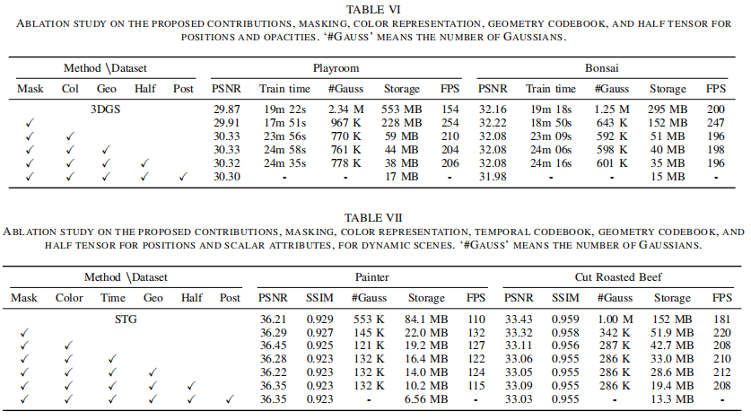

| 模块 | 作用 | 典型收益 |
|------|------|----------|
| **Mask** | 可学习体积掩码 | Playroom：存储 +140% 效率、渲染 +65% 加速；Painter 动态场景高斯 −75%，FPS +20% |
| **Color** | 哈希神经场替代 SH | 颜色存储 >3× 压缩 |
| **Geo** | R-VQ 几何码本 | 存储约 −30%，质量基本不变 |
| **Half** | FP16 位置/标量 | 进一步减小 footprint |
| **PP** | 量化 + 熵编码 | 模型再缩小 ~30–40% |

完整 pipeline（Mask + Color + Geo + Half + PP）在 Playroom 仅 17 MB。

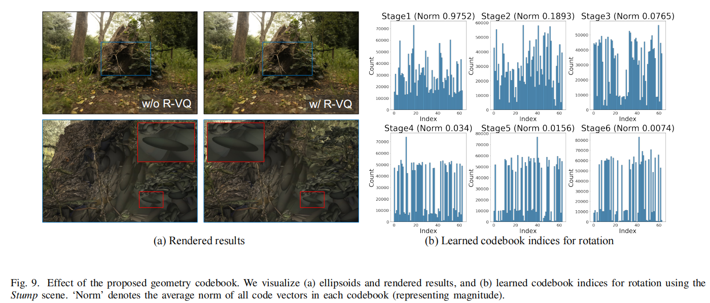

R-VQ 前后椭球体与渲染几乎无可见差异；低阶段码本索引分布较均匀、码字范数较大，高阶段残差更小、分布更稀疏——说明多阶段残差量化有效。

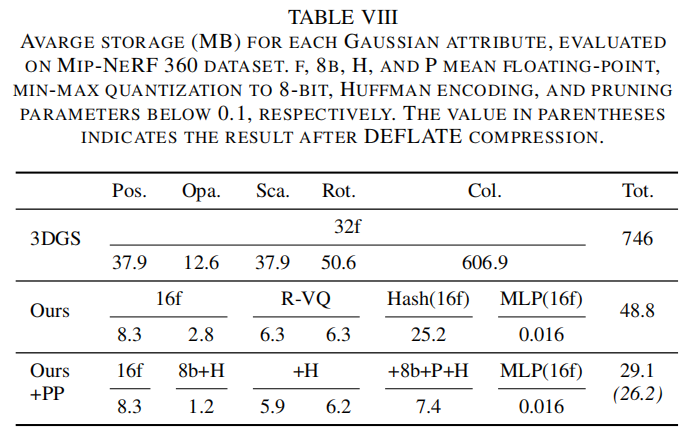

颜色表示仍是各属性中占用较大的一块，但 8-bit 量化 + 熵编码可显著压缩。

---

## 5. 总结

C3DGS 提出面向静态与动态辐射场的端到端紧凑 3DGS 框架：

- 可学习体积掩码在训练期而非训练后剔除冗余高斯，静态与动态均适用；  
  
- 哈希神经场共享表示视角相关颜色，替代高维 SH；  
  
- R-VQ 码本压缩几何与时间属性，参数开销可忽略。

相对 3DGS / STG，分别实现 >25× / >12× 存储压缩，渲染更快，重建质量相当。该框架可作为 3DGS 轻量化的完整方案，便于移动端、AR/VR 等存储与带宽受限场景部署。

