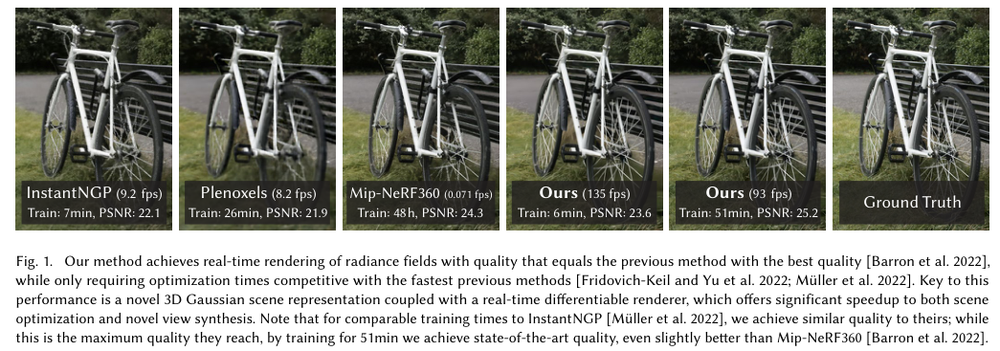
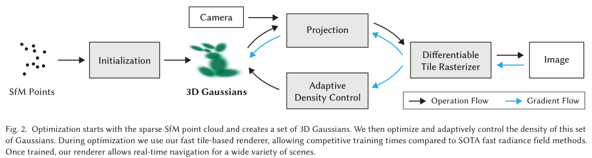
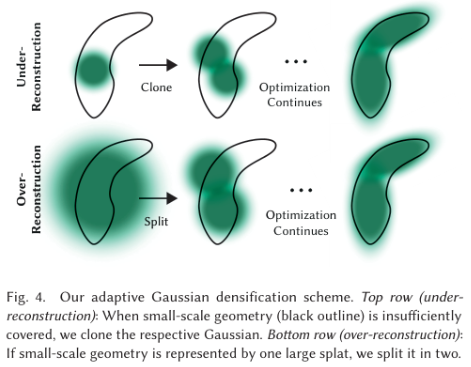
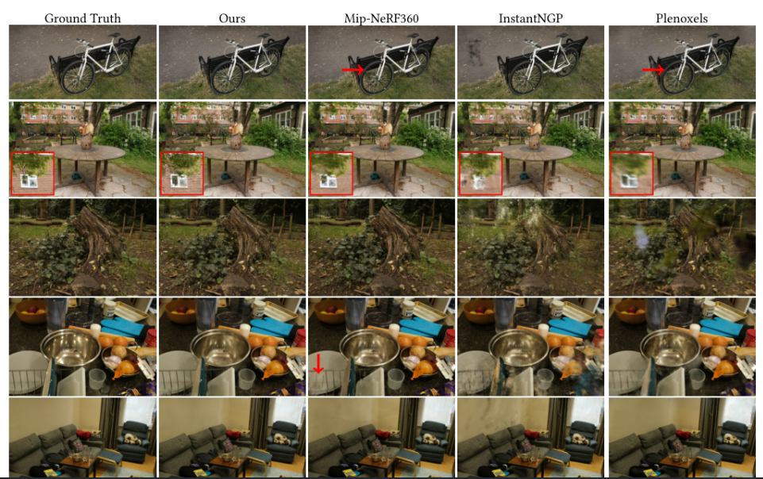
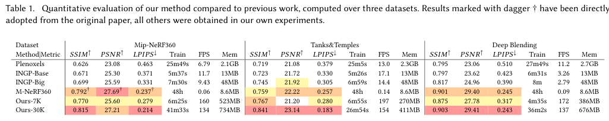
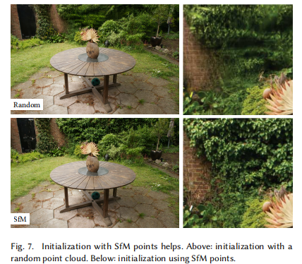
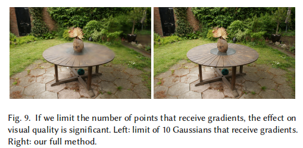
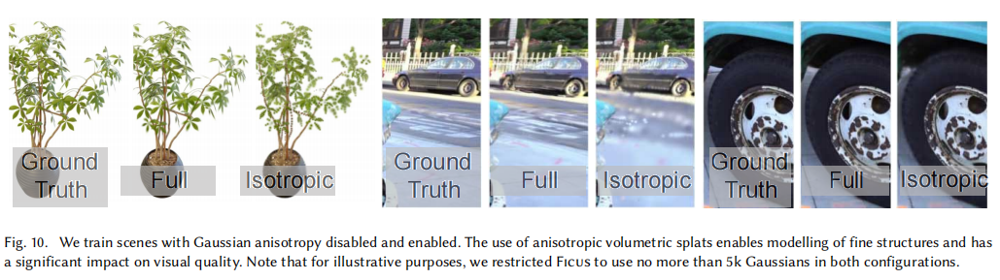

# 3D Gaussian Splatting for Real-Time Radiance Field Rendering

> 作者：Bernhard Kerbl、Georgios Kopanas、Thomas Leimkühler、George Drettakis（Inria / Max-Planck-Institut für Informatik）

> 论文链接：<https://arxiv.org/abs/2308.04079>（SIGGRAPH 2023）

> 论文代码：<https://github.com/graphdeco-inria/gaussian-splatting>

> 项目主页：<https://repo-sam.inria.fr/fungraph/3d-gaussian-splatting/>

---

## 1. 背景与动机

### 1.1 从 NeRF 到实时辐射场

神经辐射场（NeRF）用 MLP 隐式表示体密度与颜色，沿射线体渲染可得到高质量新视角合成，但训练与推理都需大量 MLP 查询，代价高。Instant NGP、Plenoxels 等通过哈希网格或稀疏体素加速，仍依赖随机射线采样，内存占用大，1080p 下难以真正实时。

网格与点云是经典显式表示，适合 GPU 光栅化；NeRF 类方法则是连续隐式场，优化灵活但渲染慢。3DGS 试图兼得二者优点：用可微三维高斯作体渲染式表示，再用溅射光栅化实现实时合成。

### 1.2 现有方法的瓶颈

在无界完整场景、1080p 分辨率下，尚无方法能同时达到当前最优画质与 \(\geq 30\) FPS 实时渲染：

- Mip-NeRF360：画质最好，单 GPU 训练约 48 小时，渲染约 10 秒/帧。  
  
- InstantNGP / Plenoxels：训练快（约 5–25 分钟），但画质低于 Mip-NeRF360，FPS 约 10–15，仍非严格实时。

### 1.3 核心目标

提出三个关键设计，在保持当前最优级画质的同时实现竞争性训练时间与 1080p 实时新视角合成：

1. 从 SfM 稀疏点出发，用三维高斯表示场景，保留连续体渲染的可优化性，又避免空域无效采样。  
   
2. 交错优化高斯属性与自适应密度控制（致密化/剪枝），优化各向异性协方差以紧凑拟合几何。  
   
3. 快速、可见性感知的可微光栅化，支持各向异性溅射与高效反向传播。

典型结果：与 InstantNGP 训练时间相近时画质相当；训练约 51 分钟时可略超 Mip-NeRF360，同时达到 93–135 FPS。

---

## 2. 方法与框架

### 2.1 整体流程

输入为多视角静态图像及 SfM 标定相机；从稀疏点云初始化三维高斯，交替优化位置、不透明度、协方差、SH 颜色，并自适应增删高斯；经分块光栅化渲染后与真值比较并反向传播。

### 2.2 可微三维高斯溅射

每个高斯由均值 \(\boldsymbol{\mu}\)、协方差 \(\boldsymbol{\Sigma}\)、不透明度 \(\alpha\) 与 SH 系数描述。三维高斯密度：

\[
G(\mathbf{x}) = \exp\!\left(-\tfrac{1}{2}(\mathbf{x}-\boldsymbol{\mu})^\top \boldsymbol{\Sigma}^{-1}(\mathbf{x}-\boldsymbol{\mu})\right)
\]

渲染时与 \(\alpha\) 相乘参与 \(\alpha\) 混合。协方差半正定，分解为缩放 \(\mathbf{S}\) 与旋转 \(\mathbf{R}\)：

\[
\boldsymbol{\Sigma} = \mathbf{R}\mathbf{S}\mathbf{S}^\top \mathbf{R}^\top
\]

优化时用三维向量 \(\mathbf{s}\)（指数激活）与单位四元数 \(\mathbf{q}\) 分别表示缩放与旋转，避免直接优化 \(\boldsymbol{\Sigma}\) 导致非半正定。

投影到像平面：设视图变换 \(\mathbf{W}\)、投影雅可比 \(\mathbf{J}\)，

\[
\boldsymbol{\Sigma}' = \mathbf{J}\mathbf{W}\boldsymbol{\Sigma}\mathbf{W}^\top\mathbf{J}^\top
\]

取 \(\boldsymbol{\Sigma}'\) 左上 \(2\times 2\) 子矩阵作为二维协方差，与 NeRF 体渲染在 \(\alpha\) 混合意义上等价：

\[
\mathbf{C} = \sum_{i\in\mathcal{N}} c_i\,\alpha_i \prod_{j=1}^{i-1}(1-\alpha_j)
\]

其中 \(c_i\) 由 SH 与视线方向求得，\(\alpha_i\) 为二维高斯与不透明度之积。

### 2.3 优化与自适应密度控制

损失函数（L1 + D-SSIM）：

\[
L = (1-\lambda)\, L_1 + \lambda\, L_{\text{D-SSIM}},\quad \lambda = 0.2
\]

\(\alpha\) 经 S 型函数约束于 \([0,1)\)，尺度用指数激活；初始协方差为各向同性，轴长取到最近三个 SfM 点距离均值。

密度控制（预热后每 100 次迭代执行）：

- 剪枝：\(\alpha < \alpha_{\min}\) 或世界/视空间覆盖范围过大的高斯。  
  
- 致密化：视空间位置梯度均值 \(> \tau_{\text{pos}}\)（0.0002）时增点。欠重建（小高斯）：克隆，沿梯度方向复制同尺度高斯。过重建（大高斯）：分裂为两个，尺度除以 \(\phi=1.6\)，位置按原高斯概率密度采样。  
  
- 每 \(N=3000\) 次迭代将 \(\alpha\) 重置接近 0，抑制相机附近漂浮伪影。

最终场景约 \(10^6\) 量级高斯（测试集 100 万–500 万），单点约 59 维参数（\(3+3+4+1+48\)）。

### 2.4 快速可微光栅化

- 屏幕划分为 \(16\times 16\) 分块；视锥与分块剔除，保留 99% 置信区间相交的高斯。  
  
- 每个高斯按重叠分块实例化，键 = 视空间深度（低 32 比特）+ 分块编号（高比特），全局基数排序一次完成。  
  
- 每分块一个线程块，协作加载高斯到共享内存，前向按深度由前向后累积颜色与 \(\alpha\)；\(\alpha\) 饱和则提前停止。  
  
- 反向传播：不限制参与梯度的高斯数量；复用排序结果由后向前遍历，用前向累积 \(\alpha\) 反推中间透明度，避免逐像素动态列表。

与 Pulsar 等相比：保持近似有序 \(\alpha\) 混合、支持各向异性溅射、对所有溅射反传梯度。

---

## 3. 实验与结果

### 3.1 设置

| 数据集 | 说明 |
|--------|------|
| Mip-NeRF 360 | 无界室内外，画质基准 |
| Tanks&Temples、Deep Blending | 大场景与室内 |
| NeRF-Synthetic | 有界合成，可随机初始化 |

指标：PSNR、SSIM、LPIPS、训练时间、FPS、存储（MB）。A6000 GPU；Mip-NeRF360 数字来自原论文。

### 3.2 真实场景

Mip-NeRF 360（本文 30K）：SSIM 0.815、PSNR 27.21、LPIPS 0.214，训练 41 分钟，134 FPS，734 MB——画质与 Mip-NeRF360 相当或略优，训练快两个数量级，渲染快数百倍。

7K 次迭代（约 6 分钟）已接近 InstantNGP / Plenoxels 画质；继续训练可追平 Mip-NeRF360，而快速方法通常无法再通过加时达到当前最优。

Deep Blending：PSNR 29.41、137 FPS。Tanks&Temples：与 InstantNGP-Base 训练时间相近（约 7 分钟），画质更好。

### 3.3 合成场景

随机初始化 10 万高斯，30K 次迭代后约 20 万–50 万点，PSNR 平均 33.32，渲染 180–300 FPS。相对点基辐射场方法，用约 1/4 点数达到相同 PSNR，模型约 3.8 MB（仅用 2 阶 SH）。

---

## 4. 消融实验

| 变体 | 作用 |
|------|------|
| 随机初始化 | 无 SfM 时仍可工作，背景与未覆盖区域易出现漂浮伪影 |
| 无克隆 / 无分裂 | 分裂对背景重要；克隆加速薄结构收敛 |
| 限制反向带宽 | 限制仅前 10 个高斯反传梯度，Truck 场景 PSNR 降约 11 dB |
| 各向同性 | 关闭各向异性协方差，细节对齐表面能力显著下降 |
| 无 SH | 去掉视角相关 SH，PSNR 下降 |

---

## 5. 局限与总结

局限：未充分观测区域仍有伪影；细长或斑块状高斯、视角相关处可能出现闪现伪影；大场景训练峰值显存超过 20 GB；存储仍高于纯 NeRF MLP（数百 MB 级点云文件）。

3DGS 首次在完整无界场景、1080p 下实现当前最优级画质与真正实时渲染。核心贡献：各向异性三维高斯 + 交错密度控制 + 可见性感知分块光栅化。显式溅射不必牺牲体渲染式优化，为后续动态扩展（如 STG）与压缩（如 C3DGS）奠定基础。
