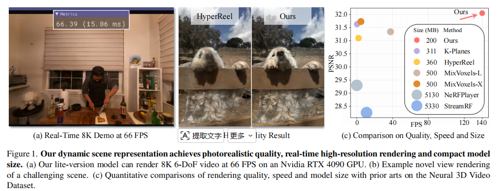
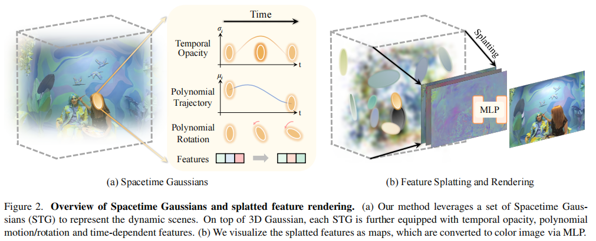
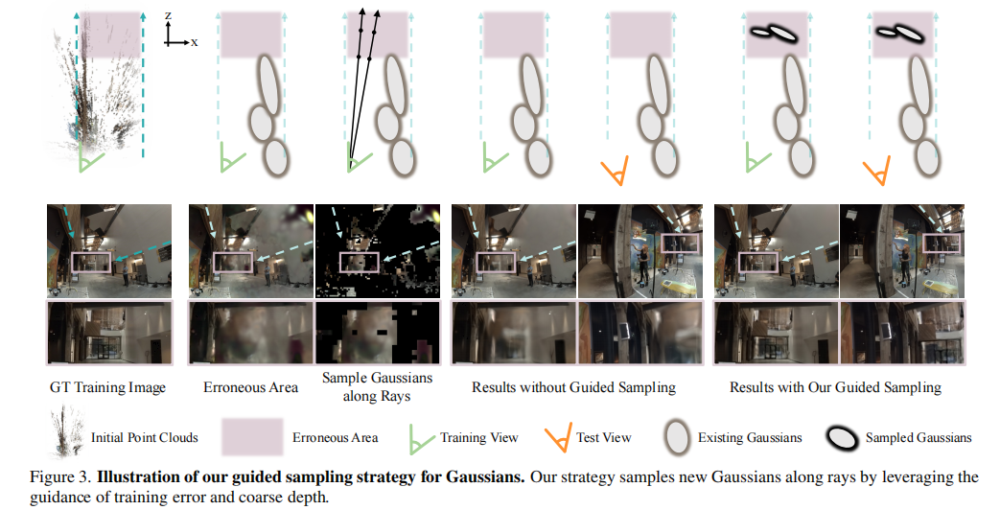
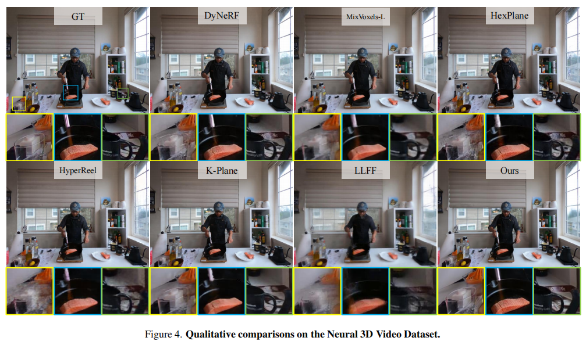
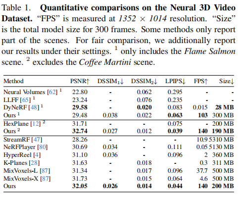
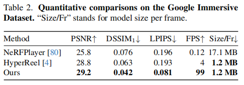
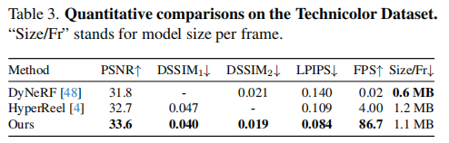
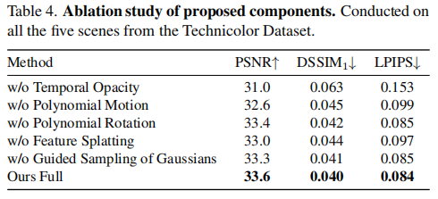

# Spacetime Gaussian Feature Splatting for Real-Time Dynamic View Synthesis

> 作者：Zhan Li、Zhang Chen、Zhong Li、Yi Xu（OPPO US Research Center / Portland State University）

> 论文链接：<https://arxiv.org/abs/2312.16812>（CVPR 2024）

> 论文代码：<https://github.com/oppo-us-research/SpacetimeGaussians>

> 项目主页：<https://oppo-us-research.github.io/SpacetimeGaussians-website/>

---

## 1. 背景与动机

### 1.1 动态新视角合成的挑战

动态场景新视角合成需同时满足高分辨率照片级真实感、实时渲染与紧凑存储，三者往往难以兼得。逐帧应用 3DGS 会导致模型体积与训练时间随帧数线性膨胀。

现有动态 NeRF 类方法（NeRFPlayer、HyperReel、K-Planes、MixVoxels 等）多在单一模型中编码多帧，利用相邻帧相似性共享特征，但网格/平面类表示难以自适应复杂运动结构，高分辨率实时渲染常需牺牲质量。

### 1.2 3DGS 的局限

3DGS 在静态场景已证明溅射光栅化的高效性，但属性逐帧存储不适用于多视角视频：百万级高斯 × 数百帧 × 每点 SH/几何参数，存储与带宽压力巨大。

### 1.3 核心目标

提出 Spacetime Gaussian Feature Splatting（STG），在四维时空域扩展 3D 高斯，并用特征溅射 + 轻量 MLP 替代 SH，实现：

- 静态、动态与瞬态（出现/消失）内容的统一建模；  
  
- 视角与时间相关外观的紧凑表达；  
  
- 引导采样补全稀疏远端区域；  
  
- 8K 分辨率轻量版约 60+ FPS。

Neural 3D Video 数据集上：PSNR 32.05、140 FPS、200 MB（300 帧）；相对 HyperReel（360 MB、2 FPS）与 K-Planes（311 MB、0.3 FPS）更优。

---

## 2. 方法与框架

### 2.1 整体架构

输入为多视角视频与相机参数；从各时间戳 SfM 稀疏点初始化 Spacetime Gaussians（STG），优化时空属性与溅射特征，经特征光栅化 + MLP 得到最终颜色。

### 2.2 时空高斯

对时空点 \((\mathbf{x}, t)\)，第 \(i\) 个 STG 的不透明度：

\[
\alpha_i(t) = \sigma_i(t)\,\exp\!\left(-\tfrac{1}{2}(\mathbf{x}-\boldsymbol{\mu}_i(t))^\top \boldsymbol{\Sigma}_i(t)^{-1}(\mathbf{x}-\boldsymbol{\mu}_i(t))\right)
\]

\(\boldsymbol{\mu}_i(t)\)、\(\boldsymbol{\Sigma}_i(t)\) 随时间变化；\(\sigma_i(t)\) 为时间调制的不透明度。

时间径向基（TRBF）——时间不透明度：

\[
\sigma_i(t) = \sigma_i^s \exp\!\left(-s_i^\tau |t-\mu_i^\tau|^2\right)
\]

\(\mu_i^\tau\) 为时间中心（可见性峰值时刻），\(s_i^\tau\) 控制有效持续时间，\(\sigma_i^s\) 为空间不透明度。可建模内容的出现与消失。

多项式运动轨迹（\(n_p=3\)）：

\[
\boldsymbol{\mu}_i(t) = \sum_{k=0}^{n_p} \mathbf{b}_{i,k}\,(t-\mu_i^\tau)^k,\quad \mathbf{b}_{i,k}\in\mathbb{R}^3
\]

复杂长运动可由多个短段 STG 组合表示。

多项式旋转（\(n_q=1\)），四元数 \(\mathbf{q}_i(t)\) 同样以 \(\mu_i^\tau\) 为中心展开；归一化得 \(\mathbf{R}_i(t)\)，再与常数缩放 \(\mathbf{S}_i\) 组成：

\[
\boldsymbol{\Sigma}_i(t) = \mathbf{R}_i(t)\mathbf{S}_i\mathbf{S}_i^\top \mathbf{R}_i(t)^\top
\]

缩放矩阵不随时间变化（实验未见时变缩放收益）。

### 2.3 特征溅射渲染

每点存 9 维特征而非 48 维 SH：

\[
\mathbf{f}_i(t) = \big[\mathbf{f}_i^{\text{base}},\,\mathbf{f}_i^{\text{dir}},\,(t-\mu_i^\tau)\mathbf{f}_i^{\text{time}}\big]^\top,\quad \mathbf{f}_i^{\cdot}\in\mathbb{R}^3
\]

光栅化时将 \(\mathbf{f}_i(t)\) 替代颜色做溅射，像素处得 \(\mathbf{F}^{\text{base}}, \mathbf{F}^{\text{dir}}, \mathbf{F}^{\text{time}}\)，再经两层 MLP \(\Phi\)：

\[
\mathbf{I} = \mathbf{F}^{\text{base}} + \Phi(\mathbf{F}^{\text{dir}}, \mathbf{F}^{\text{time}}, \mathbf{r})
\]

\(\mathbf{r}\) 为像素视线方向。轻量版省略 \(\Phi\)，仅用 \(\mathbf{F}^{\text{base}}\)，换取更高 FPS（8K 约 66 FPS）。

### 2.4 优化与引导采样

可优化参数：\(\Phi\) 及每个 STG 的 \(\sigma_i^s, s_i^\tau, \mu_i^\tau, \{\mathbf{b}_{i,k}\}, \{\mathbf{c}_{i,k}\}, \mathbf{s}_i\) 与基色/视角/时间三分量特征。损失为 L1 + D-SSIM；沿用 3DGS 密度控制，并采用更激进剪枝以控制模型大小。50 帧序列在 A6000 GPU 上训练约 40–60 分钟。

引导采样：初始化稀疏且远离相机的区域易模糊。在损失稳定后，按图像块聚合训练误差，从高误差块中心像素发射射线；利用溅射得到的粗深度图限定采样深度区间，沿射线均匀增采样新 STG 并加小噪声。每场景最多约 3 次；与克隆/分裂互补——后者在已有高斯附近增密，引导采样可填补空白区域。

---

## 3. 实验与结果

### 3.1 设置

| 数据集 | 特点 |
|--------|------|
| Neural 3D Video | 6 场景，18–21 相机，2704×2028，300 帧 |
| Google Immersive | 46 鱼眼相机，外半球布置，视角重叠少 |
| Technicolor | 5 场景，电影级多视角 |

指标：PSNR、DSSIM、LPIPS、FPS、模型体积（MB 或 MB/帧）。

### 3.2 Neural 3D Video

本文方法：PSNR 32.05、DSSIM 0.026、LPIPS 0.044、140 FPS、200 MB（300 帧）。优于 MixVoxels-X/L、K-Planes、HyperReel、NeRFPlayer 等；LPIPS 最佳，PSNR/DSSIM 多数领先。细节更鲜活（如三文鱼纹理、杯壁焦散）。

### 3.3 Google Immersive

本文方法：PSNR 29.2、DSSIM 0.042、LPIPS 0.081、99 FPS、1.2 MB/帧。相对 HyperReel 渲染快 10 倍以上；相对 NeRFPlayer 各指标全面领先。

### 3.4 Technicolor

本文方法：PSNR 33.6、LPIPS 0.084、86.7 FPS、1.1 MB/帧，优于 DyNeRF 与 HyperReel。

---

## 4. 消融实验

初始化消融（Theater 场景）：每 \(N\) 帧取 SfM 点，\(N=1\) 时 PSNR 31.58、110 MB；\(N=16\) 时 31.04、32.6 MB——更稀疏初始化可显著减小体积，画质略降。

---

## 5. 总结

STG 将 3DGS 扩展到四维时空：TRBF 时间不透明度 + 多项式运动/旋转刻画动态与瞬态；9 维特征溅射 + 小 MLP 替代 SH，体积更小且支持时变外观；引导采样结合误差与粗深度，改善远端稀疏区。

在 Neural 3D Video、Google Immersive、Technicolor 上达到当前最优级质量与实时高分辨率渲染，模型紧凑（约 200 MB/300 帧或约 1 MB/帧）。轻量版可 8K 60+ FPS，适合 VR/AR、广播与流媒体。该方法也是 Compact 3DGS 等动态压缩工作的主要基线。
