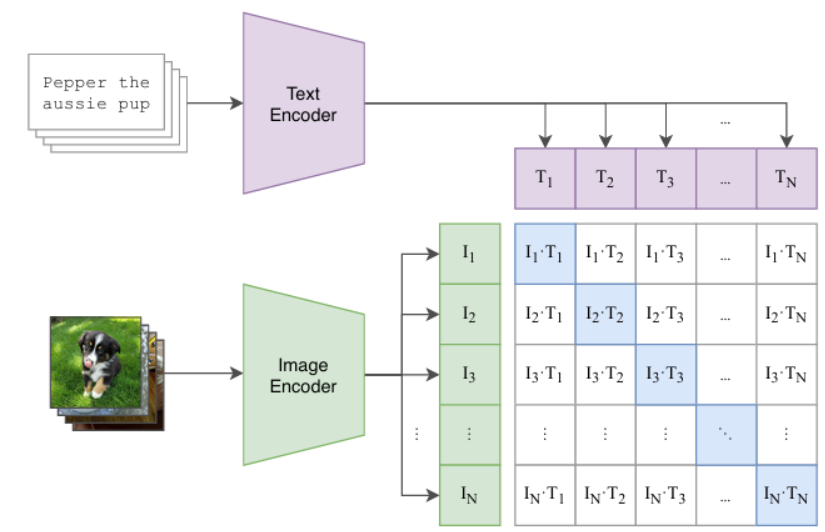
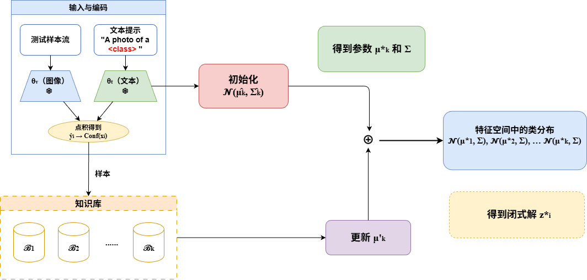
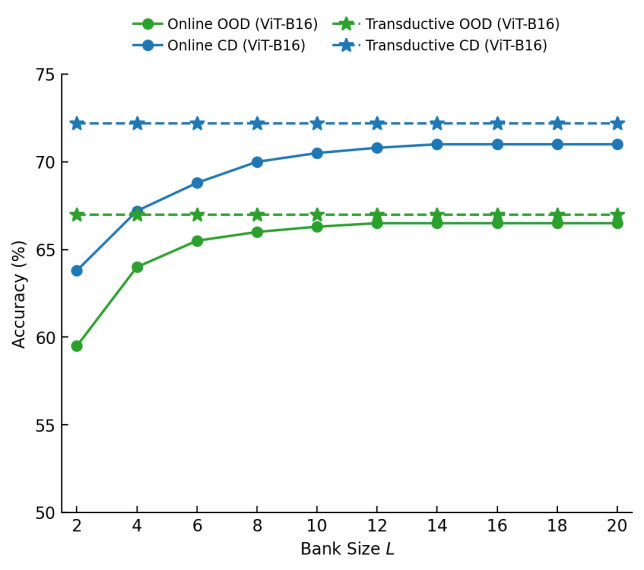
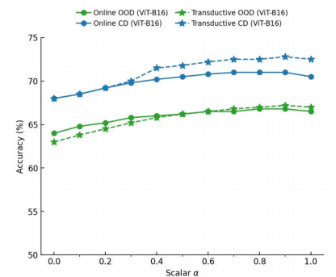

# 基于贝叶斯理论的测试时动态自适应方法研究

视觉语言模型（VLM）在测试阶段遇到数据分布偏移时，性能往往会明显下降。本文提出一种基于贝叶斯理论、免反向传播、免迭代优化的测试时动态自适应方法，在多种分布外检测与跨域细粒度数据集上取得稳定领先的平均准确率，同时保持较低的推理开销。

---

## 1. 背景与目标

### 1.1 问题背景

以 [CLIP](https://arxiv.org/abs/2103.00020) 为代表的视觉语言模型，通过对比学习在图文对之间建立跨模态对应，具备强大的零样本迁移能力。然而在实际部署中，测试数据分布与预训练数据往往存在显著差异——医疗影像的设备差异、监控场景的光照与摄像头变化等——都会导致模型性能退化。

传统域适应（Domain Adaptation）与域泛化（Domain Generalization）通常需要在训练阶段获取目标域或多源域数据，在隐私保护与数据获取成本上存在限制。测试时自适应（Test-Time Adaptation，TTA）则只需在推理阶段利用无标签测试数据动态调整模型，无需重训练，更贴近真实流式部署场景。

### 1.2 现有方法的不足

当前主流 TTA 方法存在两类典型瓶颈：

- 计算开销大：TPT、TENT 等方法依赖反向传播或迭代优化，在线推理成本高；
  
- 分布建模弱：多数方法采用启发式缓存或熵最小化，缺乏对测试数据分布结构的显式概率建模，在复杂分布偏移下鲁棒性有限。

### 1.3 核心目标

从贝叶斯理论出发，设计一种：

- 免反向传播、免迭代优化的轻量级在线适应方案；
  
- 能对测试数据分布进行显式动态估计的方法；
  
- 同时支持在线流式与直推批量两种部署模式。

---

## 2. TTA概览

TTA 的核心思想是：在模型已预训练完成的前提下，仅利用测试阶段的无标签数据，使模型适应目标域分布。按适应方式可大致分为以下几类（参见 [awesome-test-time-adaptation](https://github.com/tim-learn/awesome-test-time-adaptation)）：

| 类别 | 设定 | 代表方法 | 特点 |
|------|------|----------|------|
| 无源域适应 | 测试时无法访问源域数据 | [SHOT](https://arxiv.org/abs/2002.08546)、[TENT](https://arxiv.org/abs/2006.10726)、[AdaContrast](https://arxiv.org/abs/2204.10377) | 保护源域隐私；对伪标签质量敏感 |
| 批量适应 | 一次性获得一批测试样本 | [MEMO](https://arxiv.org/abs/2110.09506) | 计算效率较高；批次间分布剧变时不稳定 |
| 在线适应 | 连续到来的测试数据流 | [CoTTA](https://arxiv.org/abs/2203.13591)、[EATA](https://arxiv.org/abs/2204.02610)、[RoTTA](https://arxiv.org/abs/2303.13899) | 最接近实际部署；对效率与稳定性要求高 |
| 先验适应 | 利用预训练模型内置先验 | [TPT](https://arxiv.org/abs/2209.07511)、[T3A](https://openreview.net/forum?id=e_yvNqkJKAW) | 参数高效；先验利用方式仍待深入 |

面向 CLIP 等 VLM 的 TTA 还可进一步细分为：

- 提示调优路线：TPT 及其改进 [DiffTPT](https://arxiv.org/abs/2308.06038)、[C-TPT](https://arxiv.org/abs/2403.14119)、[HisTPT](https://arxiv.org/abs/2410.20346) 等，在测试时优化少量 prompt 嵌入；
  
- 缓存/记忆路线：[TDA](https://arxiv.org/abs/2403.18293)、[MTA](https://arxiv.org/abs/2405.02266)、[DMN](https://arxiv.org/abs/2403.17589) 等，维护代表性样本缓存指导后续分类；
  
- 统计/贝叶斯路线：显式估计测试分布并做概率推断。

---

## 3. 相关技术与代表工作

### 3.1 视觉语言模型基础

CLIP 由图像编码器（ResNet / ViT）与文本编码器（Transformer）组成，将图文映射到共享嵌入空间。给定 $K$ 个候选类别，零样本分类通过图像特征与类原型（文本嵌入）的余弦相似度完成：

$$
\hat{y} = \arg\max_k \; \tau \cdot \cos(f(x),\, t_k)
$$

其中 $\tau$ 为预训练阶段学习的温度参数，后续 TTA 方法通常固定该值以保持原始图文对齐特性。

提示学习方面，训练阶段有 [CoOp](https://arxiv.org/abs/2109.01134)、[CoCoOp](https://arxiv.org/abs/2203.05557)；测试阶段 [TPT](https://arxiv.org/abs/2209.07511) 首次将 prompt 调优引入 TTA。特征适配器方面，[CLIP-Adapter](https://arxiv.org/abs/2110.04544)、[Tip-Adapter](https://arxiv.org/abs/2111.03930) 通过轻量模块或免训练缓存实现适应。

### 3.2 基于统计理论的 TTA

近年来，从分布估计而非实例缓存出发的贝叶斯 TTA 成为重要方向：

- [DOTA](https://arxiv.org/abs/2409.19375) — 从实例级缓存转向分布级估计，假设各类特征服从高斯分布，用在线 EM 更新参数，缓解灾难性遗忘；小样本场景下性能受限。
  
- [BCA](https://arxiv.org/abs/2503.09248) — 从贝叶斯定理分析 CLIP 预测过程，双重更新类别嵌入（似然）与类别先验，在 OOD 与跨域任务上提升明显；未直接建模协方差，先验更新易受早期错误预测污染。
  
- [ADAPT](https://arxiv.org/abs/2508.15568) — 引入 CLIP 先验与历史知识库引导的轻量正则化，通过闭式解实现高效自适应（复现基石）。
  
- [GDA-CLIP](https://arxiv.org/abs/2402.04087) — 用高斯判别分析（GDA）实现免训练 CLIP 适应，是强基线。
  
- [TransCLIP](https://arxiv.org/abs/2406.01837) — 直推式多元高斯建模，BMM 算法迭代优化分布参数。
  
- [Frolic](https://arxiv.org/abs/2410.19294) — 从目标数据矩推断每类提示分布，做偏差校正。

### 3.3 直推式学习

直推式学习（Transductive Learning）在推理时可利用整个测试集的结构信息，适合离线批量场景。图方法如 [ZLaP](https://arxiv.org/abs/2404.04072)、[ECALP](https://arxiv.org/abs/2412.18303) 在特征图上传播标签，但迭代代价较高。本方法同时覆盖在线与直推两种模式，部署灵活性更强。

---

## 4. 方法设计

### 4.1 整体框架

本项目提出的方法包含四个核心设计：

1. 基于 GDA 的免反向传播分类器：假设各类图像特征服从共享协方差的高斯分布，MLE 给出类均值与协方差的闭式解；
   
2. 知识库引导的偏差校正：每类维护固定容量高置信样本库，融合 CLIP 先验、GDA 线性项与一致性正则；
   
3. 闭式标签估计与动态融合：推导单遍闭式解；用预测熵与主峰概率构造含糊度度量，动态调节融合系数；
   
4. 双模式部署：分别实现在线流式与直推批量算法。

### 4.2 高斯判别分析分类器

假设给定类别 $k$ 时特征 $f(x) \sim \mathcal{N}(\mu_k, \Sigma)$，共享协方差 $\Sigma$。由贝叶斯规则，均匀先验下最优预测为：

$$
\hat{y} = \arg\max_k \; f(x)^\top \Sigma^{-1} \mu_k - \frac{1}{2}\mu_k^\top \Sigma^{-1} \mu_k
$$

在独立同分布假设下，$\mu_k$ 与 $\Sigma$ 的 MLE 分别为类经验均值与合并样本协方差，无需反向传播或迭代优化。高维情形下采用带收缩的贝叶斯岭型估计量稳定 $\Sigma^{-1}$。

### 4.3 知识库与偏差校正

在线场景中，早期预测不可靠会导致似然估计有偏。本方法为每类维护容量为 $L$ 的知识库 $\mathcal{B}_k$，以 CLIP 预测负熵作为置信度，仅保留高置信样本。

最小化如下正则化目标（三项分别为在线负对数似然、CLIP 先验正则、知识库一致性正则），可严格推导出闭式标签估计器，融合：

- CLIP 零样本预测；
  
- GDA 线性判别项；
  
- 知识库类条件一致性。

类均值采用知识库经验均值与 CLIP 先验均值的动态加权融合。定义归一化熵 $H_{\text{norm}}$ 与主峰概率 $p_{\max}$，构造含糊度：

$$
u = \lambda \cdot H_{\text{norm}} + (1-\lambda) \cdot (1 - p_{\max})
$$

融合系数 $\alpha$ 在 $[\alpha_{min}, \alpha_{max}]$ 间线性变化：高置信样本更依赖知识库，含糊样本更回退到 CLIP 先验。

### 4.4 直推式扩展

直推模式下可一次性访问整个测试集，将在线目标扩展为全局目标，标签估计器形式不变；类均值改为单遍估计，$\alpha$ 取固定值（无需动态更新）。实验表明直推模式准确率通常高于在线模式，但在线模式更贴近真实流式部署。

---

## 5. 实验设计与结果

### 5.1 实验设定

- 骨干网络：CLIP 视觉编码器 ViT-B/16 与 ResNet-50
  
- 评价指标：Top-1 准确率
  
- 部署模式：在线模式：batch size = 1，逐样本流式处理；直推模式：一次性访问全测试集
  
- 超参数（ViT-B/16）：在线模式 $\alpha_{min} \in [0.6, 0.9]$，$\alpha_{max} \in [0.9, 1.0]$，$\lambda=0.5$，知识库大小 $L=16$；直推模式 $\alpha=0.9$，$L=6$
  
- 先验初始化：采用 [AWT](https://arxiv.org/abs/2407.04603) 中 GPT 生成的类别视觉描述

数据集：

| 任务类型 | 数据集 | 说明 |
|----------|--------|------|
| 分布外检测（5个） | ImageNet、ImageNet-A/V/R/S | 自然对抗、变体、渲染、素描等偏移 |
| 跨域细粒度（8个） | Aircraft、Caltech、Cars、DTD、EuroSAT、Flower、Sun397、UCF101 | 细粒度与跨域分类 |

对比基线：

- 在线：Zero-Shot CLIP、TPT / DiffTPT / C-TPT / HisTPT / DMN（需反向传播）、TDA / MTA / BCA / DOTA（免梯度）
  
- 直推：GDA-CLIP、TransCLIP、Frolic

### 5.2 主要结果

分布外检测（ViT-B/16，在线模式）

| 方法 | 平均准确率 |
|------|-----------|
| CLIP Zero-Shot | 59.11% |
| TPT | 62.45% |
| DOTA | 65.76% |
| Our | 66.39% |

本方法在 ViT-B/16 在线模式下平均准确率达 66.39%，超越全部需/免反向传播基线；ResNet-50 上平均 50.73%，同样最优。直推模式下超过 GDA-CLIP、TransCLIP、Frolic，在 ImageNet 系列数据集上几乎全面领先。

跨域细粒度（ViT-B/16）

| 模式 | Our 平均 | 相对 Zero-Shot 提升 |
|------|----------|---------------------|
| 在线 | 66.60% | +8.76% |
| 直推 | 68.05% | +10.21% |

ResNet-50 在线模式略低于需梯度的 DMN（58.72%），但在免反向传播方法中最优；直推模式优于 TransCLIP。

### 5.3 消融实验

模块有效性（ViT-B/16，在线，分布外任务）：

| 配置 | 平均准确率 |
|------|-----------|
| 无知识库、无 $\mu$/$\Sigma$ 更新 | 49.65% |
| 完整方法 | 66.39% |

移除知识库后性能从 66.39% 骤降至 49.65%，说明知识库正则对缓解在线似然偏差至关重要。$\mu$ 与 $\Sigma$ 的联合自适应更新效果最佳。

超参数敏感性

知识库过小则统计信息不足、性能波动；适中容量后趋于稳定。直推模式因可访问全测试集，对 $L$ 更鲁棒。

直推模式准确率随 $\alpha$ 增大稳步提升，说明方法更受益于可靠历史样本而非仅依赖静态 CLIP 先验；取 $\alpha=0.9$ 可平衡先验与自适应性。

### 5.4 效率对比

| 方法 | 模式 | 耗时 | 内存 | 准确率 |
|------|------|------|------|--------|
| TPT | 在线 | 数小时级 | — | 68.98% |
| Our | 在线 | 59 min | 0.93 GB | 70.93% |
| GDA-CLIP | 直推 | 较长 | 较大 | 64.13% |
| TransCLIP | 直推 | 较长 | 较大 | 70.30% |
| Our | 直推 | 0.71 min | 3.37 GB | 71.54% |

本方法在精度与效率之间取得较好平衡：在线模式以远低于 TPT 的时间达到更高准确率；直推模式单遍运行，时间与内存显著优于 GDA-CLIP 与 TransCLIP。

---

## 6. 总结与展望

### 6.1 主要结论

本方法将贝叶斯推理、高斯判别分析与知识库引导的偏差校正结合，实现了：

- 免反向传播、免迭代优化的闭式在线/直推自适应；
  
- 在 5 个 OOD + 8 个跨域数据集上的稳定领先平均准确率；
  
- 低内存、低延迟的部署特性。

### 6.2 局限性

- 共享协方差的高斯假设难以刻画类内外观差异极大的复杂分布；
  
- 知识库采用置信度阈值替换策略，对长时序历史样本的利用仍较粗糙；
  
- 实验仅在 CLIP 上验证，尚未扩展至 ALIGN、BLIP 等其他 VLM。

### 6.3 未来方向

- 探索混合分布或更灵活的生成式建模；
  
- 改进知识库时序加权与遗忘策略；
  
- 扩展至检测、分割、视频理解等下游任务及其他 VLM 骨干。
