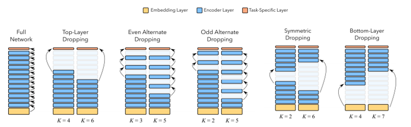
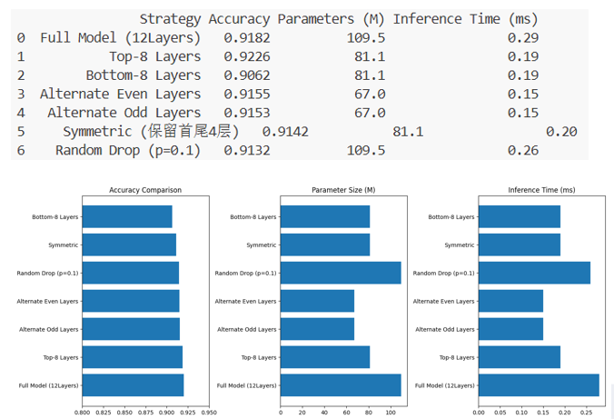
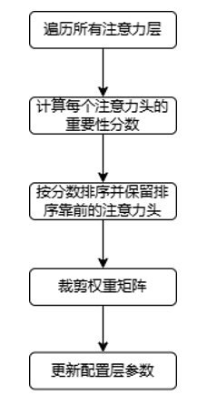
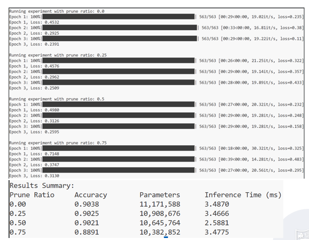
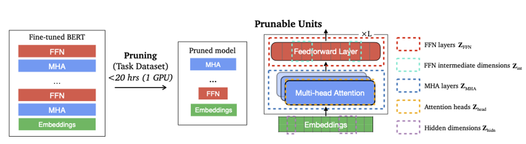
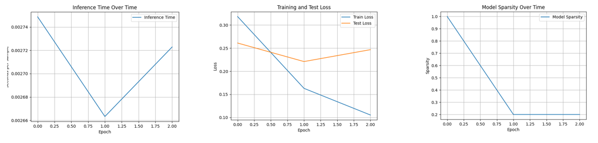

# 基于 BERT 预训练模型的剪枝策略

## 1. 背景与目标

### 1.1 剪枝原因

预训练语言模型参数量大，在落地部署时常面临算力与显存占用高、推理延迟大等问题。模型剪枝通过移除对任务冗余的结构或参数，在尽量保留精度的前提下缩小模型、降低计算量，是压缩与加速路线的经典手段之一。

### 1.2 实验设定

- **任务**：文本分类。  
  
- **数据**：AG News等新闻语料上微调 BERT 类模型。  
  
- **评价维度**：准确率、参数量、推理速度。

### 1.3 核心目标

在尽可能保留原始模型核心能力与任务精度的前提下：

- 降低模型规模与计算复杂度；  
  
- 减少资源消耗，使模型更易部署到实际场景。

---

## 2. 层剪枝（Layer Pruning）

### 2.1 思路与相关论文

层剪枝属于粗粒度结构化剪枝：直接去掉若干 Transformer 层，参数量与深度同步下降，实现路径清晰，也便于与固定深度推理的工程栈对接。

- **LayerDrop（结构化 Dropout）** — Fan 等，[Reducing Transformer Depth on Demand with Structured Dropout](https://arxiv.org/abs/1909.11556)。训练时以一定概率随机丢弃整层，使子网络在多种深度上都能工作；推理时可按需使用更浅的子网络，从而在深度维度上获得压缩与加速潜力。  
  
- **Poor Man’s BERT** — Sajjad 等，[On the Effect of Dropping Layers of Pre-trained Transformer Models](https://arxiv.org/abs/2004.03844)。在不重新预训练的前提下，通过删层、减头、减隐藏维度等简单策略缩小 BERT，说明结构裁剪加微调在工程上可行，并与更大规模蒸馏等方法形成对照。

层剪枝：通过移除网络中的冗余层，减小模型规模、降低计算成本并加速推理，是一种粗粒度但高效的方案。

### 2.2 LayerDrop 与训练设置

除训练后直接删层的剪枝策略外，我们还对照了LayerDrop：训练阶段使用丢弃概率约 0.1 的结构化丢弃，使模型适应随机深度。

### 2.3 我们采用的层剪枝策略

在微调后的文本分类模型上，对比多种删层模式（均以完整模型为基准）：

| 策略类型 | 含义 |
|----------|------------------|
| Top-Layer | 优先去掉靠近输出侧的部分层 |
| Bottom-Layer | 优先去掉靠近输入侧的部分层 |
| 奇数 / 偶数层丢弃 | 按层号间隔删除，观察结构对称性对性能的影响 |
| 对称丢弃 | 按对称模式删层 |
| Full Model | 不删层，作为对照 |

### 2.4 实验现象

从准确率、参数量、推理速度三方面对比：

- **准确率**：在所测试的策略中，Top-Layer 表现相对最好。  
  
- **规模与速度**：相对 Full Model，各类层剪枝均能减小参数量、加快推理；丢弃的层越多，模型越小、往往也越快。  
  
- **精度—速度权衡**：多数策略在略低于原模型准确率的代价下，仍保持可接受性能，说明层剪枝在本任务上性价比较好。  
  
- **LayerDrop**：实验中收益不突出，推测与丢弃概率是否合适有关，仍需搜索更优超参。

---

## 3. 注意力头剪枝（Head Pruning）

### 3.1 思路与相关论文

多头自注意力中，并非每个头对下游任务都同等重要。头剪枝在注意力头这一粒度上移除冗余，仍保持 Transformer 整体模块形态，属于常见的结构化裁剪单元。

- **Voita 等**，[Analyzing Multi-Head Self-Attention: Specialized Heads Do the Heavy Lifting, the Rest Can Be Pruned](https://arxiv.org/abs/1905.09418)：从分析与剪枝实验说明，少数头承担主要语义与句法功能，大量头可被剪掉而性能损失有限。 
   
- **Michel 等**，[Are Sixteen Heads Really Better than One?](https://arxiv.org/abs/1905.10650)：系统研究多头数量与性能，表明许多头可剪，且剪枝后可通过微调恢复部分性能。

Head Pruning：移除多头注意力中贡献小或近似无效的头，在降参与加速的同时尽量保持精度。

### 3.2 实验现象

在不同剪枝比例下观察训练过程与最终指标：

- 随剪枝比例增大，参数量持续下降，准确率出现可预期的渐进式下降。  
  
- 推理速度并非随剪枝单调明显改善：仅在约 50% 头被剪掉时，速度提升较为明显；其他比例下提速不显著。  

这与文献中头剪枝的收益依赖实现与硬件的论述一致：减少 FLOPs 不等于 wall-clock 时间同比例下降，矩阵乘在 GPU 上往往以张量整块计算，轻度剪头未必改变主导算子的形状或内存访问模式。

小结：头剪枝在论文层面已验证大量头可删；在工程上若要以延迟为主要目标，需要结合剪枝比例、算子实现与硬件，而不能只看参数量或理论 FLOPs。

---

## 4. CoFi：粗粒度 + 细粒度联合剪枝与分层蒸馏

### 4.1 动机：剪枝、蒸馏与速度上限

经验上，单纯剪枝往往难以把端到端推理加速推到特别高的倍数。知识蒸馏可以把大模型能力迁移到小模型，常能带来更明显的小模型 + 低延迟，但往往依赖大量无标签数据与较高的训练成本。

**CoFi**：[Structured Pruning Learns Compact and Accurate Models](https://arxiv.org/abs/2204.00408)提出一种面向特定任务的结构化剪枝框架：在同一套目标函数下同时学习：

- 粗粒度单元（如自注意力子层、前馈子层等是否保留）；  
  
- 细粒度单元（如隐藏维度内的权重级稀疏等）；  

并配合分层蒸馏（layer-wise distillation）：动态学习教师网络与学生网络之间的层对应关系，把蒸馏损失写进联合目标，从而在剪枝的同时拉近师生表示，提升小模型精度。

CoFi 类方法旨在得到更小更快的模型，且相对大规模无标签蒸馏而言，不一定依赖额外海量无标签数据做传统意义上的蒸馏数据管线。

### 4.2 设置与现象

在尝试向 CoFi 论文设定靠拢时，我们采用约0.2 的剪枝率、稀疏度（Sparsity Ratio）约 0.2 等配置，观察到：

- 参数量约减少 15.72%；  
  
- 测试准确率未出现明显损失；  
  
- 但推理时间变长，整体速度约下降 37%，与更小应更快的直觉不一致。

### 4.3 反思：为何参数少了却更慢？

结合实现与文献，可能原因包括：

1. 剪枝粒度偏窄：若主要对线性层等做稀疏/掩码，而嵌入层、注意力中的大张量等仍占主导，则实际减少的有效计算有限。  
   
2. 迭代剪枝比例：若每轮仅约20%剪枝，多轮累积不足时，整体结构仍接近稠密网络。 
    
3. 稀疏计算与硬件：非结构化或半结构化稀疏若未走专用稀疏内核，在 GPU 上可能无法加速甚至变慢（额外掩码、不规则访存）。  
   
4. 推理路径：需确认是否启用与稀疏匹配的推理后端，以及是否仍按稠密算子执行。

---

## 5. 总结

| 方向 | 主要思想（文献） | 本项目观察 |
|------|------------------|------------|
| **层剪枝** | LayerDrop、删层式 BERT 压缩等 | 多种删层策略可降参、提速；Top-Layer 较优；LayerDrop 需调参 |
| **头剪枝** | 多头可大量剪除；需微调补偿 | 高比例剪头才较明显提速；精度随比例缓慢下降 |
| **CoFi** | 粗 + 细联合剪枝 + 分层蒸馏 | 参数量可降且精度稳，但实现不当会导致推理变慢 |

---

## 参考文献

1. Fan, A., Grave, E., Joulin, A. *Reducing Transformer Depth on Demand with Structured Dropout.* [arXiv:1909.11556](https://arxiv.org/abs/1909.11556)  
2. Sajjad, H., Dalvi, F., Durrani, N., Nakov, P. *Poor Man’s BERT: Smaller and Faster Transformer Models.* [arXiv:2004.03844](https://arxiv.org/abs/2004.03844)  
3. Voita, E., Talbot, D., Moiseev, F., Sennrich, R., Titov, I. *Analyzing Multi-Head Self-Attention: Specialized Heads Do the Heavy Lifting, the Rest Can Be Pruned.* [arXiv:1905.09418](https://arxiv.org/abs/1905.09418)  
4. Michel, P., Levy, O., Neubig, G. *Are Sixteen Heads Really Better than One?* [arXiv:1905.10650](https://arxiv.org/abs/1905.10650)  
5. Xia, M., Zhong, Z., Chen, D. *Structured Pruning Learns Compact and Accurate Models (CoFi).* [arXiv:2204.00408](https://arxiv.org/abs/2204.00408)  
6. 知乎专栏（CoFi相关笔记）：<https://zhuanlan.zhihu.com/p/510614211>
